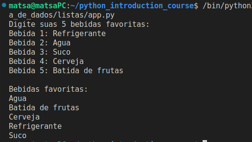
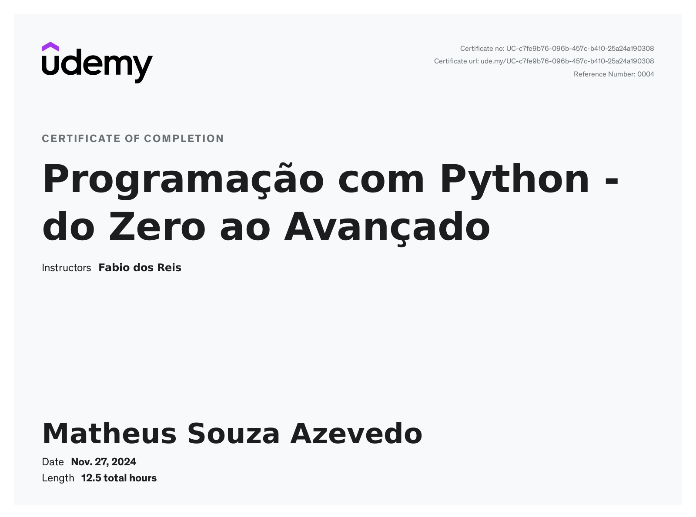

<h1 align="center">
    <strong>Sprint 01</strong>
</h1>

# Exercícios

- [`Código Desafio Operadores Aritméticos`](./exercicios/curso_programacao_python/ex01_operadores_aritmeticos/app.py) 
[Clique para visualizar a execução](#evidencia-01)

- [`Código Exercício de Desvio Condicional`](./exercicios/curso_programacao_python/ex02_desvios_condicionais/app.py) 
[Clique para visualizar a execução](#evidencia-03)

- [`Código Jogo da adivinhação`](./exercicios/curso_programacao_python/ex03_mini_projeto_jogo_adivinhacao/app.py) 
[Clique para visualizar a execução](#evidencia-05)

- [`Código exercício de listas`](./exercicios/curso_programacao_python/ex04_listas/app.py) 
[Clique para visualizar a execução](#evidencia-07)

- [`Codígo exercício Fibonacci`](./exercicios/curso_programacao_python/ex05_fibonacci_recursivo/app.py) 
[Clique para visualizar a execução](#evidencia-09)

- [`Codígo exercício renomeação de arquivos`](./exercicios/curso_programacao_python/ex06_renomeando_pastas_em_massa/app.py) 
[Clique para visualizar a execução](#evidencia-11)

- [`Codígo jupyter gráfico de linhas`](./exercicios/curso_programacao_python/ex07_graficos/introducao_e_interface.ipynb) 
[Clique para visualizar a execução](#evidencia-13)

- [`Codígo jupyter gráfico de barras`](./exercicios/curso_programacao_python/ex07_graficos/outros_tipos_graficos.ipynb) 
[Clique para visualizar a execução](#evidencia-14)

- [`Codígo jupyter subplots`](./exercicios/curso_programacao_python/ex07_graficos/subplot.ipynb) 
[Clique para visualizar a execução](#evidencia-15)

# Evidências

###  ● Curso: Aprenda Git e GitHub em 3 dias + Projetos 

- Anotações feitas durante o curso 
[Anotação](./evidencias/curso_git_github/note.txt)

- Vídeo evidência sobre atividades realizadas no curso 
[Assistir no Youtube](https://youtu.be/eKtUz_Xe9tw)

### ●  Curso: Programação com Python - do Zero ao Avançado

- Com o [`Desafio de Operadores Aritméticos`](./exercicios/curso_programacao_python/ex01_operadores_aritmeticos/app.py) foi possível aprender as operações básicas matemáticas em Python

- Na `seção 2` foi possível aprender conceitos básicos da linguagem, como variáveis, tipos de dados e operadores.

- Com o [`exercício de desvio condicional`](./exercicios/curso_programacao_python/ex02_desvios_condicionais/app.py), aprendi melhor sobre a estrutura condicional if else

- Na `seção 3`foi possível aprender sobre as estruturas de controle no Python, como condições if else, while, for e dentre outros detalhes.

- Com o [`Jogo de Adivinhação`](./exercicios/curso_programacao_python/ex03_mini_projeto_jogo_adivinhacao/app.py), trabalhei com bibliotecas externas do Python como random e os, além de praticar estruturas de condição e repetição

    

- O simples exercício de [`digitar suas 5 bebidas favoritas`](./exercicios/curso_programacao_python/ex04_listas/app.py), permitiu trabalhar com lista e ordenação.

- Na `seção 4` aprendi sobre o import de módulos, libs, criação de ambientes virtuais, manipulação de hora e data e as diferenças entre as principais estruturas de dados como listas, tuplas, dicionários e conjuntos.

- O exercício de calcular a [`sequência Fibonacci`](./exercicios/curso_programacao_python/ex05_fibonacci_recursivo/app.py) dado um número permitiu um bom entendimento sobre como funciona a recursividade.

- Na `seção 5` o principal tópico foi funções em Python, aprendendo sobre funções com e sem parâmetros, manipulação de exceções e criação de uma exceção personalizada, além de recursividade.

- Foi muito interessante trabalhar com o [`renomeamento em massa de arquivos`](./exercicios/curso_programacao_python/ex06_renomeando_pastas_em_massa/app.py) com o módulo OS, passando um diretório como parâmetro.

- A `seção 6` aborda recursos avançados em Python, como compreensões de lista, uma forma compacta de se trabalhar com lista, programação orientada a objetos, maior abordagem sobre o módulo OS, manipulação de arquivos de textos e CSV e outros demais recursos avançados em Python.

- A `seção 7` introduz a biblioteca matplotlib, ensinando como pensar ao trabalhar com a visualização de informações através do plot de diferentes tipos de gráficos como de linhas, barras, pizza e subplots.

- [`Gráfico de linhas`](./exercicios/curso_programacao_python/ex07_graficos/introducao_e_interface.ipynb)

- [`Gráfico de barras`](./exercicios/curso_programacao_python/ex07_graficos/outros_tipos_graficos.ipynb)

- [`Subplots`](./exercicios/curso_programacao_python/ex07_graficos/subplot.ipynb)

# Certificados

- Certificado do curso Data & AI - Ciência de Dados - Introdução

- Certificado do curso Aprenda Git e GitHub em 3 dias + Projetos reais

- Certificado do curso Programação com Python - do Zero ao Avançado

