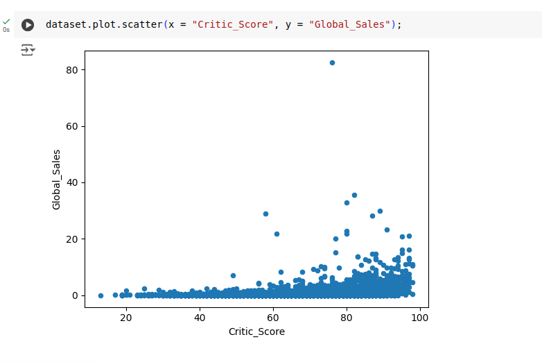

<h1 align="center">
    <strong>Sprint 01</strong>
</h1>

# Exercícios

###  ● Curso: Aprenda Git e GitHub em 3 dias + Projetos 

- **Código desafio Operadores Aritméticos** 

[Clique para visualizar o código](./exercicios/curso_programacao_python/ex01_operadores_aritmeticos/app.py) 
[Clique para visualizar a execução](#evidencia-01)

- **Código exercício de Desvio Condicional** 
[Clique para visualizar o código](./exercicios/curso_programacao_python/ex02_desvios_condicionais/app.py) 
[Clique para visualizar a execução](#evidencia-03)

- **Código exercício Jogo da Adivinhação** 
[Clique para visualizar o código](./exercicios/curso_programacao_python/ex03_mini_projeto_jogo_adivinhacao/app.py) 
[Clique para visualizar a execução](#evidencia-05)

- **Código exercício de Listas** 
[Clique para visualizar o código](./exercicios/curso_programacao_python/ex04_listas/app.py) 
[Clique para visualizar a execução](#evidencia-07)

- **Codígo exercício Fibonacci Recursivo** 
[Clique para visualizar o código](./exercicios/curso_programacao_python/ex05_fibonacci_recursivo/app.py) 
[Clique para visualizar a execução](#evidencia-09)

- **Codígo exercício Renomeação de Arquivos** 
[Clique para visualizar o código](./exercicios/curso_programacao_python/ex06_renomeando_pastas_em_massa/app.py) 
[Clique para visualizar a execução](#evidencia-11)

- **Codígo Jupyter Gráfico de Linhas** 
[Clique para visualizar o código](./exercicios/curso_programacao_python/ex07_graficos/introducao_e_interface.ipynb) 
[Clique para visualizar a execução](#evidencia-13)

- **Codígo Jupyter Gráfico de Barras** 
[Clique para visualizar o código](./exercicios/curso_programacao_python/ex07_graficos/outros_tipos_graficos.ipynb) 
[Clique para visualizar a execução](#evidencia-14)

- **Codígo Jupyter Subplots** 
[Clique para visualizar o código](./exercicios/curso_programacao_python/ex07_graficos/subplot.ipynb) 
[Clique para visualizar a execução](#evidencia-15)

###  ● Curso: Pandas Descomplicado: Um Guia Prático para Iniciantes

- **Código Jupyter para exercícios das seções 2, 3 e 4**
[Clique para visualizar o código](./exercicios/curso_pandas/exercicios_resolvidos_matheus_azevedo.ipynb) 
[Clique aqui para visualizar as evidências](#evidencias_pandas)

 

# Evidências

###  ● Curso: Aprenda Git e GitHub em 3 dias + Projetos 

- Anotações feitas durante o curso 
[Anotação](./evidencias/curso_git_github/note.txt)

- Vídeo evidência sobre atividades realizadas no curso 
[Assistir no Youtube](https://youtu.be/eKtUz_Xe9tw)

### ●  Curso: Programação com Python - do Zero ao Avançado

- Com o `Desafio de Operadores Aritméticos` foi possível aprender as operações básicas matemáticas em Python

    
    

 

- Na `seção 2` foi possível aprender conceitos básicos da linguagem, como variáveis, tipos de dados e operadores.

    

 

- Com o `exercício de desvio condicional`, coloquei em prática o funcionamento da estrutura condicional if else.

    
    

 

- Na `seção 3`foi possível aprender sobre as estruturas de controle no Python, como condições if else, while, for e dentre outros detalhes.

    

 

- Com o `Jogo de Adivinhação`, trabalhei com bibliotecas externas do Python como random e os, além de praticar estruturas de condição e repetição

    
    

    

 

- O simples exercício de `digitar suas 5 bebidas favoritas`, permitiu trabalhar com lista e ordenação.

    
    

 

- Na `seção 4` aprendi sobre o import de módulos, libs, criação de ambientes virtuais, manipulação de hora e data e as diferenças entre as principais estruturas de dados como listas, tuplas, dicionários e conjuntos.

    

 

- O exercício de calcular a `sequência Fibonacci` dado um número permitiu um bom entendimento sobre como funciona a recursividade.

    
    

 

- Na `seção 5` o principal tópico foi funções em Python, aprendendo sobre funções com e sem parâmetros, manipulação de exceções e criação de uma exceção personalizada, além de recursividade.

    

 

- Foi muito interessante trabalhar com o `renomeamento em massa de arquivos` com o módulo OS, passando um diretório como parâmetro.

    
    

 

- A `seção 6` aborda recursos avançados em Python, como compreensões de lista, uma forma compacta de se trabalhar com lista, programação orientada a objetos, maior abordagem sobre o módulo OS, manipulação de arquivos de textos e CSV e outros demais recursos avançados em Python.

    

 

- A `seção 7` introduz a biblioteca matplotlib, ensinando como pensar ao trabalhar com a visualização de informações através do plot de diferentes tipos de gráficos como de linhas, barras, pizza e subplots.

 

- `Gráfico de linhas`

    
    

 

- `Gráfico de barras`

    
    

 

- `Subplots`

    
    

###  ● Curso: Pandas Descomplicado: Um Guia Prático para Iniciantes

- Com a função `loc`do Pandas, é possível realizar uma filtragem para exibir dados em um determinado intervalo, através da utilização do index da serie. 
No exemplo abaixo, a função loc é utilizada para filtrar a série e exibir os dados entre abril de 1949 e janeiro de 1950.

    

 

- No exemplo abaixo, utiliza-se o `iloc` para realizar uma filtragem baseada em posição, das 5 primeiras linhas e as 5 primeiras colunas da serie.

    

 

- Com o `sort_values`, é possível ordenar os valores da coluna "Global_Sales" do dataset, de forma decrescente

    

 

- O `groupby` do Pandas agrupa os dados do Dataframe baseando-se nas colunas "Genre" e "Platform" e faz uma função de agregação da média das colunas numéricas.

    

- Na imagem abaixo, trabalha-se com a plotagem de gráficos, nesse caso, é feito um agrupamento com base na coluna "Platform", faz a contagem de registros e plota um `gráfico de barras`.

    

 

- O `gráfico de dispersão` plotado utilizando as colunas de "Critic_Score" e "Global_Sales"

    

 

# Certificados

- Certificado do curso **Data & AI - Ciência de Dados - Introdução**

    

- Certificado do curso **Aprenda Git e GitHub em 3 dias + Projetos reais**

    

- Certificado do curso **Programação com Python - do Zero ao Avançado**

    

- Ceritificado do curso **Pandas Descomplicado: Um Guia Prático para Iniciantes**
    
