<h1 align="center">
    <strong>SPRINT 02</strong>
</h1>

# 📝 Exercícios

###  ➣ Curso: SQL para Análise de Dados: Do básico ao avançado

1. ...
[Resposta Ex1.](exercicios/ex1.txt)

2. ...
[Resposta Ex2.](exercicios/ex2.txt)

# 🔎 Evidências

### ➣ Curso: Estatística para Análise de Dados com Python

- **Seção 3: Preparação, organização e estruturação dos dados** 
    A seção 3 nos fornece um primeiro contato 
    com o dataset ENEM do ano de 2019. Porém, 
    como o dataset é muito grande por abranger 
    o país inteiro, para fins didáticos, 
    foram feitos uma **série de tratamentos**, 
    para que o dataset se tornasse mais intuitivo
    para o aprendizado, organizado e 
    **limitadoao estado de São Paulo**.
    
    - Exclusão das colunas que não fazem sentido 
    em nossa análise:

        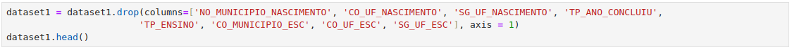
    
    - Verificação da quantidade de valores nulos 
    para as notas respectivas as matérias do ENEM. Tratamento através da presença nos dois dias da prova, com `TP_PRESENCA_CH == 1` e `TP_PRESENCA_CN == 1`. Isso elimina valores nulos já que a ausência é contada se o valor das variáveis forem 0:  
        
        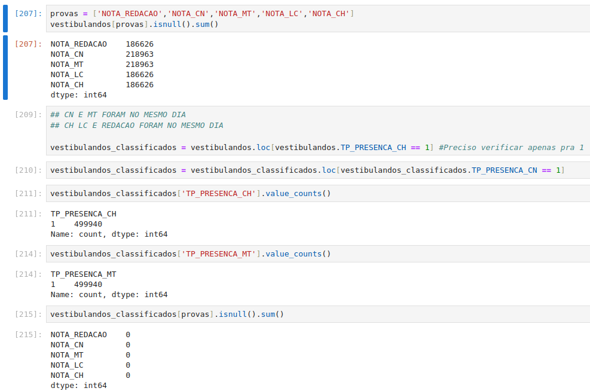
        

    Uma dos primeiros elementos ao se analisar o dataset, é tratar de suas colunas e linhas. Isso inclui, **renomear, reposicionar, excluir** e dentre outras operações.
    - Renomeação das colunas entre colchetes; 
    O valor antes do caractere ':' representa o 
    antigo nome e após, o novo nome da coluna:

        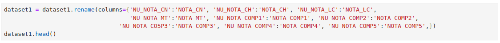

    - Renomeação das linhas de uma coluna:

        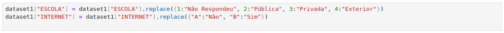

    Além disso, nessa seção aprendemos a realizar 
    alguns **filtros** e utilizar de 
    funcionalidades do Pandas como `loc`, `iloc`,
    `query`que vão proporcionar melhores 
    compreensões sobre o dataset.
    - Separando os candidatos em treineiros e 
    vestibulandos com `loc`:

        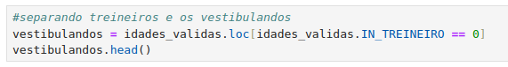
    
    - Consulta da quantidade de notas 0.0 em 
    Matemática com uma `query`:

        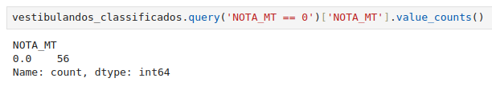

- **Seção 4: Fundamentos de estatística** 
    A seção 4 introduz conceitos muito utilizados
    de estatística para análise de dados, 
    como os diferentes tipos de amostragem 
    **(aleatória, sistemática, estratificada, por conglomerado)**, **distribuição de frequência** 
    e sua visualização a partir de gráficos, 
    **medidas de dispersão**, **outliers** e 
    visualização através do Boxplot. 

    - Amostra aleatória simples permite coletar 
    uma fração (`sample`) da população total. 
    Utiliza-se o seed para que a amostra seja 
    fixa, pois não é interessante uma amostra 
    que se modifica a cada execução. 

        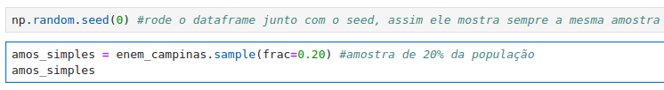

    - Amostra por conglomerado permite a a divisão 
    da população em grupos, que representa a 
    amostra. No caso abaixo, cada valor '1' que 
    é gerado aleatoriamente pelo `np.random.choice` 
    indica que o grupo deve ser incluido.

        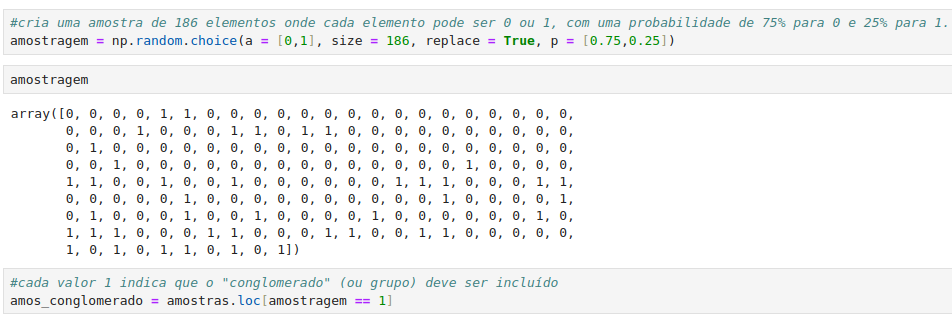

    - Amostra estratificada realizada sobre as 
    raças presentes no dataset. Uma fração de 
    amostra é coletada de cada raça e depois 
    concatenada, formando a amostra estratificada.

        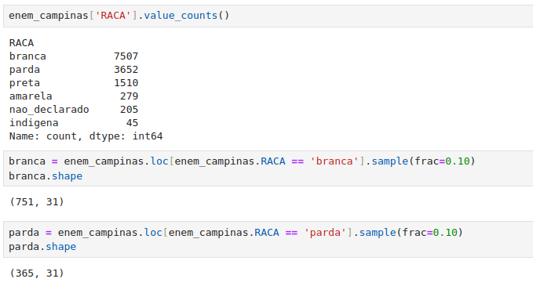
        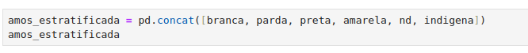

    - Visualização dos outliers: O `Boxplot` é 
    muito utilizado para visualização de outliers. 
    No exemplo abaixo, é feita uma análise das 
    notas de redação do enem do estado de São 
    Paulo para cada tipo de escola. Os pontos 
    no gráfico representam os 'valores atípicos'.

        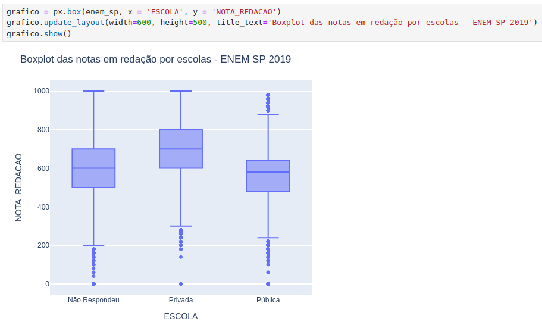
    
    - Tratamento dos outliers: No exemplo abaixo
    os `outliers` são removidos a partir de seus 
    valores mínimos e máximos, que são as retas 
    dos bigodes do Boxplot.

        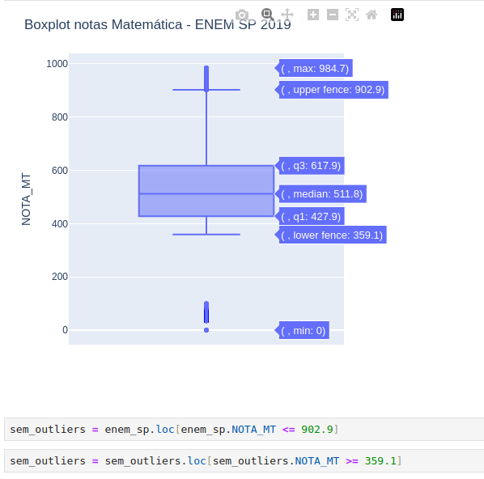

- **Seção 5: Estatística probabilística para análise de dados** 
    A seção 5 introduz o conceito da probabilidade 
    relacionada a análise de dados. A estatística
    probabilística abrange a probabilidade de não
    ocorrer um evento, interseção de eventos, 
    probabilidade condicional e diversos outros 
    conceitos.

    Além disso, a seção abrange a probabilidade
    de distribuição discreta e contínuas e para
    finalizar, testes de normalidade.

    - Exemplo de probabilidade condicional, que 
    representa a probabilidade de um **evento A** 
    **condicionado a um evento B ocorrer**. Neste caso,
    a probabilidade de uma pessoa do dataframe ser
    **mulher e parda**.

        

    - A distribuição analisa a provavilidade de 
    se obter 2 resultados. Abaxo, é testado a
    probabilidade de retirar uma `quatro mulheres
    num total de 10 amostras`.

        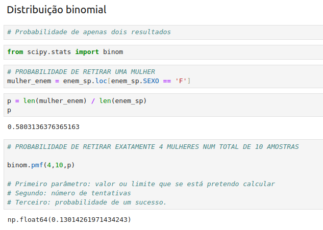 

    - O `Q-Q plot` nos permite visualizar graficamente
    se uma amostra possui distribuição normal
    através de sua **linha vermelha**.

        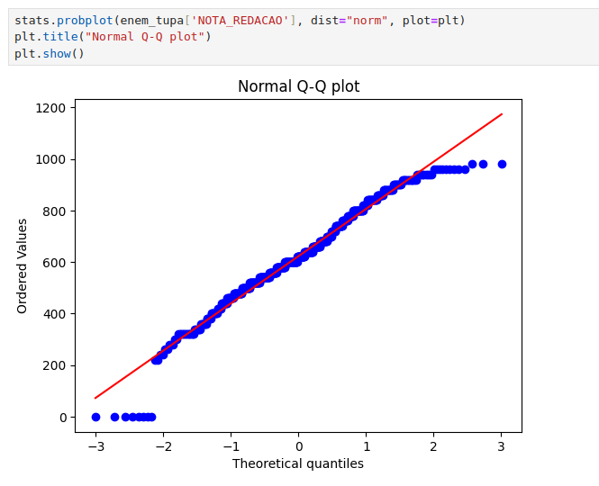

    - O Q-Q plot abaixo indica a distribuição das notas de
    redação de um colégio aleatório. Como o gráfico não
    explicita exatamente se a distribuição é normal,
    um teste Shapiro-Wilk é realizado. Como o seu p-value
    é maior que 0.05, a sua distribuição pode ser considerada
    normal.
    
        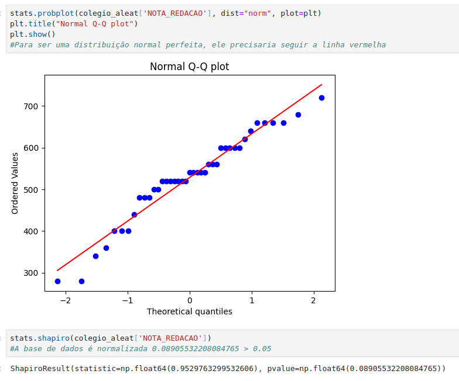

- **Seção 6: Fundamentos da estatística para inferencial para análise de dados** 
    A seção 6 aborda diversos conceitos relacionados
    à estatística inferencial, no sentido de se
    ter uma hipótese a analisar. Diversos testes
    de hipótese são trabalhados como o **Teste Z, Teste T
    Correlação e Regressão Linear e denrte outros
    fatores.**

    - `Teste Z:` No exemplo abaixo, foi comparado
    a média das notas do colégio aleatório de
    São Paulo com a média das notas de todos os 
    colégios de SP. Com o `intervalo de confiança
    de 95% (significância de 0,05)`, aceita-se a 
    `hipótese alternativa` que o **colégio aleatório
    possui médias diferentes do que do estado de
    São Paulo.**

        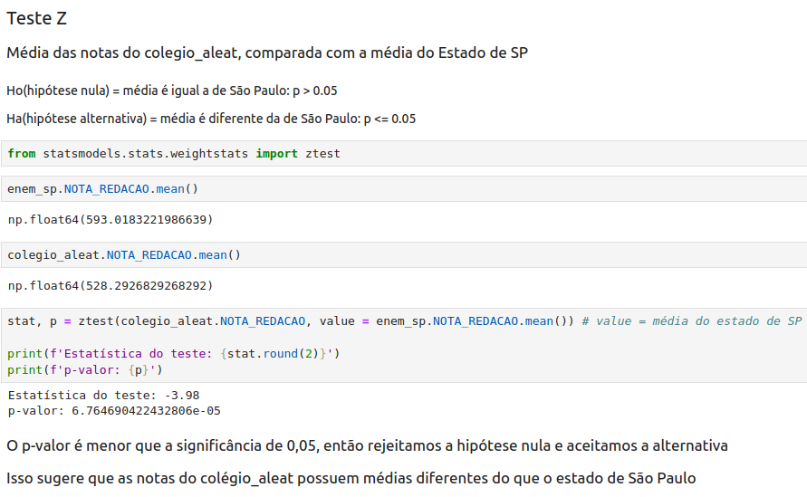

    - `Teste T:` O Teste T foi utilizado em outro
    colégio aleatório, porém a amostra utilizada
    era menor que 30, pois o Teste T possui maior
    precisão para amostras menores. Aceita-se a
    `hipótese alternativa` que o **colégio aleatório
    possui médias diferentes do que do estado de
    São Paulo.**

        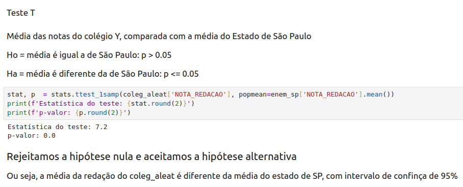

    - `Teste Mann Whitney:` Esse teste é utilizado para
    amostras `não paramétricas, ou seja, independentes`.
    No caso abaixo, compara-se as medianas da notas de
    homens e mulheres de um colégio aleatório. Como a hipótese
    nula foi aceita, pode-se dizer que **não há uma diferença
    significante entre as medianas das notas de homens 
    e mulheres.**

        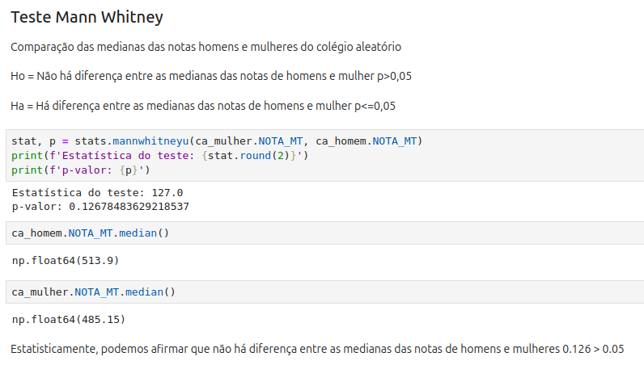 

    - `Correlação:` O gráfico de dispersão mostra uma 
    relação entre as **notas finais e as notas de redação 
    de um grupo de alunos de um colégio aleatório**.A 
    distribuição dos pontos no gráfico indica uma 
    tendência geral de que quanto maior a nota na 
    redação, maior tende a ser a nota final. 
    Isso sugere que **a performance na redação tem um 
    impacto positivo na nota final do aluno**.

        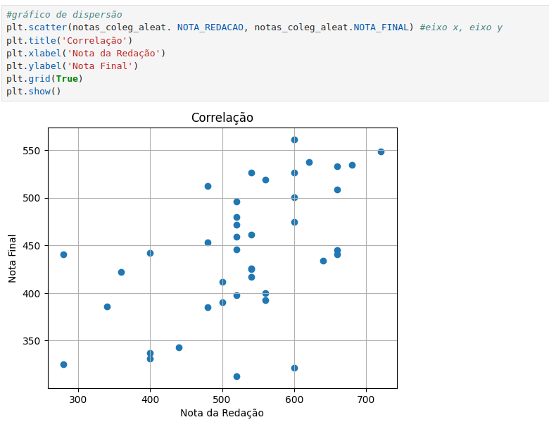

###  ➣ Curso: SQL para Análise de Dados: Do básico ao avançado 

# 👨🏼‍🎓 Certificados

- Certificado do Curso **Estatística para Análise de Dados com Python**

    

