<h1 align="center">
    <strong>SPRINT 03</strong>
</h1>

# 📝 Exercícios

No diretório de exercícios, coloquei alguns noteboooks que eu trabalhei durante o curso.

# 🔴 Vídeo - [Desafio Sprint 03](https://compasso-my.sharepoint.com/:v:/g/personal/matheus_azevedo_pb_compasso_com_br/Efb0dNQWhMBJiovzgamlg0YBp9K82x4rAuVNhYSBLM73lA?nav=eyJyZWZlcnJhbEluZm8iOnsicmVmZXJyYWxBcHAiOiJPbmVEcml2ZUZvckJ1c2luZXNzIiwicmVmZXJyYWxBcHBQbGF0Zm9ybSI6IldlYiIsInJlZmVycmFsTW9kZSI6InZpZXciLCJyZWZlcnJhbFZpZXciOiJNeUZpbGVzTGlua0NvcHkifX0&e=kiOe7W)

# 🔎 Evidências

### ➣ Curso: Formação Completa Inteligência Artificial e Machine Learning

- **Seção 2: Fundamentos de Machine Learning** 
    'Fundamentos de Machine Learning' é uma seção completamente teórica que nos introduz conceitos que são abordados durante todo o curso em diferentes momentos. O que é **machine learning**, sua **aplicabilidade** em diferentes áreas, **dados**, **modelos**, **classificação**, **regressão**, **associação**, **agrupamentos**, **performance**, entre outros.

    - Quiz da seção:

        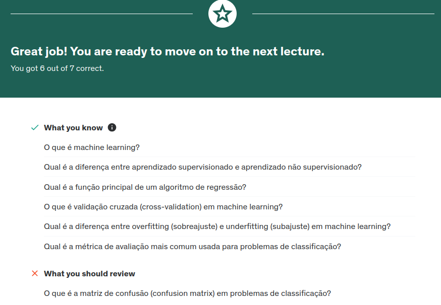

- **Seção 3: Estudo de Algoritmos de Machine Learning** 
    Na seção 3 aprendemos diferentes algoritmos em machine learning, o que se precisa para criá-los, medir sua performance e otimizá-los. Abaixo, tem-se exemplos de como foram trabalhados alguns algoritmos nessa seção.

    - **Criação do modelo de regressão linear:**  Divisão de variável dependente(a que queremos prever) e variáveis independentes(que vão auxiliar na previsão). 

        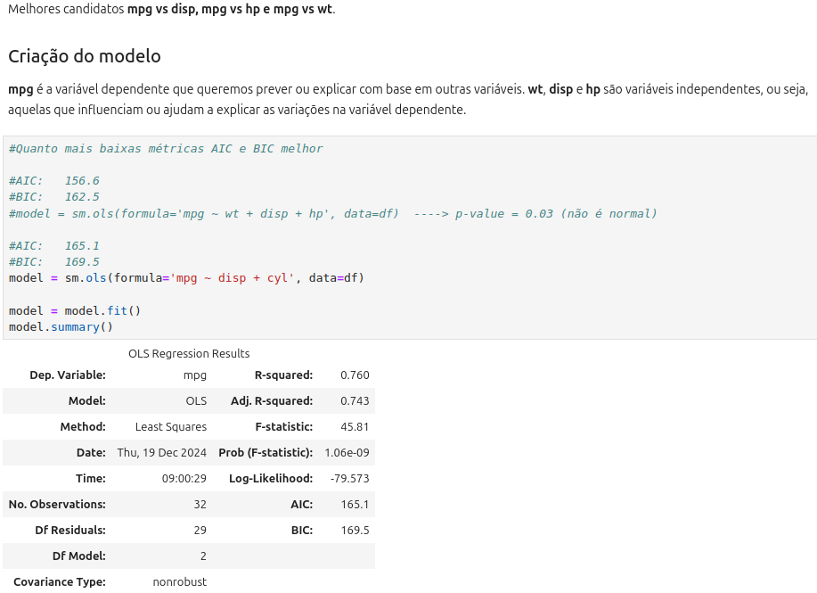
    
    
    - **Seleção de variáveis:**  Antes de realizar o treinamento de um modelo machine learning, é necessário selecionar as variável que se utilizará. A variável **dependente** representa a que queremos que o modelo realize previsões, as **independentes** são as que irão auxiliar o modelo a realizar correlações para a previsão.

     - **Transformação de dados:**  Um modelo machine learning não é capaz de entender variáveis categóricas, portanto, é necessário realizar uma transforamação de variáveis categóricas para númericas. O `LabelEncoder` faz esse trabalho tranformando variáveis do tipo `object` em números, dessa forma o modelo consegue compreender, realizar associações e aprender.

        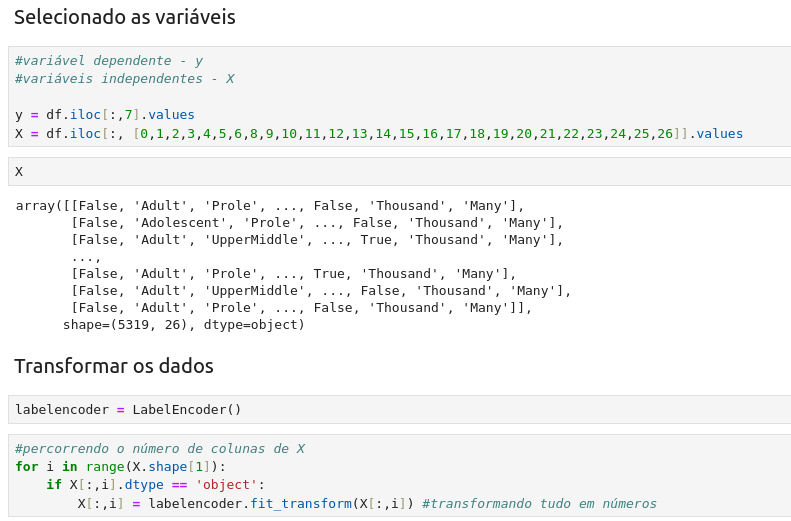

    - **Treinamento de um modelo Naive Bayes:**  O algoritmo Naive Bayes é um classificador probabilístico baseado no `Teorema de Bayes`. É amplamente utilizado em tarefas de classificação como análise de sentimentos, detecção de spam e categorização de texto. Nesse caso, utiliza-se o modelo `Gaussian Naive Bayes (GaussianNB)`. Nele fazemos a preparação e transformação dos dados de entrada, divisão entre conjunto de treinamento e teste, ajuste do modelo ao conjunto de treinamento usando o método `fit()` e por fim, a previsão de rótulos com o método `predict()`.     

        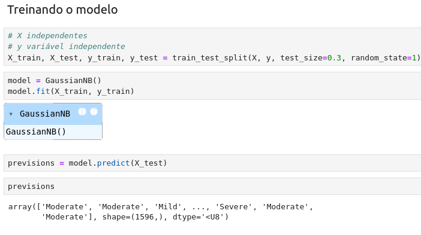

    - **Analisando performance através de métricas:**  As métricas de desempenho são muito importantes para avaliar a performance de um modelo machine learning. As principais são `acurácia`, `precisão`, `recall` e `f1-score`. Cada métrica tem uma fórmula tem sua particularidade através de uma fórmula bem definida.

        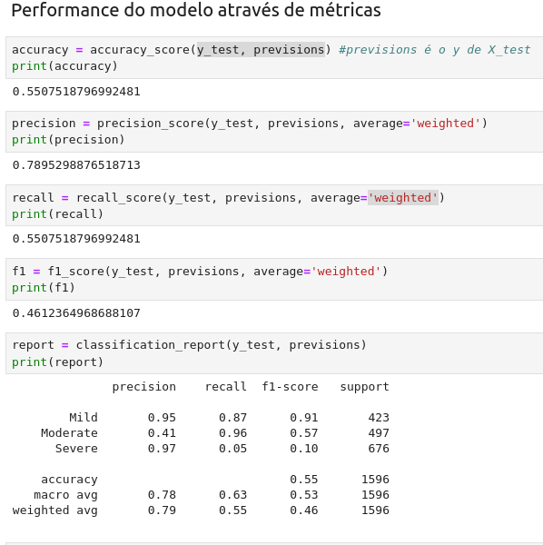

    - **Arvore de decisão:**  O algoritmo de árvore de decisão utiliza uma estrutura hierárquica para dividir os dados em subconjuntos com base em condições de decisão. Ele é usado tanto para **classificação** quanto para **regressão**, sendo fácil de interpretar e visualizar quando seus parâmetros são tratados corretamente.

        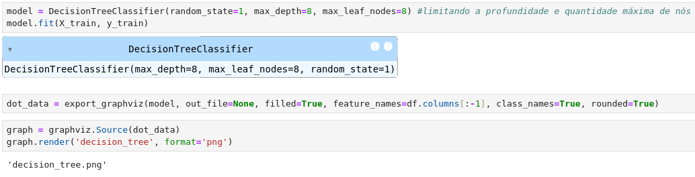

        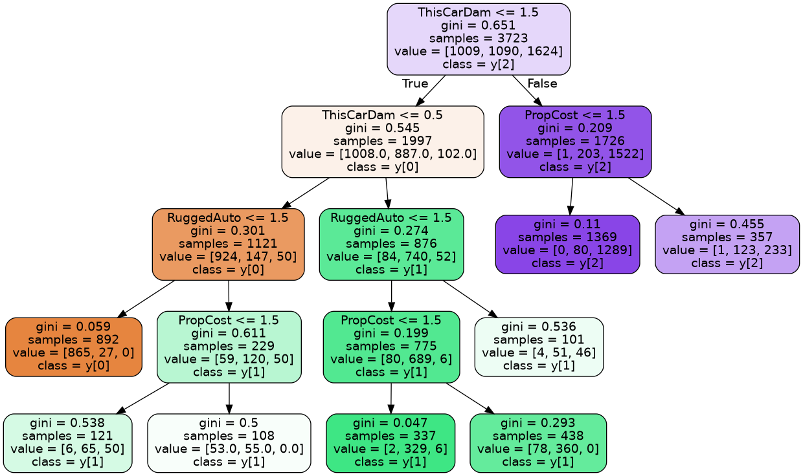

    - **Aprendizado baseado em instância:**  No aprendizado baseado em instância, o modelo aprende armazenando os exemplos de treinamento e faz previsões com base nesses exemplos. O **KNN (K-Nearest Neighbors)** é um dos algoritmos dessa categoria que classifica uma amostra ao observar os K exemplos mais próximos no conjunto de treinamento, usando uma métrica de distância, como a Euclidiana.

        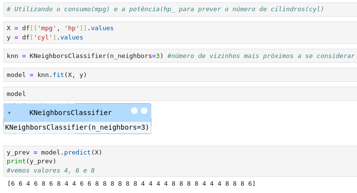

        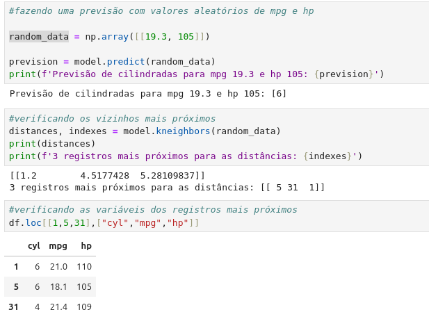

    - **Clusters diversos:**  O agrupamento(`clustering`) é uma técnica de aprendizado **não supervisionado** que busca identificar padrões ou grupos em dados não rotulados. Os algoritmos de clustering têm diversas aplicações, como análise de comportamento de clientes, segmentação de mercado e detecção de anomalias.

        - **Kmeans:**  Divide os dados em K grupos, onde cada ponto pertence ao cluster cujo centro está mais próximo

            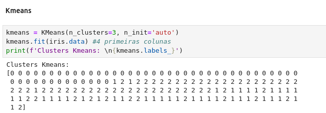

            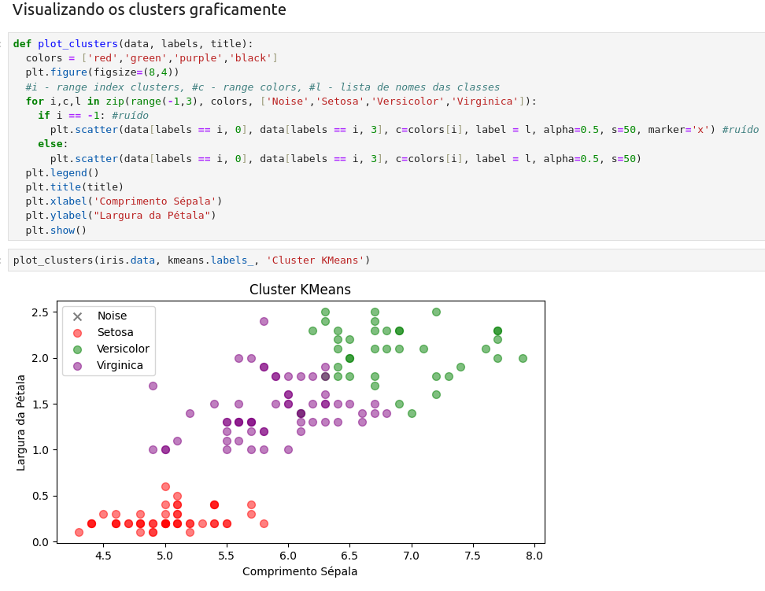
        
        - **Dbscam:**  Algoritmo baseado em densidade que forma clusters conectando pontos em regiões densas

            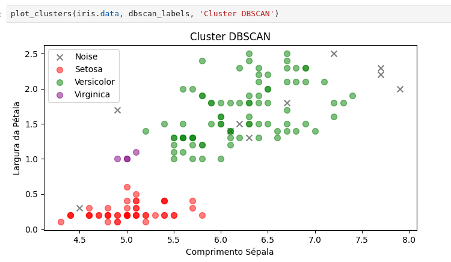

    - **Regras de associação - Apriori:**   O Apriori também é um algoritmo **não supervisionado** que identifica relações frequentes entre variáveis em bases de dados. Ele se baseia no princípio de que todos os subconjuntos de um item frequente também devem ser frequentes. Isso reduz significativamente a busca em grandes datasets.

        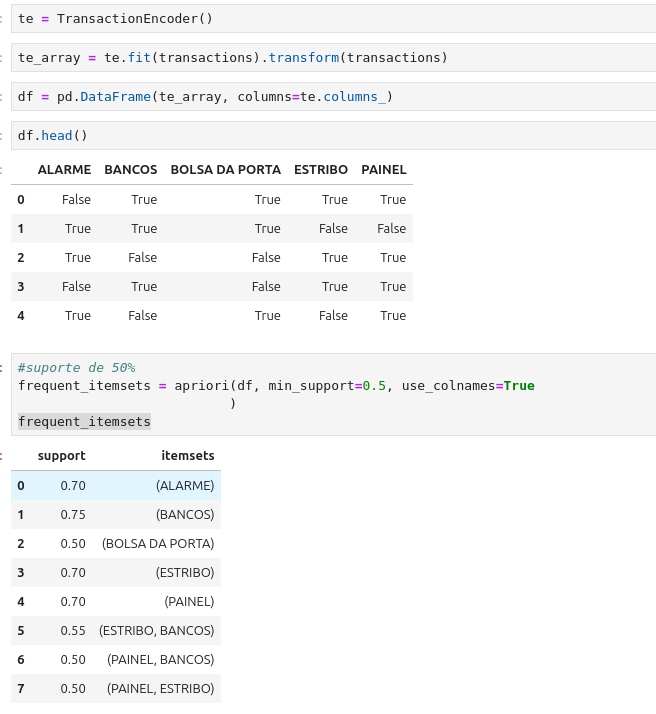

        

- **Seção 4: Tópicos Avançados em Machine Learning** 
    A seção 4 nos permitiu uma abordagem mais avançada dos tópicos de machine learning, onde diversos conceitos foram trabalhados de forma densa, como: engenharia e seleção de atributos, avaliação de variabilidade, custo e desempenho de um modelo, técnicas mais avançadas de clusterização, entre outros.

    - **Engenharia de atributos:**  O tratamento inicial de dados com a engenharia de atributos é essencial para limpar e transformar dados, garantindo que estejam prontos para o aprendizado.

        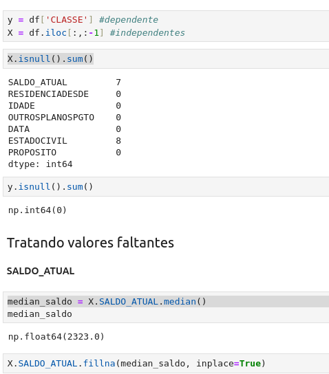 

        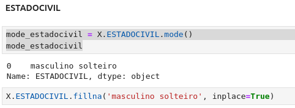

        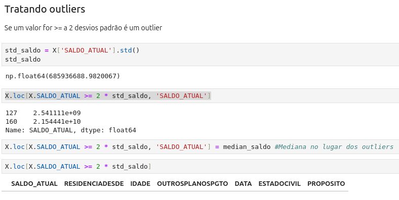   

        - **Data Binning:**  Técnica para agrupar valores contínuos em intervalos (bins), facilitando análises.

            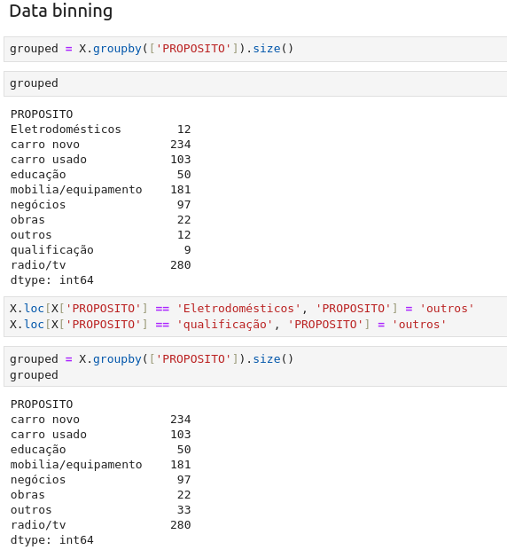

         - **Label Encoder:**  O Label Encoder é uma técnica de codificação que transforma variáveis categóricas em valores numéricos inteiros.
            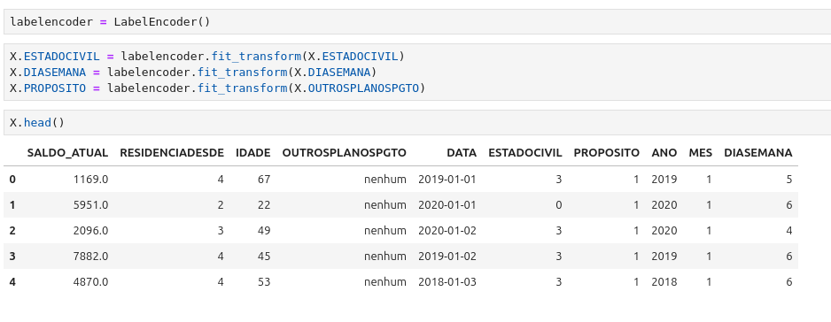

        - **One Hot Encoder:**  Transforma variáveis categóricas em representações binárias para uso em modelos de machine learning, criando uma coluna distinta para cada categoria. 
            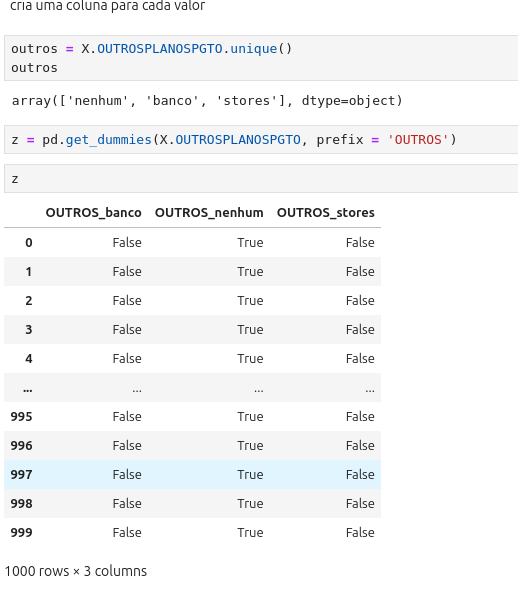

        - **Standard Scalar:**  Normaliza os dados para padronizar as variáveis com médias próximas de zero e desvio padrão unitário, otimizando o desempenho dos algoritmos.

            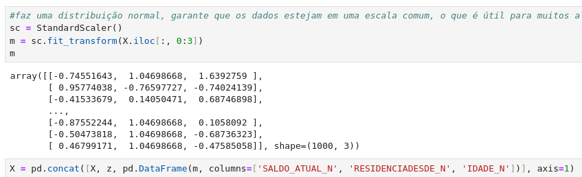

    - **Seleção de atributos:**  Selecionar os atributos certos melhora a eficiência do modelo e reduz o risco de overfitting. Técnicas de seleção ajudam a identificar as variáveis mais relevantes para o problema em questão.

        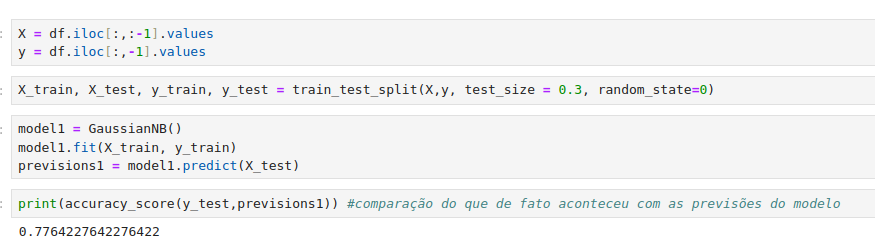

        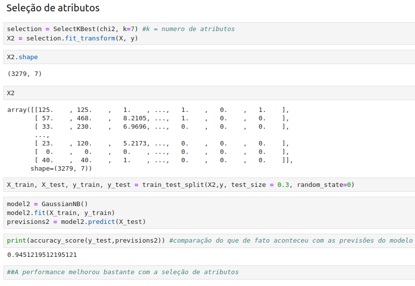

    - **Comparação de melhores agrupadores clusters (KMeans, Agglomerative e DBSCAN):** 

        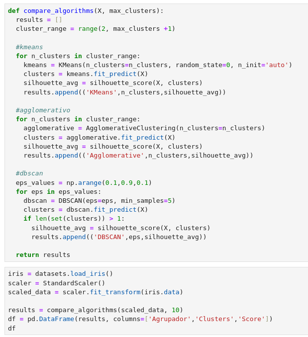

        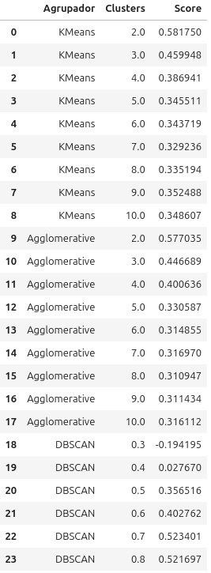

    - **Antes e depois do modelo de transformação:** 

        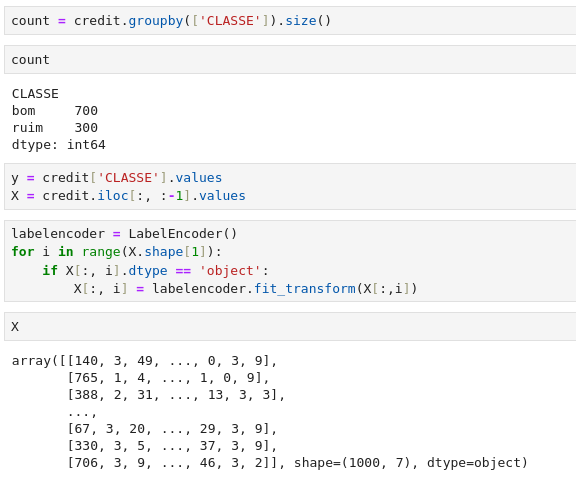

        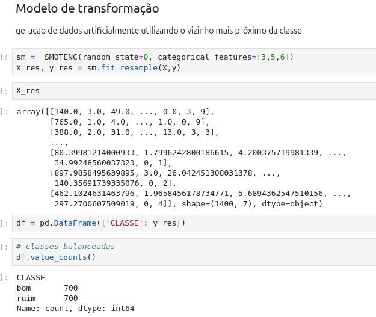

- **Seção 5: Redes Neurais, Deep Learning e Computer Vision** 
    A seção 5 introduz e aprofunda os conceitos de `Redes Neurais Artificiais(RNA)`. Aprendi sobre o funcionamento de modelos como Perceptron, redes MLP (Perceptron Multicamadas), Redes Neurais Convolucionais (CNN), redes recorrentes como LSTM, além de conceitos como Autoencoders para aprendizado não supervisionado. 

    - **Implementando uma Rede Neural MLP:**  MLP é uma rede neural com pelo menos uma camada oculta que realiza **aprendizado supervisionado** para classificação ou regressão. Aprendemos a configurar os hiperparâmetros, como número de camadas, neurônios, taxa de aprendizado e função de ativação, e analisamos o desempenho do modelo monitorando métricas como a taxa de perda (`loss rate`).

        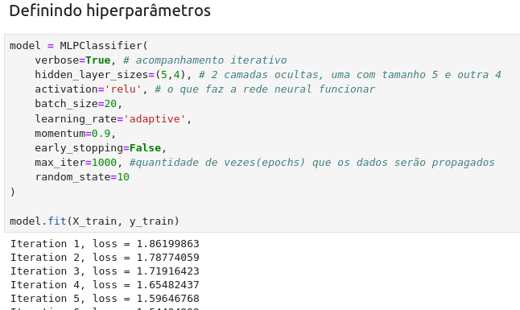

        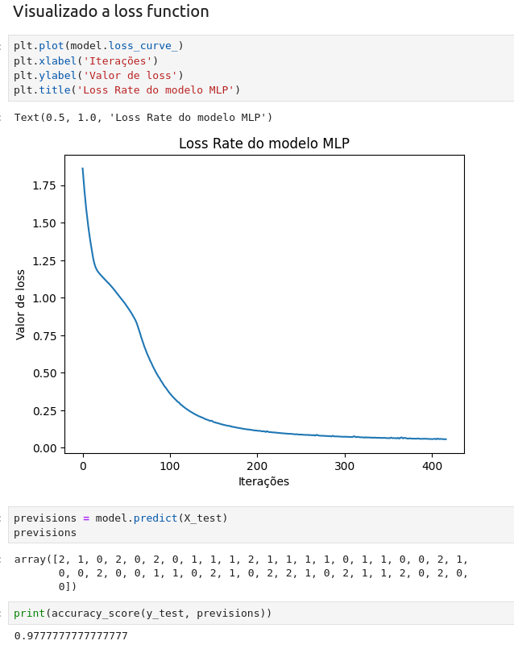

    - **Implementando RNA com Keras:**  `Keras` é uma biblioteca de alto nível para construção e treinamento de redes neurais, facilitando a criação de modelos complexos. 

        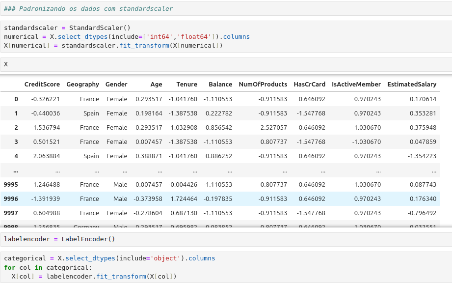

        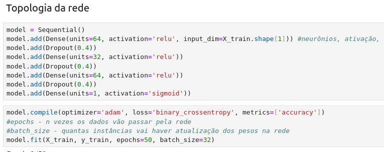

        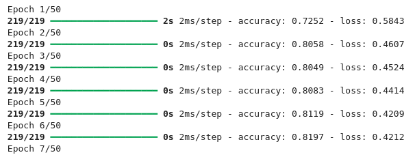

        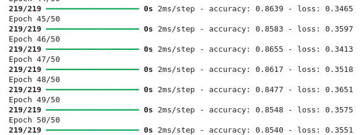

    - **CNN:**  As `CNNs` são redes especialmente projetadas para tarefas de **visão computacional**, como classificação de imagens, detecção de objetos e segmentação. Utilizam camadas convolucionais para extrair padrões espaciais e características relevantes das imagens.

        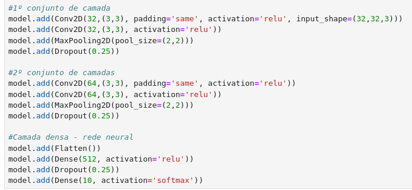

        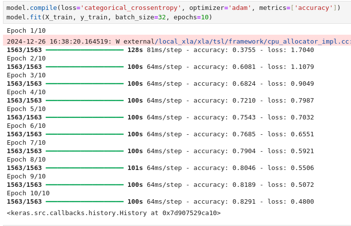

    - **Autoencoders:**  Autoencoders são redes neurais projetadas para aprender representações compactas e úteis dos dados de entrada, utilizando aprendizado não supervisionado. Muito utilizados para redução de dimensionalidade, detecção de anomalias entre outros.

        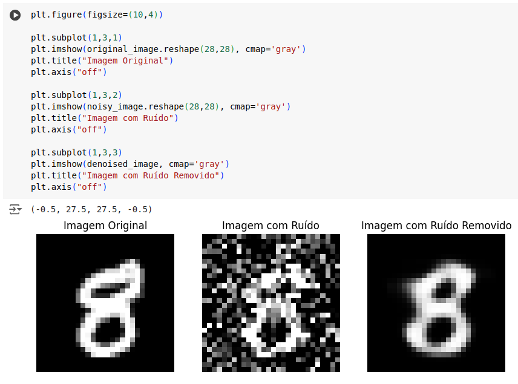

- **Seção 6: Machine Learning Explicável** 
    Essa seção aborda o conceito de `Machine Learning Explicável (Explainable AI - XAI)`, um ramo da IA que se concentra em tornar os modelos mais interpretáveis e transparentes, permitindo aos usuários compreender como as decisões são tomadas. 

    - **XAI - Eli5:**  O `Eli5` é uma biblioteca Python que fornece explicações intuitivas para modelos de machine learning. Ele permite visualizar o impacto de diferentes features no resultado de modelos, como árvores de decisão, regressão logística e outros, ajudando a identificar quais atributos têm maior peso nas decisões

        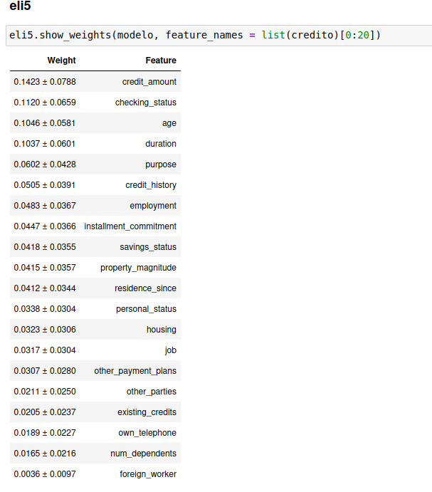

    - **Shap - Atributos que influenciam bom e mal pagador:**  O `SHAP (SHapley Additive exPlanations)` é uma técnica avançada que utiliza valores de Shapley para calcular a contribuição de cada atributo em uma predição. No contexto de análise de crédito, aprendemos a identificar os fatores que mais influenciam as decisões relacionadas a bons e maus pagadores.

        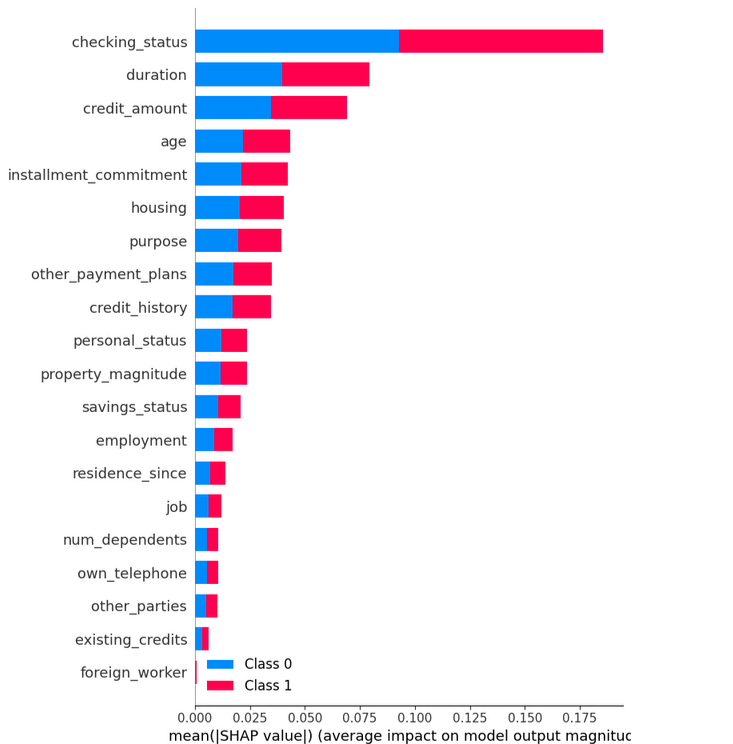

- **Seção 7: Processamento de Linguagem Natural(NLP) e Large Language Models(LLMs)**  
Essa seção explora as bases do **Processamento de Linguagem Natural (NLP)**, apresentando técnicas e ferramentas fundamentais para análise de texto e introduzindo modelos de **linguagem de grande escala (LLMs)**, que revolucionaram o campo com sua capacidade de entender e gerar texto de forma contextual.

    - **Introdução a NLTK:**  A biblioteca NLTK (Natural Language Toolkit) é amplamente utilizada em tarefas de NLP. Abordamos conceitos como:

        `Steaming:` Redução das palavras às suas raízes. 
        `Tokenize:` Divisão de textos em sentenças ou palavras. 
        `Stop Words:` Remoção de palavras comuns sem valor semântico relevante. 
        `Distribuição de frequência:` Identificação das palavras mais frequentes. 
       ` Entidades nomeadas:` Reconhecimento de nomes, datas e organizações no texto.

        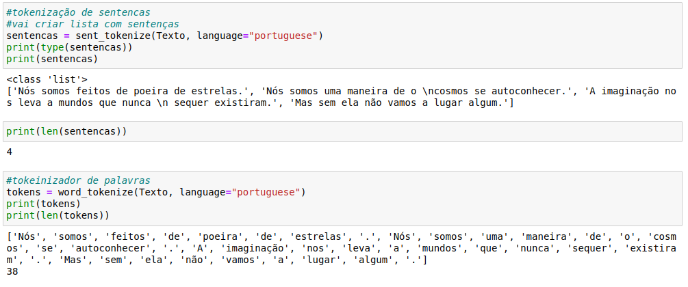

        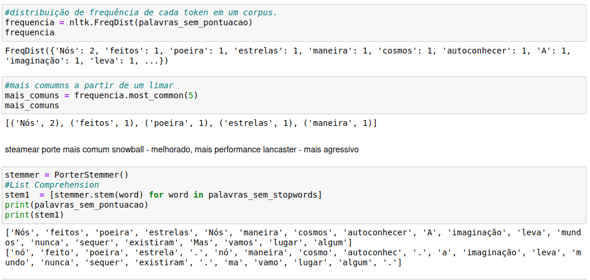

    - **Fillmask:**  Técnica utilizada para preencher lacunas em textos utilizando modelos de linguagem pré-treinados, permitindo análises contextuais e geração de texto coerente.

        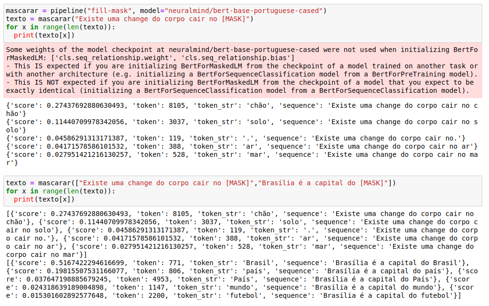

    - **OpenAI:**  Exploração de APIs da OpenAI para geração de texto, tradução, resumo e outras tarefas de NLP. A prática incluiu a utilização de modelos como o GPT para resolver problemas reais de linguagem.

        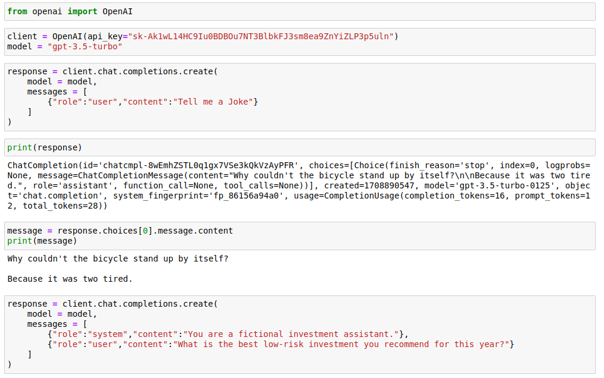

- **Seção 9: Detecção de Anomalias**  Nesta seção, exploramos técnicas para detectar **padrões anômalos em dados**, uma tarefa crítica em cenários como detecção de fraudes, monitoramento de sistemas e análise preditiva. Aprendemos sobre métodos estatísticos, densidade e modelos avançados de deep learning.

    - **ZScore:**  O método `Z-Score` utiliza estatísticas para identificar anomalias ao calcular a distância de um dado em relação à média em termos de desvio padrão. É útil para detectar valores extremos em dados numéricos.

        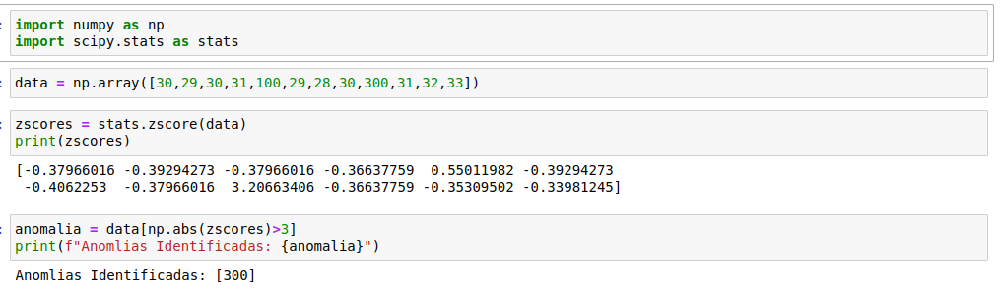

    - **LOF(Local Outlier Factor):**  O algoritmo **LOF** detecta anomalias com base na densidade local, comparando a densidade de um ponto com a densidade de seus vizinhos. É eficaz para detectar anomalias em conjuntos de dados com clusters variados.

        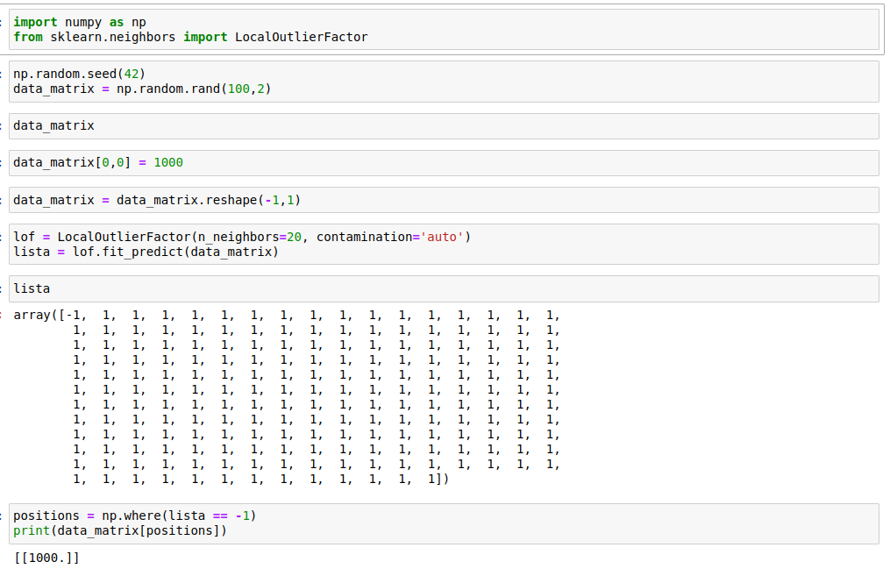

    - **LSTMAnomalias:**  O uso de **LSTMs (Long Short-Term Memory)** para detecção de anomalias é uma abordagem avançada que explora padrões temporais em dados sequenciais. É particularmente útil em séries temporais, como monitoramento de sensores ou transações financeiras.

        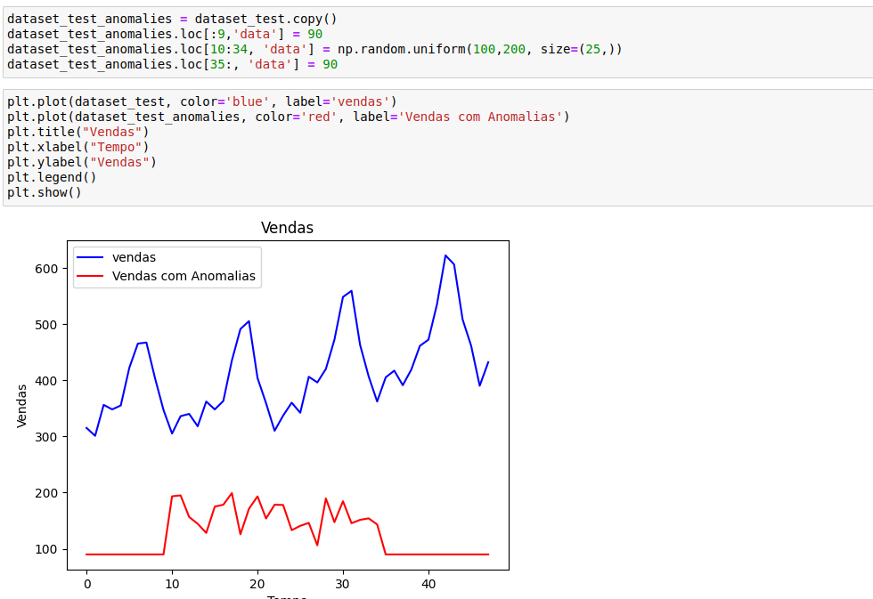

# 👨🏼‍🎓 Certificados

- Certificado do Curso **Formação Completa Inteligência Artificial e Machine Learning**

    