<h1 align="center">
    <strong>SPRINT 03</strong>
</h1>

# 📝 Exercícios

No diretório de exercícios, coloquei alguns noteboooks que eu trabalhei durante o curso.

# 🔴 Vídeo - [Desafio Sprint 04]

# 🔎 Evidências

### ➣ Curso: Machine Learning com Amazon AWS e SageMaker

### ➣ Curso: Machine Learning e Data Science com Python de A a Z

- **Seção 14: Regressão Linear**  A regressão linear é um conceito estatístico que busca realizar a modelagem da relação entre variáveis numéricas, sendo separadas em uma `variável dependente(alvo)` e `variáveis independentes(preditores)`. O principal objetivo é encontrar a **melhor linha reta** que mostre a relação entre essas variáveis e dizer o quão bem a variável dependente pode ser **prevista** pelas variáveis preditoras.

    - **Regressão Linear Simples:** esse tipo de regressão linear relaciona uma variável dependendete a uma única variável independente.

        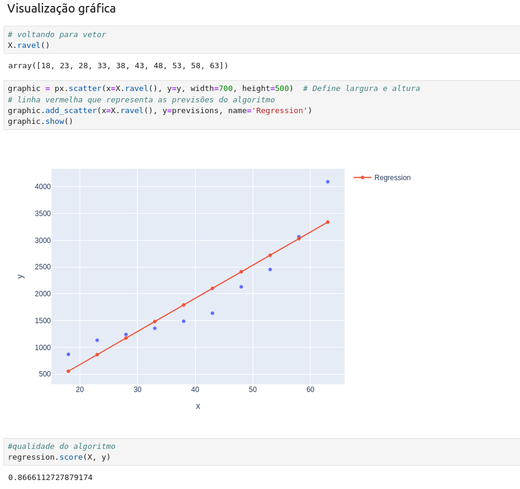

    Prever o custo de um plano de saúde baseado na idade de uma pessoa. O modelo foi criado tendo como variável dependente(y) o `custo` e independente(X) `idade`.

    A linha vermelha representa as previsões realizadas pelo modelo.

    - **Regressão Linear Múltipla:** esse tipo de regressão linear relaciona uma variável dependendete a múltiplas variáveis independentes.

        Selecionando as variáveis independentes e a dependente(`price`). A ideia é prever o preço de uma casa com base em diversas outras variáveis.

        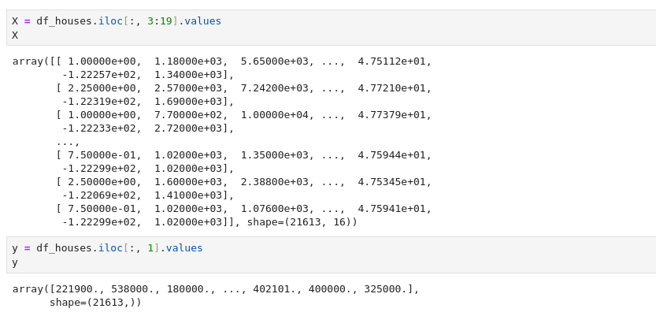

        Previsões e `Mean Absolute Error`

        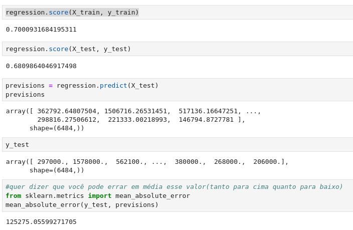

- **Seção 15: Outros tipos de regressão** 

    - **Regressão Polinomial:**  Uma extensão da regressão linear que permite capturar relações **não lineares** entre as variáveis. Útil quando a relação entre as variáveis não é linear e pode ser aproximada por uma **curva**.

        O parâmetro `degree = 4`permite que o modelo se ajuste bem, mas em outros cenários pode gerar overfitting em dados mais ruidosos.

        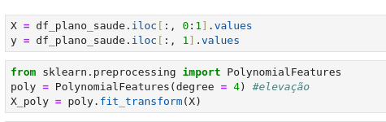

        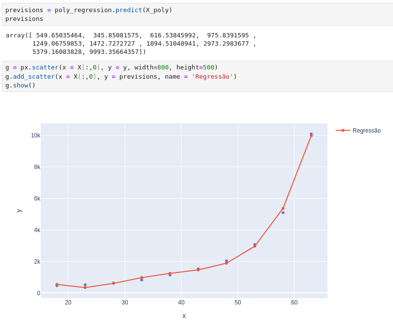

    - **Regressão com Random Forest**  O `Random Forest` faz parte do que se chama `Aprendizado em Conjunto(Ensemble Learning)`, que basicamente significa consultar diversas fontes para se obter um resultado mais preciso e robusto. O Random Forest utiliza de várias `árvores de decisão` para construir um algoritmo mais "forte". Além disso, utiliza a média(regressão) ou votos da maioria(classificação) para se obter uma resposta final.

        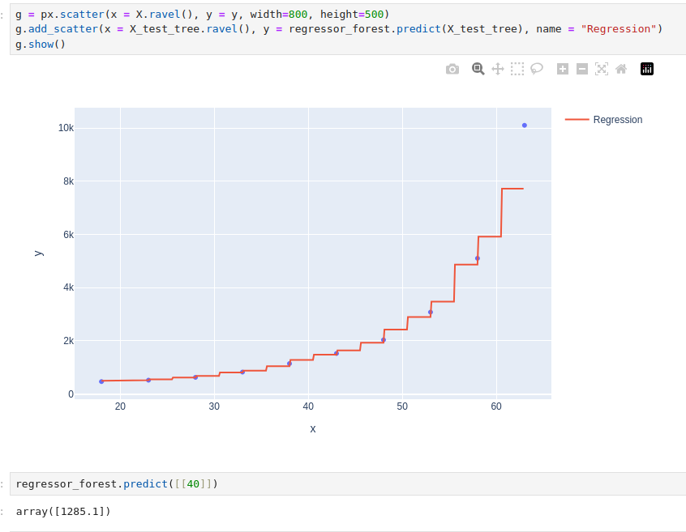

        A linha vermelha, que são os `degraus` passam próximas aos pontos reais, indicando que o modelo conseguiu capturar bem as variações presentes nos dados.

    - **Regressão com Redes Neurais Artificiais**  As RNAs são amplamente utilizadas para resolver problemas complexos, nesse caso, a regressão. Os dados de entrada (X) são escalados para melhorar o desempenho do treinamento, eles percorrem cada camada da rede realizando os cálculos de erros e ajuste de pesos.

        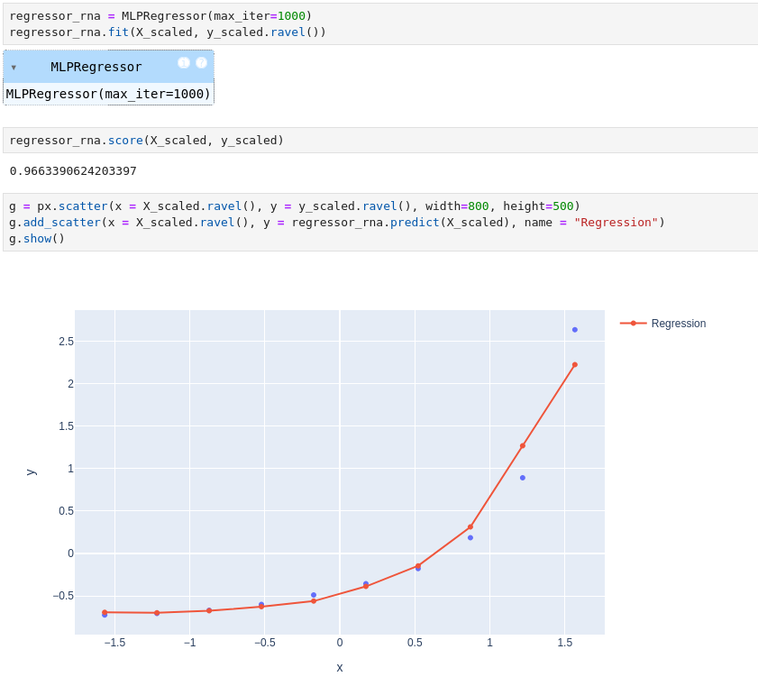

        O modelo parece ter se ajustado bem aos dados reais, dado que a linha vermelha segue o padrão dos pontos azuis.

- **Seção 17: Algoritmo Apriori**  Antes de explicar o algoritmo Apriori, é importante falar sobre as **regras de associação**.

    - **Regras de associação:**  As regras de associação tem como objetivo identificar **padrões e associações** entre conjunto de dados. Com esse conjunto de regras, é possível encontrar relações ocultas entre variáveis que geralmente não são esperadas.

    - É possível obter muitos **insights** que podem ser determinísticos para **tomadas de decisõe**s. Por exemplo, responder as seguintes perguntas:

        - Em que prateleira o biscoito de chocolate deve ser colocado para maximizar suas vendas?

        - Suco de uva costuma ser comprado com refrigerante?

        - Qual produto deve ser colocado em promoção para uma venda casada com tomates?

    - **Apriori:**  O `Apriori` busca encontrar conjuntos frequentes de itens em transações e derivar regras de associação que indicam relações entre os itens.

    - 3 conceitos são fundamentais de saber ao se estudar regras de associação e Apriori:

        `Suporte (Support):` Frequência com que um conjunto de itens aparece nas transações.

        `Confiança (Confidence):` Probabilidade de que, se um item AA é comprado, BB também seja.

        `Lift:` Mede a força da regra. Um valor maior que 1 indica uma associação positiva entre AA e BB.

        No Apriori, apenas os conjuntos de itens que **atendem ao suporte mínimo definido** pelo usuário são mantidos. Além disso, a partir desse conjunto de itens mantidos, o objetivo é descobrir regras de associação com fator de **confiança maior ou igual** ao estabelecido pelo usuário.
    
    - **Utilizando o Apriori:** 
        Transformando o dataframe para uma lista e definindo as regras do **Apriori(Support, Confidence e Lift)**.

        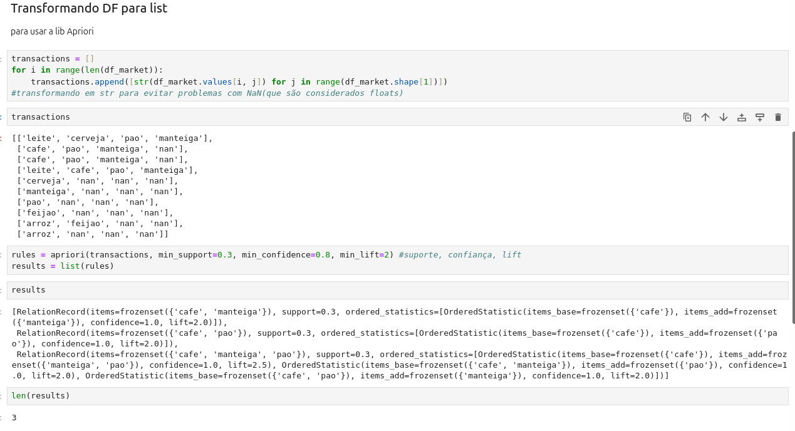

        **Extração das regras** do algoritmo e transformando em um **dataframe**.

        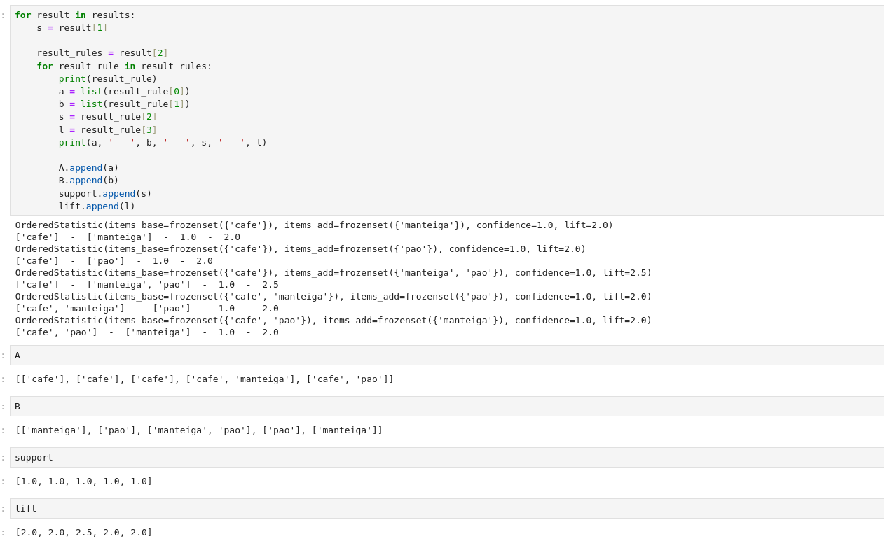

        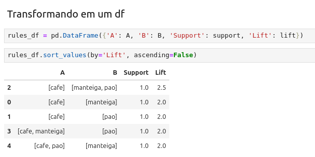

- **Seção 20: Agrupamento com K-Means**  Agrupamento ou `clusterização` é uma técnica muito utilizada em machine learning para identificar grupos (ou `clusters`) de dados que possuem **características semelhantes**. 

    O `K-Means` é um dos algoritmos mais conhecidos para se trabalhar com clusterização. Ele divide os dados em **K clusters**(definido pelo usuário), calculando o `centroide`(centros de cada cluster) e ajustando até convergir.

    Após encontrar os clusters, a média do cluster é calculada e os centróides são reposicionados.

    - **Utilizando o K-means:**  Utilizando uma pequena base que representa idades e salários, apliquei o algoritmo `K-means` para entender como seriam dividido **3 clusters**. A imagem mostra que foram criados 3 clusters com a média das idades sendo o centróide e a média dos salários recebidos.

        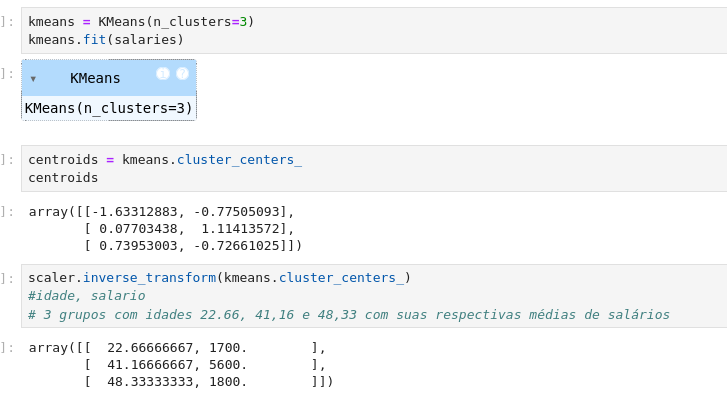

        Os pontos maiores azuis são os centróides dos clusters.

        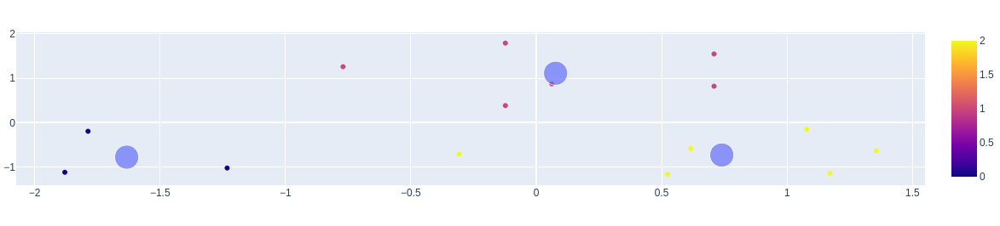

        Utilizando bases de dados randômicas foi possível plotar um gráfico que permitiu visualizar muito claramente a **separação de dados em cada cluster e os seus centróides**.

       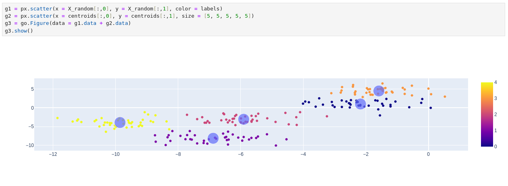

- **Seção 21: Outros algoritmos de agrupamento**  Nesta seção aprendemos sobre o agrupamento hierárquico, que basicamente tem como objetivo estabelecer uma **hierarquia de de agrupamentos**, onde é criada uma estrutura em forma de árvore que indica o número de clusters

    O `dendrograma`(árvore de clusters) exibe os grupos formados pelo agrupamento hierárquico em cada passo e em seus níveis de similaridade.

    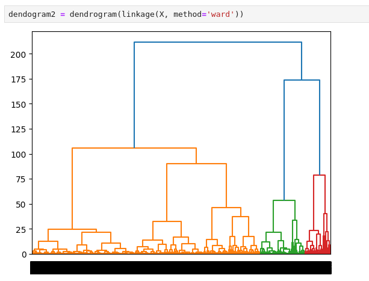

    Scatter Plot que evidencia os clusters aglomerativos criados em cima de uma base de cartão de crédito, onde o Eixo X representa o limite disponibilizado no cartão de crédito, e o Eixo Y o total gasto pelo cliente(Os dados estão normalizados).

    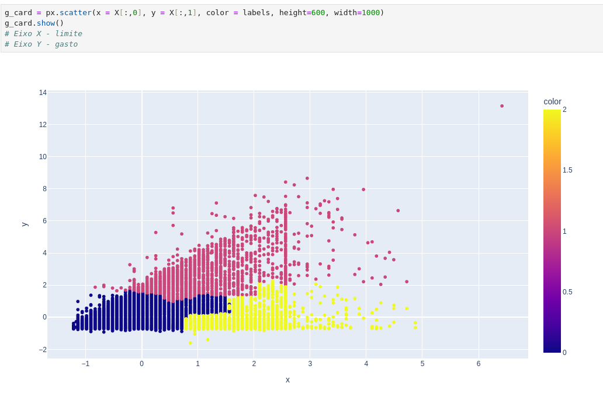

    - **Clientes conservadores (amarelo):** Baixo gasto apesar do alto limite disponível.
    - **Clientes equilibrados (rosa):** Usam uma parte significativa de seus limites de forma consistente.
    - **Clientes dependentes (azul):** Altos gastos em relação a limites baixos.

    - **DBSCAN:**  DBSCAN é um algoritmo de agrupamento baseado em densidade, agrupando pontos similares no mesmo espaço, **não sendo necessário descobrir e especificar o número de clusters**.

    Ele é mais rápido e geralmente apresenta melhores resultados do que o K-Means, encontrando padrões não lineares e sendo mais robusto contra outliers.

    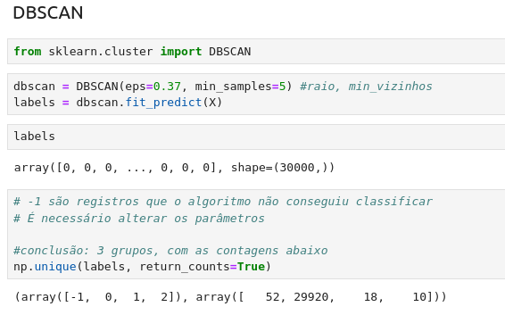

    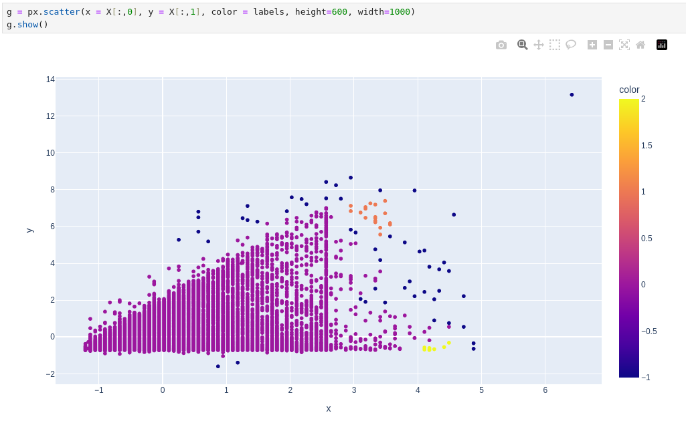

- **Seção 27: Seleção de atributos**  A seleção de atributos é muito importante para a clusterização e machine learnnig no geral, pois o seu objetivo é **identificar os atributos mais relevantes** que influenciam os padrões ou comportamentos dos dados, reduzindo a dimensionalidade e melhorando a interpretabilidade.

    Considerando uma análise onde queremos prever o salário de uma pessoa, vamos selecionar somente os atributos com o `threshold mínimo de 0.05` e utilizar o algortimo de `Low Variance` em cima disso.

    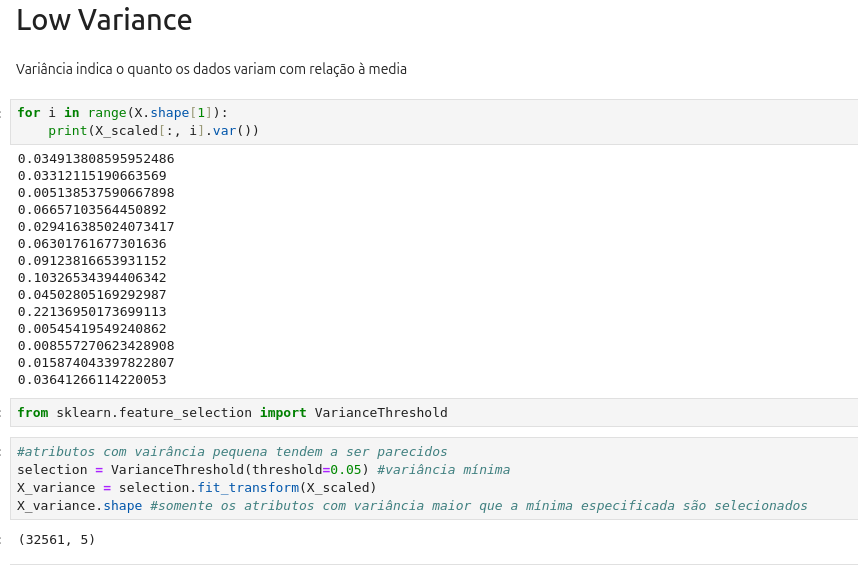

    Criação de um dataframe com somente os índices selecionados, eles vão auxiliar nossa análise.

    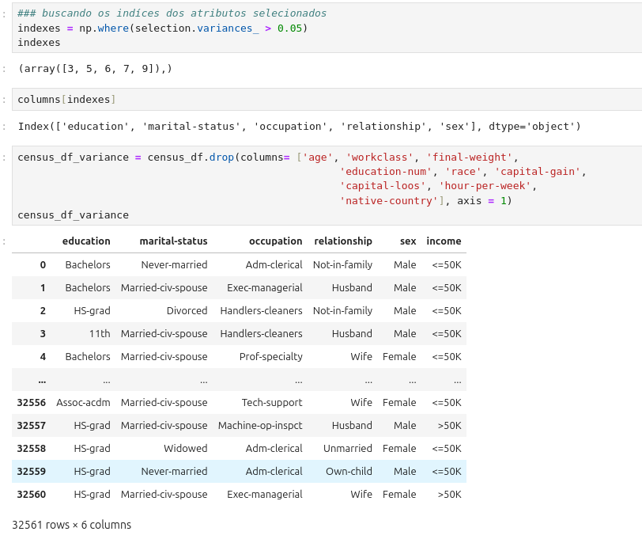

    Depois de realizar alguns processos, obtivemos esse modelo com **dimensionalidade reduzida**.

    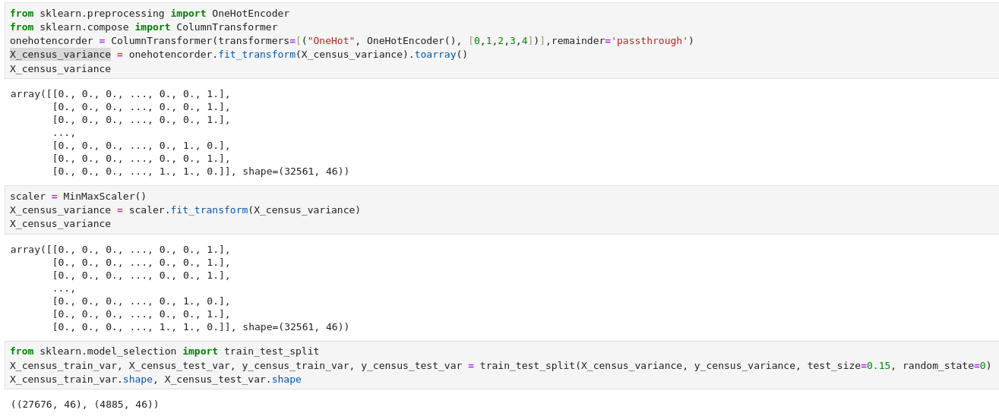

- **Seção 28: Redução de dimensionalidade** 

- **Seção 29: Detecção de Outliers** 

# 👨🏼‍🎓 Certificados

- Certificado do Curso **Machine Learning com Amazon AWS e SageMaker**

- Certificado do Curso **Machine Learning e Data Science com Python de A a Z**

