<h1 align="center">
    <strong>SPRINT 04</strong>
</h1>

# 🔴 Vídeo - [Desafio Sprint 04]

# 📝 Exercícios

### 🧠 Curso: Machine Learning com Amazon AWS e SageMaker

- **Seção 03: Regressão Linear Learner e XGBoost**  A seção 03 possui um exercício que sintetiza todo o conteúdo aprendido na seção acerca principalmente do algoritmo `XGBoost. Porém, trabalhamos com **tratamento da base de dados**, **configurações do SageMaker**, **treinamento** e **deploy** do XGBoost.

    [Clique para visualizar o código](./exercicios/curso_aws_e_sagemaker/sec3/xgboost_credit_card.ipynb)

- **Seção 04: Classificação com Linear Learner e XGBoost**  No exercício dessa seção trabalhamos com o treinamento de um modelo XGBoost, o seu deploy e análise das previsões, a realização do Tuning para uma melhor escolha dos hiperparâmetros e a construção de um novo modelo baseado no Tuning.

    [Clique para visualizar o código](./exercicios/curso_aws_e_sagemaker/sec4/xgboost-census.ipynb)

- **Seção 05: Séries temporais com DeepAR**  Neste exercício utilizamos uma base de dados das ações da Petrobras. A ideia era realizar uma previsão do preço das ações através de atributos que representam o preço das ações diáriamente, sendo interessante utilizar o DeepAR.

    [Clique para visualizar o código](./exercicios/curso_aws_e_sagemaker/sec5/petr4-deepar.ipynb)

- **Seção 06: Outliers com Random Cut Forest**  A ideia do exercício da seção 06 é detectar os outliers de uma base de dados de ações da Petrobras. Esse exercício foi interessante para reforçar como utilizar o algoritmo Random Cut Forest.

    [Clique para visualizar o código](./exercicios/curso_aws_e_sagemaker/sec6/petr4_outliers_random_cut.ipynb)

- **Seção 07: PCA e agrupamento K-means**  O exercício dessa seção foi interessante para reforçar a utilização do algoritmo PCA para reduzir a dimensionalidade do conjunto de dados e o Linear Learner para a classificação.

    [Clique para visualizar o código](./exercicios/curso_aws_e_sagemaker/sec7/pca-census-classificacao.ipynb)

### 🧠 Curso: Machine Learning e Data Science com Python de A a Z
No diretório de exercícios, coloquei alguns noteboooks que eu trabalhei durante o curso.

# 🔎 Evidências

### 🧠 Curso: Machine Learning com Amazon AWS e SageMaker

- **Seção 02: Introdução ao AWS**  Nesta seção aprendi sobre os serviços mais utilizados da AWS, como o SageMaker, S3 e IAM, entendendo um pouco das funcionalidades e propósitos de cada um deles.

    - **Amazon SageMaker:** Plataforma de machine learning que facilita a criação, treinamento e implantação de modelos. Integra-se com outros serviços da AWS, como S3 e IAM, para oferecer escalabilidade e simplicidade no gerenciamento de modelos e dados.

    - **Amazon S3:** Serviço de armazenamento escalável e seguro. Aprendi sobre buckets, que são como pastas para armazenamento de arquivos.
    
    - **AWS IAM:** Serviço que gerencia usuários, permissões e funções para garantir a segurança dos recursos.

        Exemplo de criação de `bucket` via código:

        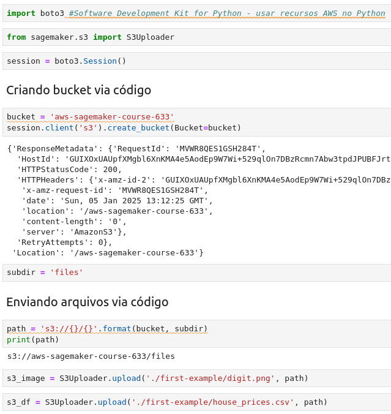 

- **Seção 03: Regressão Linear Learner e XGBoost**  

    - **Configurações do SageMaker:** Realização da configuração prévia do SageMaker e buckets E3 para preparar os dados que serão enviados através do treinamento do modelo.

        Os dados estão sendo enviados de forma que os algoritmos integrados da AWS possam utilizá-los no treinamento de modelos.

        Um `buffer` é criado para armazenar os dados em memória e é feito uma conversão para o `Dense Tensor` que é o formato binário necessário para os algoritmos integrados do SageMaker.

        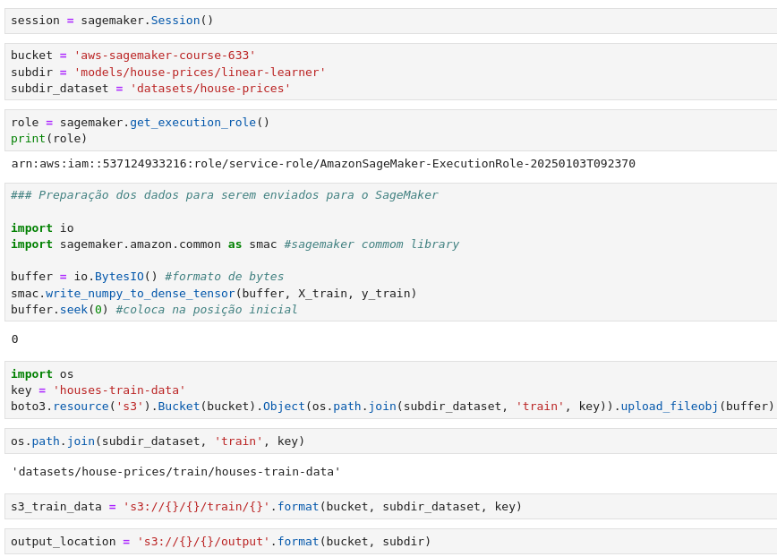

        Treinamento `Linear Learner` com a instânica **ml.m5.large**

        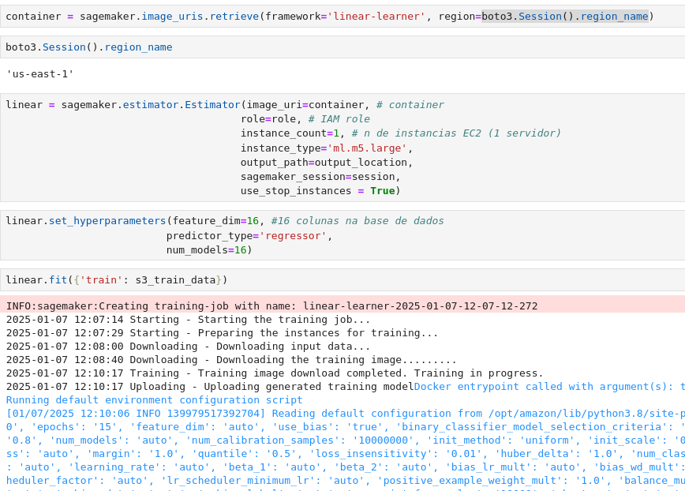

        2025-01-07 12:10:30 Completed - Training job completed 
        Training seconds: 150 
        Billable seconds: 150

        Criação de um modelo de `Deploy ` que pode ser utilizado para realização de previsões.

        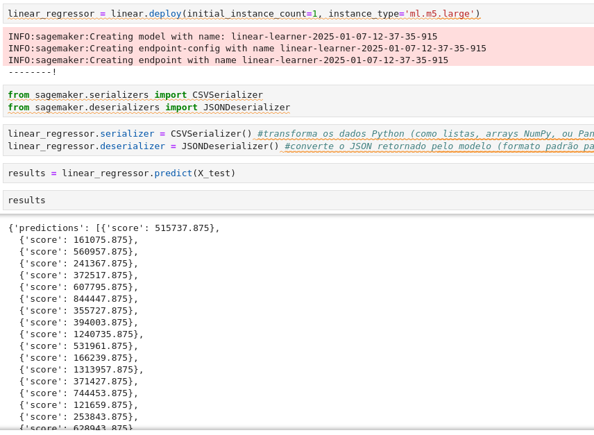

        Avaliação do modelo preditivo através das métricas Esse trecho de código está avaliando a qualidade de um modelo preditivo utilizando as métricas **MAE (Mean Absolute Error)** e **MSE (Mean Squared Error)**.

        Essas métricas ajudam a avaliar o desempenho do modelo preditivo, indicando quão próximas estão as previsões (previsions) dos valores reais (y_test).

        - **MAE:** Indica o erro médio absoluto, fácil de interpretar.
        - **MSE:** Penaliza mais os erros grandes, destacando previsões discrepantes.
    
        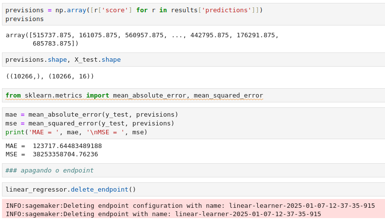

    - **XGBoost:** O `Extreme Gradient Boosting` é uma biblioteca de aprendizado de máquina baseada no algoritmo de `gradient boosting`, amplamente utilizada por sua eficiência, flexibilidade e alto desempenho.

        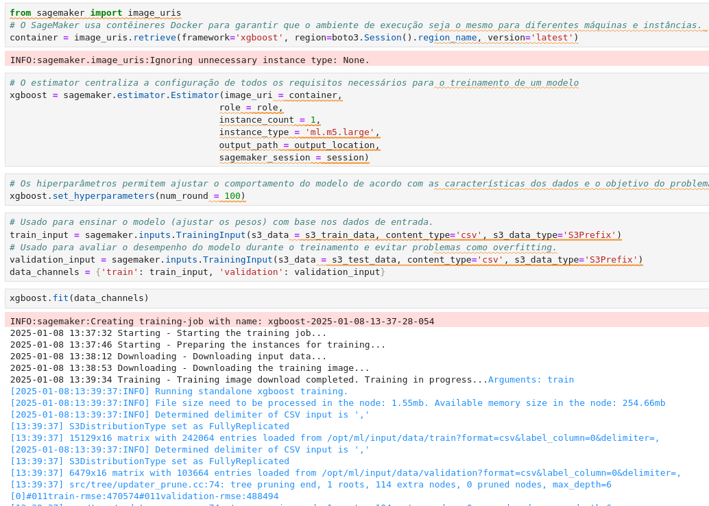

        2025-01-08 13:39:57 Uploading - Uploading generated training model 
        2025-01-08 13:39:57 Completed - Training job completed 
        Training seconds: 105 
        Billable seconds: 105

        É interessante observar que o `RMSE(Root Mean Squared Error)` diminuiu consistentemente ao longo das iterações, tanto para os dados de treinamento quanto de validação, o que mostra que **o modelo está aprendendo adequadamente**.

        - **Deploy e previsões utilizando o XGBoost**

        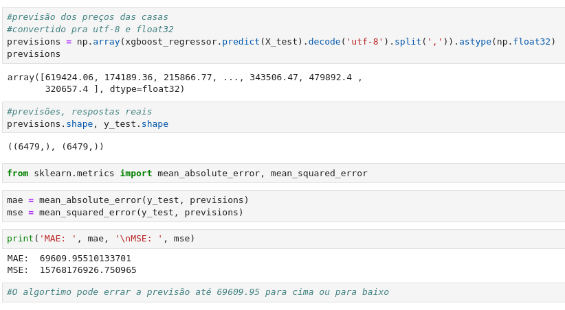

        - **Tuning:** processo de encontrar os melhores valores para os hiperparâmetros de um modelo de Machine Learning (ML), a fim de melhorar sua performance em um determinado conjunto de dados.

            Tendo como objetivo final a métrica `RMSE(Root Mean Squared Error)`, obtive os seguintes resultados:

            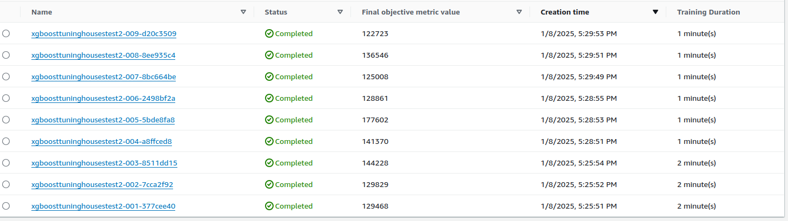 

            Best Training Job:

            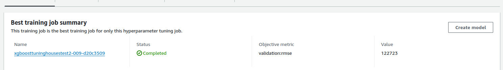

            Hyperparameters:

            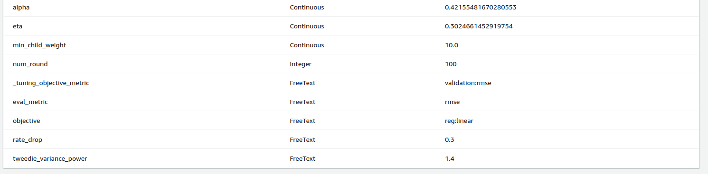

- **Seção 04: Classificação com Linear Learner e XGBoost**  O **XGBoost (Extreme Gradient Boosting)** é uma biblioteca de aprendizado de máquina baseada no algoritmo de `gradient boosting`, amplamente utilizada por sua eficiência, flexibilidade e alto desempenho.

    O XGBoost utiliza o gradient boosting, que combina vários modelos fracos (geralmente `árvores de decisão`) de maneira sequencial e cada árvore é construída para **corrigir os erros das árvores anteriores**, minimizando uma função de perda.

    Nessa seção também somos introduzidos ao conceito de `Regressão Logística`, onde seu objetivo é **prever classes**, diferentemente da regressão que era prever números. Ela é muito utilizada para resolver problemas de classificação binária ou seja, quando o objetivo é prever se algo pertence a uma de duas categorias **(ex.: "sim" ou "não", "verdadeiro" ou "falso", "1" ou "0")**.

    Exemplo de criação e treinamento de um modelo `Linear Learner`

    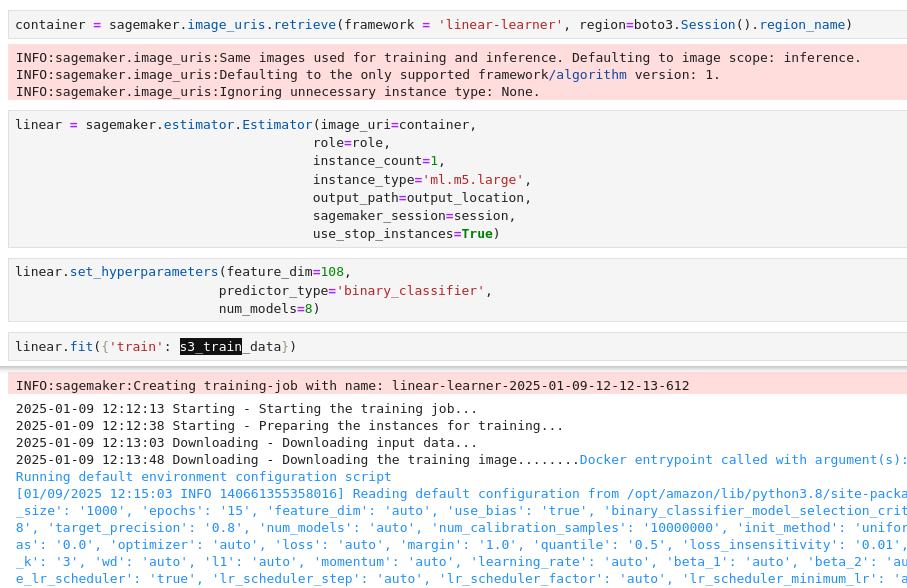

    Após o deploy e realização das previsões, obtive esses valores para as métricas na imagem abaixo, o que eu acredito estar **incorreto**. Isso evidencia que o modelo não foi bem treinado. Porém, para evitar maiores custos, não criei outro endpoint, mas acredito que alterar os hiperparâmetros como o `feature_dim` e `num_models` poderia trazer resultados mais coerentes.

    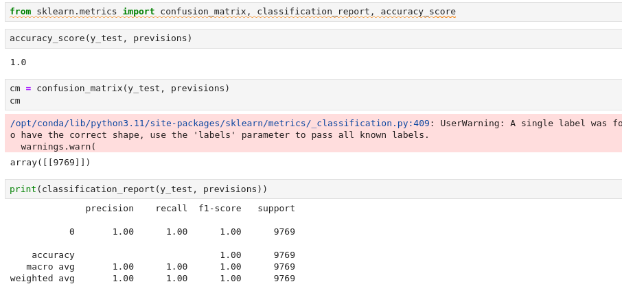

- **Seção 05: Séries temporais com DeepAR**  Séries temporais em ciência de dados, se referem a dados que são registrados com base em intervalos de tempo regulares. A principal característica deles é a **dependência temporal**, pois valores futuros podem ser influenciados por valores passados.

    No curso estudamos séries temporais com o algoritmo `DeepAR` em uma base de dados de vendas de bicicletas em um dado período de tempo. A frequência de tempo trabalhada foi **diária**.

    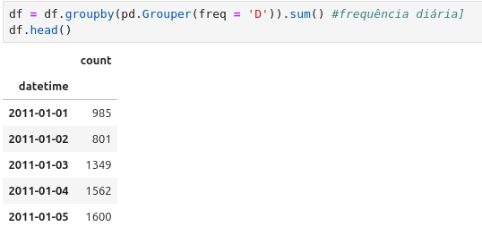

    O DeepAR é um modelo desenvolvido pela Amazon que se destaca em previsões de séries temporais, muito utilizado quando se busca prever valores futuros de maneira precisa.

    Exemplo de treinamento do modelo: 
    Interessante ressaltar a definição de **hiperparâmetros** de forma separada. A visualização da documentação é muito útil para descobrir parâmetros **obrigatórios** e **opcionais**.

    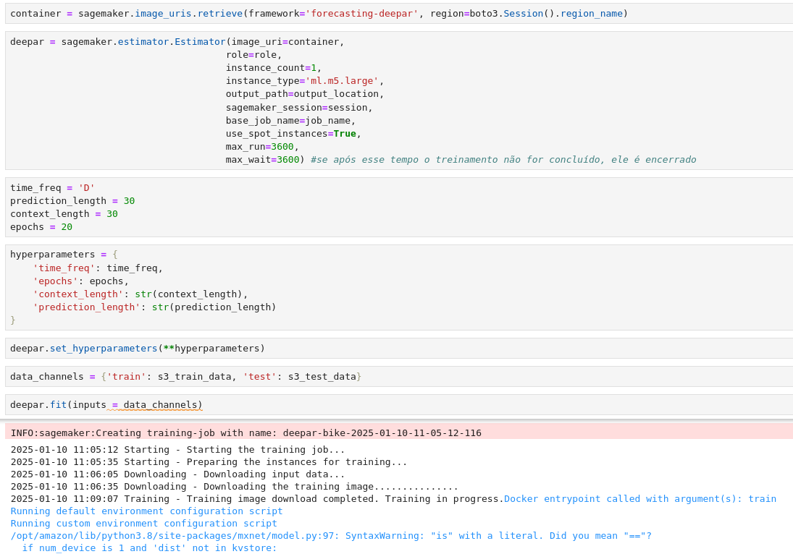

    Exemplo de deploy(criação do **endpoint**):

    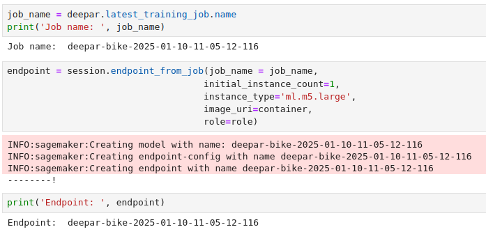

    Resultado gráfico das previsões do DeepAR.  
    
    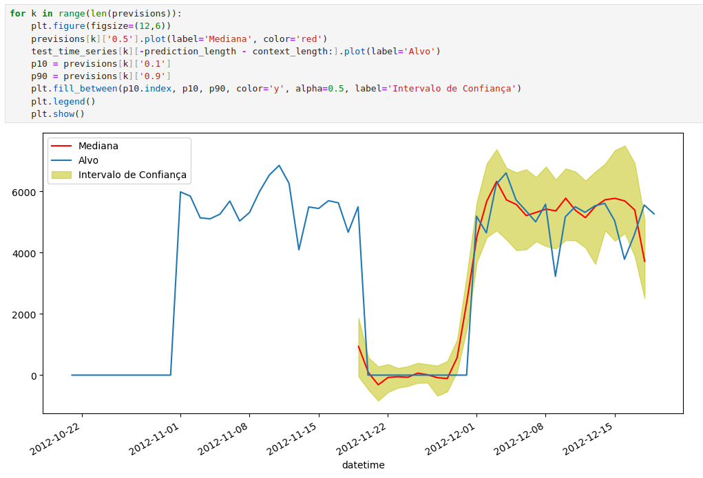
    
    A `mediana`(linha vermelha) é a previsão central do modelo, ou seja, o valor mais provável estimado.

    O `alvo`(linha azul) são os valores reais observados na série temporal, usados para comparar com as previsões.

    O `intervalo de confiança`(área amarela) evidencia  a incerteza das previsões, delimitada pelos percentis 10 e 90 definidos.

    É possível observar, pela aproximação da linha vermelha à azul, que o modelo **prevê bem os valores futuros**.

- **Seção 06: Outliers com Random Cut Forest**  Os Outliers como já sabemos são valores fora do padrão, ou muito discrepantes dos demais da base de dados.
    
    O `Random Cut Forest` é muito utilizado para a detecção de outliers em dados de alta dimensionalidade ou séries temporais(como visto na seção anterior). O **RCF** baseia-se na construção de florestas de árvores que particionam os dados de forma aleatória sempre avaliando o quão **fora do normal** cada ponto é em **relação ao conjunto de dados** e fazendo sua detecção. 
    
    Ele associa um `anomaly score` para cada um dos registros. Valores baixos indicam registros normal, valores altos indicam anomalia no registro. Por esse motivo, o RCF é tão eficaz para a detecção de outliers.

    

    Detalhes do treinamento: 
    2025-01-10 14:19:13 Training - Training image download completed. Training in progress. 
    2025-01-10 14:19:13 Uploading - Uploading generated training model 
    2025-01-10 14:19:25 Completed - Training job completed 
    Training seconds: 140 
    Billable seconds: 53 
    Managed Spot Training savings: 62.1% 

    Interessante notar que o parâmetro `use_spot_instances = True` salvou 62.1% de custos.

    Através da documentação do RCF, foi possível saber que os scores que possuírem valores **acima de 3 desvios padrões com base na média** são considerados valores anormais. Através dessa informação, foi possível fazer esse calculo e obter um dataframe com os outliers.

    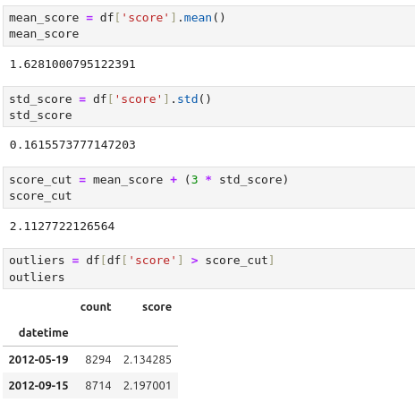

- **Seção 07: PCA e agrupamento K-means**  `PCA` é um algoritmo que tem como objetivo **reduzir a dimensionalidade** enquanto preserva a maior quantidade possível de variabilidade (informação) presente no dataset. Quando há muitos atributos com alta correlação em uma base de dados, é um **sinal** que podemos reduzir a sua dimensionalidade, pois muitas colunas estão correlacionadas.

    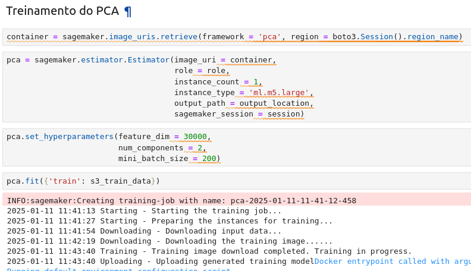

    2025-01-11 11:43:53 Completed - Training job completed 
    Training seconds: 120 
    Billable seconds: 120 

    Deploy:

    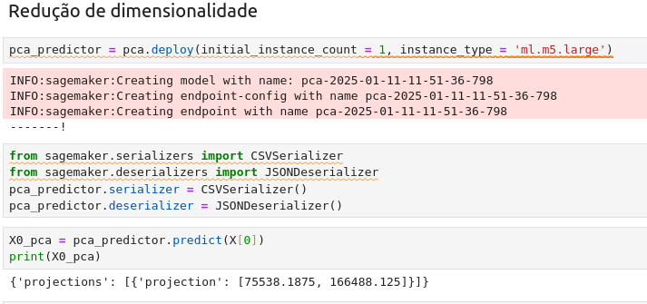

    Redução de dimensionalidade(de 25 para 2 colunas):

    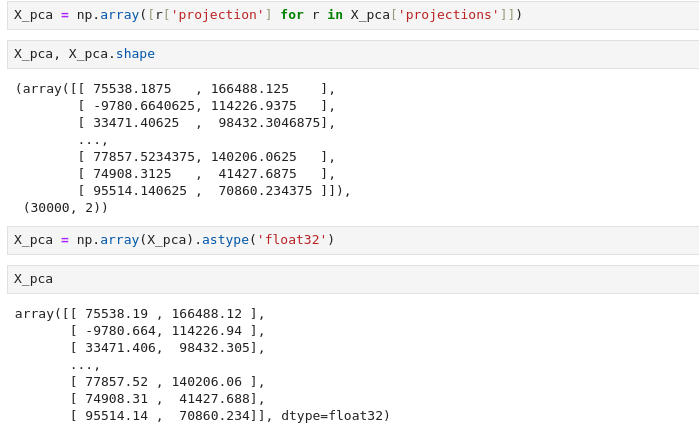

    `K-Means` é um dos algoritmos mais conhecidos para se trabalhar com clusterização. Ele divide os dados em **K clusters**(definido pelo usuário), calculando o centroide(centros de cada cluster) e ajustando até convergir.

    Após encontrar os clusters, a média do cluster é calculada e os **centróides são reposicionados**.

    Treinamento do K-Means:

    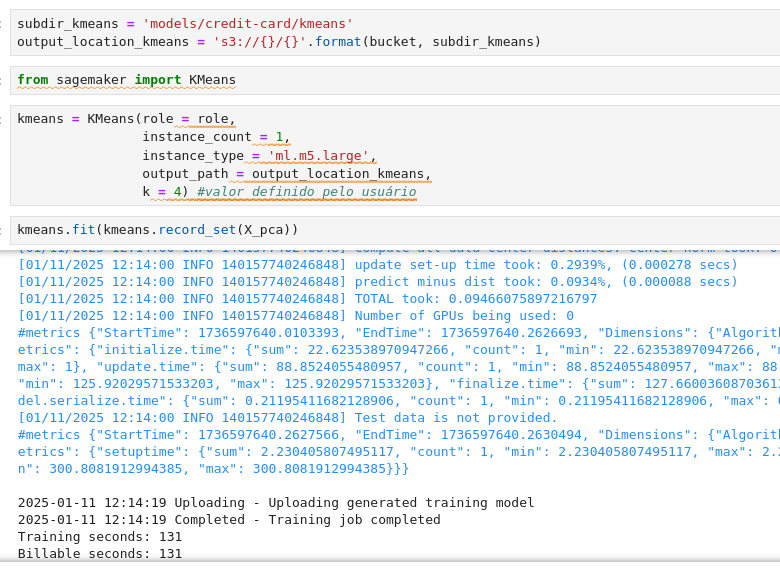

    Scatter Plot para **k = 4**:

    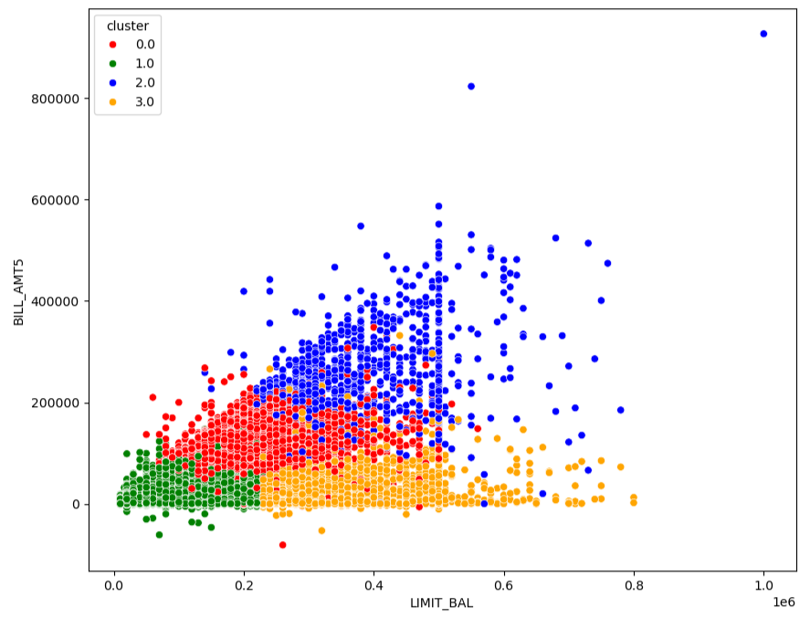

    - Os **pontos verdes** são pessoas que gastam pouco no cartão de crédito e possuem pouco limite;
    - Os **pontos amarelos** são pessoas que possuem um limite maior, mas gastam pouco;
    - Os **pontos vermelhos** são pessoas que ficam na parte central, ou seja, possuem um limite médio de cartão de crédito e também gastam de forma moderada.
    - Os **pontos azuis** são pessoas que possuem um limite alto e gastam muito no cartão de crédito. 

- **Seção 08: Redes neurais artificiais - classificação de imagens**  Na seção 08 vemos como configurar, treinar e realizar deploy de uma rede neural convolucional(cnn) para trabalhar com classificação de imagens.

    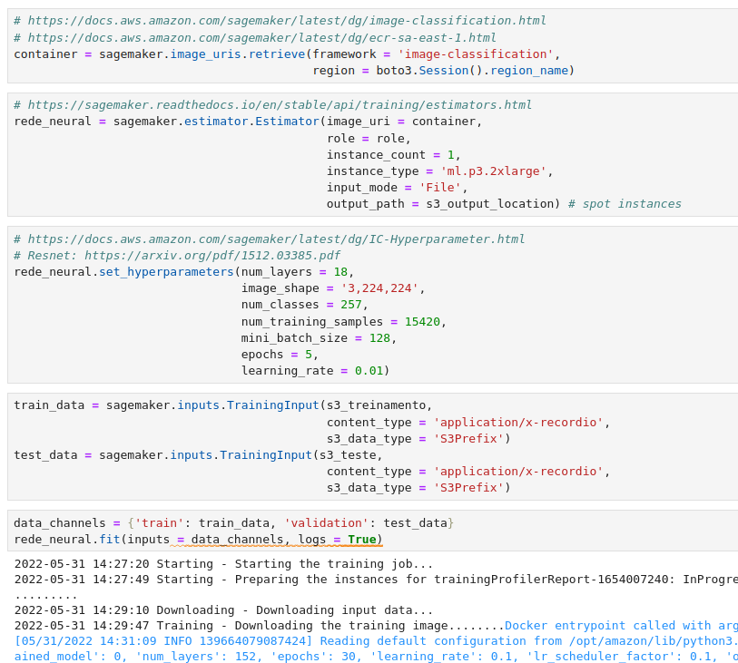

    Foi realizado uma aplicação do modelo treinado em imagens individuais para verificar predições, além de identificar a categoria ou rótulo correspondente à maior probabilidade em uma previsão de classificação, baseando-se no resultado gerado pelo modelo.

    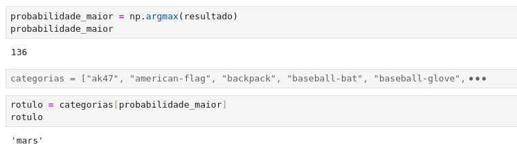

- **Seção 09: Sagemaker com TensorFlow**  Na seção trablha-se com o treinamento e a avaliação de uma rede neural usando a base de dados **MNIST** com o `TensorFlow` e o `Keras`.

    A base MNIST, que contém imagens de dígitos manuscritos **(28x28 pixels)**, é carregada e dividida em dados de treinamento e teste.

    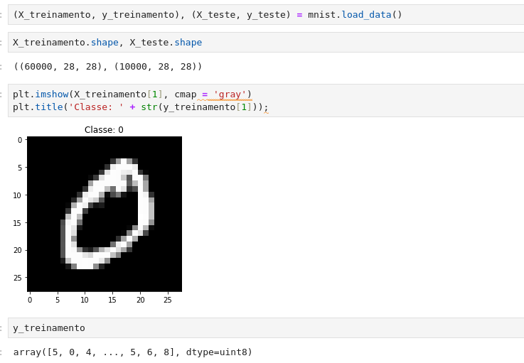

    Em resumo, a seção aborda a criação e treinamento de uma rede neural para classificação de dígitos através da base MNIST. Também é avaliado o desempenho do modelo nos dados de teste para medir sua acurácia e por fim, ele é salvo para reutilização e predições futuras.

    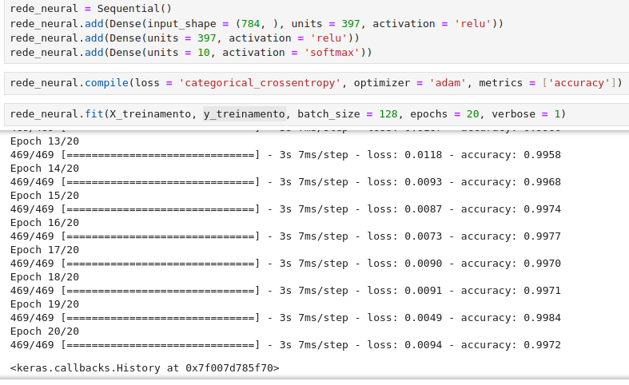

    Resumo da arquitetura da rede neural criada:

    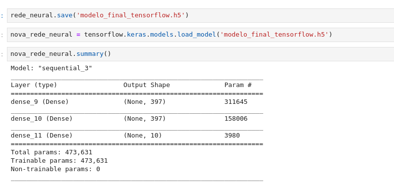

    - `dense_9`: Primeira camada oculta com 397 neurônios e função de ativação ReLU.
    - `dense_10`: Segunda camada oculta com 397 neurônios e função de ativação ReLU.
    - `dense_11`: Camada de saída com 10 neurônios e função de ativação softmax (para classificação multiclasse).

- **Seção 10: Endpoint externo**  Na seção 10 se trabalha com o conceito de **Endpoint externo**, que nesse contexto é uma interface que conecta a aplicação do cliente a um modelo de Machine Learning implantado na nuvem.

    Nessa seção, utiliza-se um endpoint externo para realizar previsões com um modelo treinado e implantado no Amazon SageMaker.

    O modelo treinado usando o algoritmo `XGBoost` é utilizado para fazer previsões.

    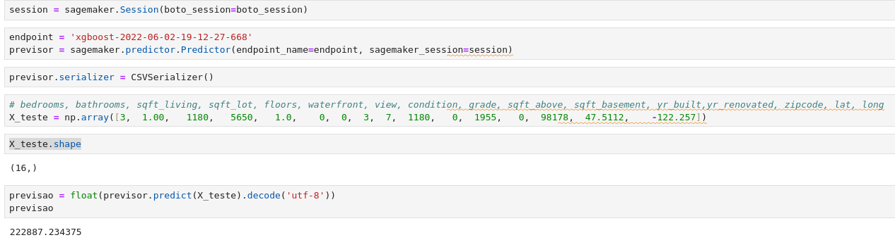

- **Seção 11: Autopilot - aprendizagem automática**  O `SageMaker Autopilot` automatiza o processo de treinamento de modelos de Machine Learning. Ele permite que você envie **dados brutos** e obtenha um **modelo treinado** com base nesses dados, sem a necessidade de conhecimento profundo sobre algoritmos ou engenharia de features.

    O que você precisa fazer é somente configurar o experimento, como o bucket, o dataset, variável alvo, o tipo de problema machine learning, tempo máximo de execução e entre outras configurações que você geralmente realiza, porém sendo preciso 0 linhas de código.   

    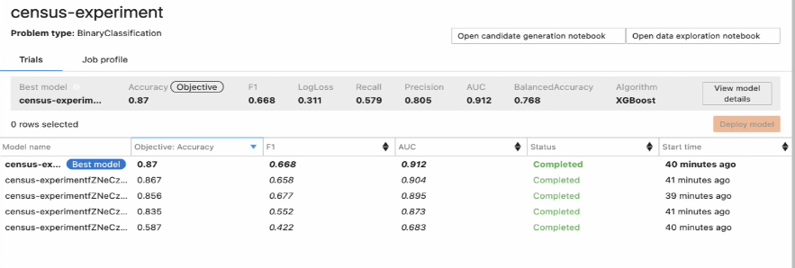

- **Seção 12: Anexo 1: Redes neurais artificiais**  As Redes neurais artificiais(RNAs) são modelos computacionais que tentam replicar o funcionamento do cérebro humano. As RNAs possuem as unidades conectadas chamadas de **neurônios**, a organização em **camadas** que processam dados para resolver problemas complexos como classificação, regressão, detecção de padrões e tomada de decisão.

    Existem vários tipos de redes neurais como a simples, multicamadas e entre outras.

    A rede **Perceptron Simples** é um modelo básicox om uma única camada de saída.

    A rede **Perceptron Multicamadas(MLP)** consiste em várias camadas (entrada, ocultas, saída).

    Durante o treinamento, a rede ajusta os pesos e os vieses para minimizar o erro. O conceito de **backpropagation** é um cálculo do gradiente do erro em relação aos pesos, usando o algoritmo do gradiente descendente.

- **Seção 13: Anexo 2: Redes neurais convolucionais**  As redes neurais convolucionais são projetadas para lidar com dados com grande estrutura de grade. Um ótimo exemplo, são imagens, vídeos, voz entre outros.

    As `CNNs` possuem processos importantes de destacar como o `Pooling(amostragem)`, que tem como objetivo reduzir a **dimensionalidade da entrada**, mantendo as características mais importantes. Ele tem uma função muito importante em diminuir o número de parâmetros e cálculos, ajudando a evitar **overfitting**.

    Outro processo, é o `Flattening`, que é necessário para tratar da saída de uma camada convolucional ou de uma camada de pooling (geralmente em **formato matricial ou tensorial**) é convertida em um **vetor unidimensional**.

- **Seção 14: Anexo 3: Redes neurais recorrentes**  As redes neurais recorrentes são projetadas para lidar com dados **sequenciais e temporais**, como séries temporais, texto, áudio ou vídeo. A principal caracteristica delas é a capacidade de eter informações sobre entradas anteriores ao processar uma nova entrada, permitindo que a rede tenha uma **"memória" de curto prazo**.

    Um fato importante sobre as redes neurais recorrentes, é que durante o treinamento, os gradientes podem se tornar **extremamente pequenos** (desaparecer) ou **extremamente grandes** (explodir), dificultando o aprendizado de dependências temporais de longo prazo.

    AS `LSTMs(Long Short-Term Memory)` são um tipo de RNN que usa células de memória e mecanismos de "portas" para aprender dependências de longo prazo e curto prazo. 

### 🧠 Curso: Machine Learning e Data Science com Python de A a Z

- **Seção 14: Regressão Linear**  A regressão linear é um conceito estatístico que busca realizar a modelagem da relação entre variáveis numéricas, sendo separadas em uma `variável dependente(alvo)` e `variáveis independentes(preditores)`. O principal objetivo é encontrar a **melhor linha reta** que mostre a relação entre essas variáveis e dizer o quão bem a variável dependente pode ser **prevista** pelas variáveis preditoras.

    - **Regressão Linear Simples:** esse tipo de regressão linear relaciona uma variável dependendete a uma única variável independente.

        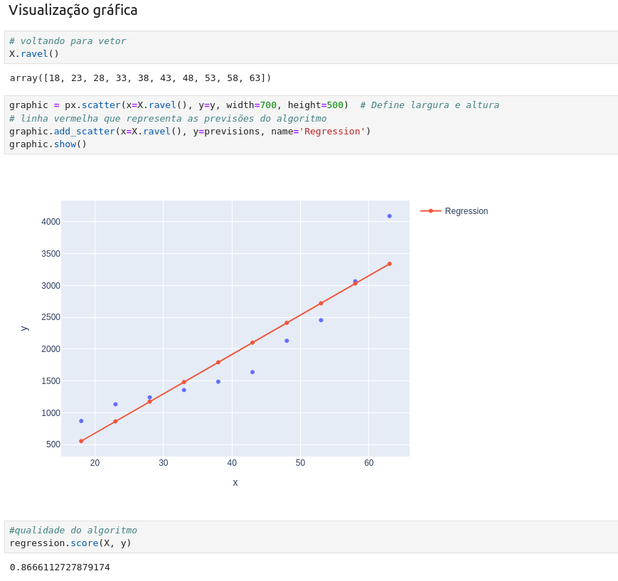

    Prever o custo de um plano de saúde baseado na idade de uma pessoa. O modelo foi criado tendo como variável dependente(y) o `custo` e independente(X) `idade`.

    A linha vermelha representa as previsões realizadas pelo modelo.

    - **Regressão Linear Múltipla:** esse tipo de regressão linear relaciona uma variável dependendete a múltiplas variáveis independentes.

        Selecionando as variáveis independentes e a dependente(`price`). A ideia é prever o preço de uma casa com base em diversas outras variáveis.

        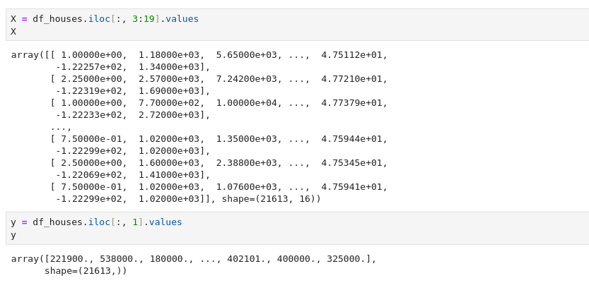

        Previsões e `Mean Absolute Error`

        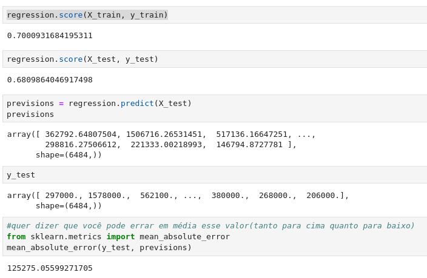

- **Seção 15: Outros tipos de regressão** 

    - **Regressão Polinomial:**  Uma extensão da regressão linear que permite capturar relações **não lineares** entre as variáveis. Útil quando a relação entre as variáveis não é linear e pode ser aproximada por uma **curva**.

        O parâmetro `degree = 4`permite que o modelo se ajuste bem, mas em outros cenários pode gerar overfitting em dados mais ruidosos.

        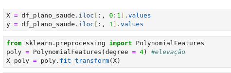

        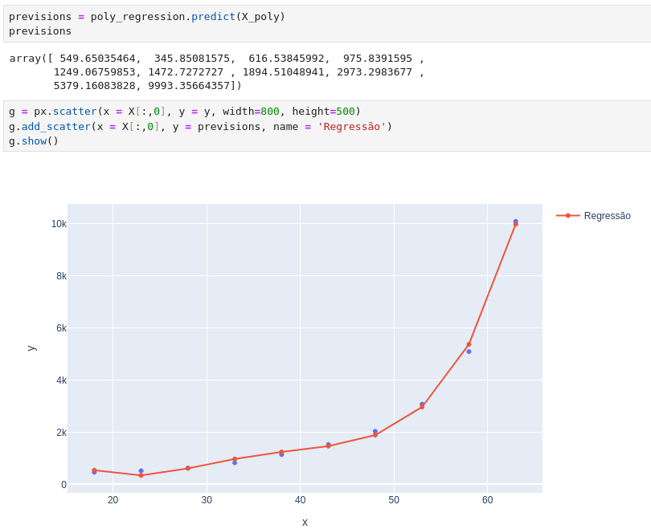

    - **Regressão com Random Forest**  O `Random Forest` faz parte do que se chama `Aprendizado em Conjunto(Ensemble Learning)`, que basicamente significa consultar diversas fontes para se obter um resultado mais preciso e robusto. O Random Forest utiliza de várias `árvores de decisão` para construir um algoritmo mais "forte". Além disso, utiliza a média(regressão) ou votos da maioria(classificação) para se obter uma resposta final.

        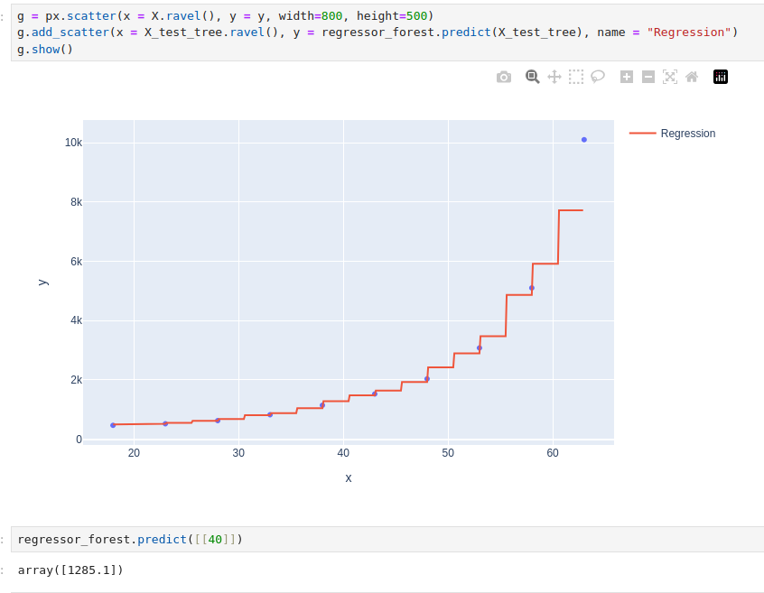

        A linha vermelha, que são os `degraus` passam próximas aos pontos reais, indicando que o modelo conseguiu capturar bem as variações presentes nos dados.

    - **Regressão com Redes Neurais Artificiais**  As RNAs são amplamente utilizadas para resolver problemas complexos, nesse caso, a regressão. Os dados de entrada (X) são escalados para melhorar o desempenho do treinamento, eles percorrem cada camada da rede realizando os cálculos de erros e ajuste de pesos.

        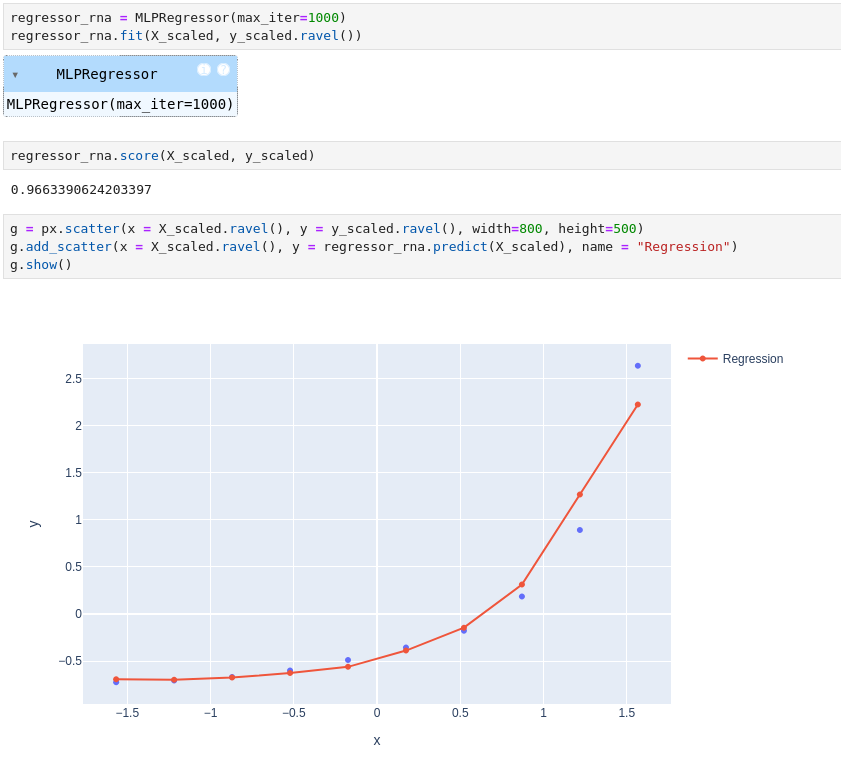

        O modelo parece ter se ajustado bem aos dados reais, dado que a linha vermelha segue o padrão dos pontos azuis.

- **Seção 17: Algoritmo Apriori**  Antes de explicar o algoritmo Apriori, é importante falar sobre as **regras de associação**.

    - **Regras de associação:**  As regras de associação tem como objetivo identificar **padrões e associações** entre conjunto de dados. Com esse conjunto de regras, é possível encontrar relações ocultas entre variáveis que geralmente não são esperadas.

    - É possível obter muitos **insights** que podem ser determinísticos para **tomadas de decisõe**s. Por exemplo, responder as seguintes perguntas:

        - Em que prateleira o biscoito de chocolate deve ser colocado para maximizar suas vendas?

        - Suco de uva costuma ser comprado com refrigerante?

        - Qual produto deve ser colocado em promoção para uma venda casada com tomates?

    - **Apriori:**  O `Apriori` busca encontrar conjuntos frequentes de itens em transações e derivar regras de associação que indicam relações entre os itens.

    - 3 conceitos são fundamentais de saber ao se estudar regras de associação e Apriori:

        `Suporte (Support):` Frequência com que um conjunto de itens aparece nas transações.

        `Confiança (Confidence):` Probabilidade de que, se um item AA é comprado, BB também seja.

        `Lift:` Mede a força da regra. Um valor maior que 1 indica uma associação positiva entre AA e BB.

        No Apriori, apenas os conjuntos de itens que **atendem ao suporte mínimo definido** pelo usuário são mantidos. Além disso, a partir desse conjunto de itens mantidos, o objetivo é descobrir regras de associação com fator de **confiança maior ou igual** ao estabelecido pelo usuário.
    
    - **Utilizando o Apriori:** 
        Transformando o dataframe para uma lista e definindo as regras do **Apriori(Support, Confidence e Lift)**.

        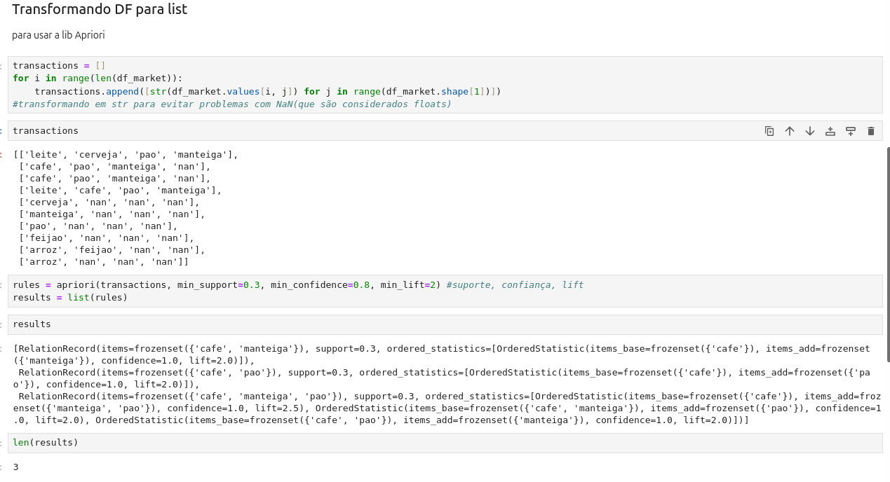

        **Extração das regras** do algoritmo e transformando em um **dataframe**.

        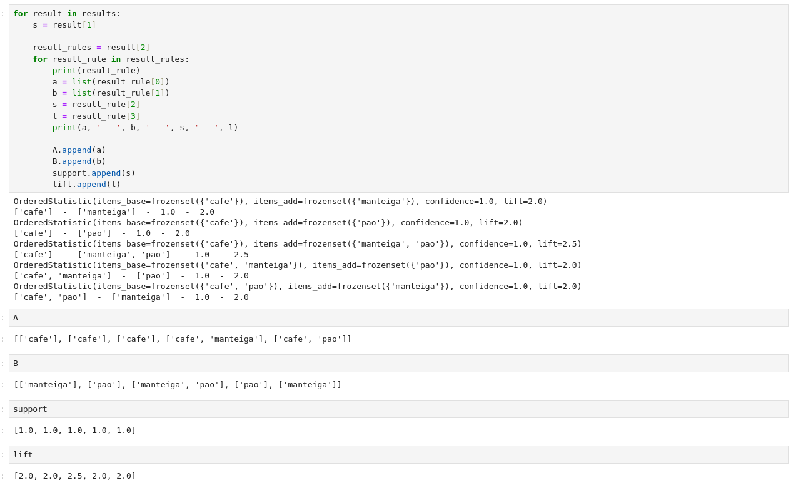

        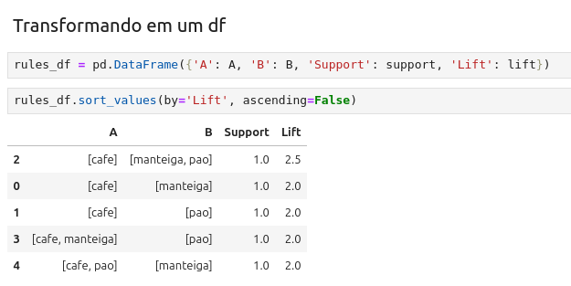

- **Seção 20: Agrupamento com K-Means**  Agrupamento ou `clusterização` é uma técnica muito utilizada em machine learning para identificar grupos (ou `clusters`) de dados que possuem **características semelhantes**. 

    O `K-Means` é um dos algoritmos mais conhecidos para se trabalhar com clusterização. Ele divide os dados em **K clusters**(definido pelo usuário), calculando o `centroide`(centros de cada cluster) e ajustando até convergir.

    Após encontrar os clusters, a média do cluster é calculada e os centróides são reposicionados.

    - **Utilizando o K-means:**  Utilizando uma pequena base que representa idades e salários, apliquei o algoritmo `K-means` para entender como seriam dividido **3 clusters**. A imagem mostra que foram criados 3 clusters com a média das idades sendo o centróide e a média dos salários recebidos.

        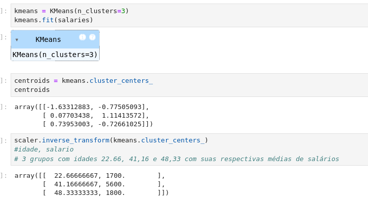

        Os pontos maiores azuis são os centróides dos clusters.

        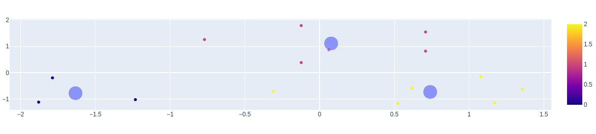

        Utilizando bases de dados randômicas foi possível plotar um gráfico que permitiu visualizar muito claramente a **separação de dados em cada cluster e os seus centróides**.

       

- **Seção 21: Outros algoritmos de agrupamento**  Nesta seção aprendemos sobre o agrupamento hierárquico, que basicamente tem como objetivo estabelecer uma **hierarquia de de agrupamentos**, onde é criada uma estrutura em forma de árvore que indica o número de clusters

    O `dendrograma`(árvore de clusters) exibe os grupos formados pelo agrupamento hierárquico em cada passo e em seus níveis de similaridade.

    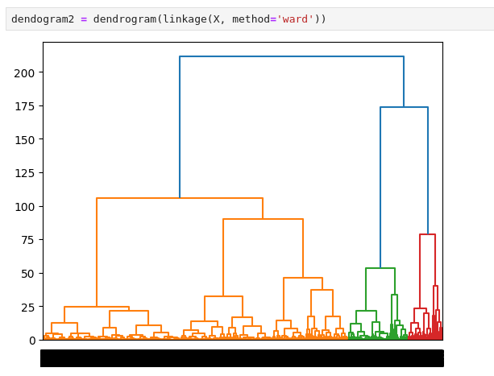

    Scatter Plot que evidencia os clusters aglomerativos criados em cima de uma base de cartão de crédito, onde o Eixo X representa o limite disponibilizado no cartão de crédito, e o Eixo Y o total gasto pelo cliente(Os dados estão normalizados).

    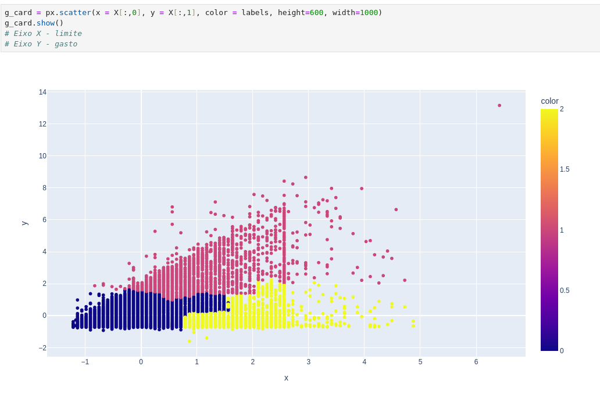

    - **Clientes conservadores (amarelo):** Baixo gasto apesar do alto limite disponível.
    - **Clientes equilibrados (rosa):** Usam uma parte significativa de seus limites de forma consistente.
    - **Clientes dependentes (azul):** Altos gastos em relação a limites baixos.

    - **DBSCAN:**  DBSCAN é um algoritmo de agrupamento baseado em densidade, agrupando pontos similares no mesmo espaço, **não sendo necessário descobrir e especificar o número de clusters**.

    Ele é mais rápido e geralmente apresenta melhores resultados do que o K-Means, encontrando padrões não lineares e sendo mais robusto contra outliers.

    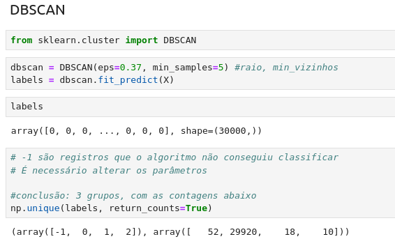

    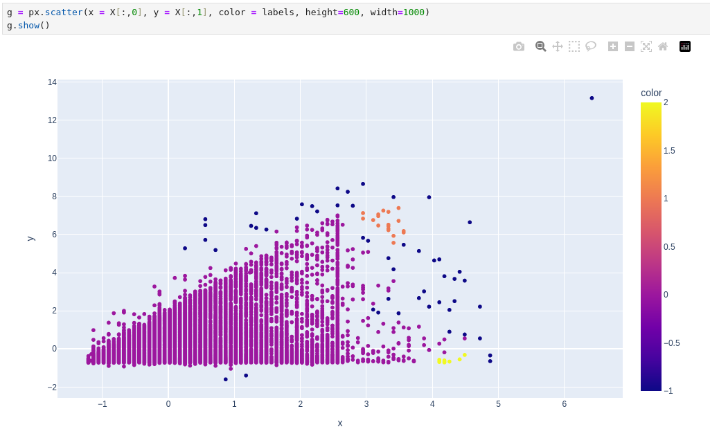

- **Seção 27: Seleção de atributos**  A seleção de atributos é muito importante para a clusterização e machine learnnig no geral, pois o seu objetivo é **identificar os atributos mais relevantes** que influenciam os padrões ou comportamentos dos dados, reduzindo a dimensionalidade e melhorando a interpretabilidade.

    Considerando uma análise onde queremos prever o salário de uma pessoa, vamos selecionar somente os atributos com o `threshold mínimo de 0.05` e utilizar o algortimo de `Low Variance` em cima disso.

    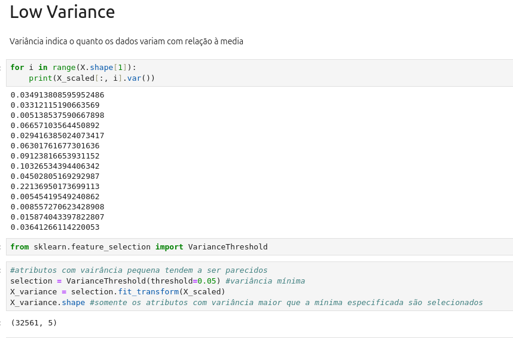

    Criação de um dataframe com somente os índices selecionados, eles vão auxiliar nossa análise.

    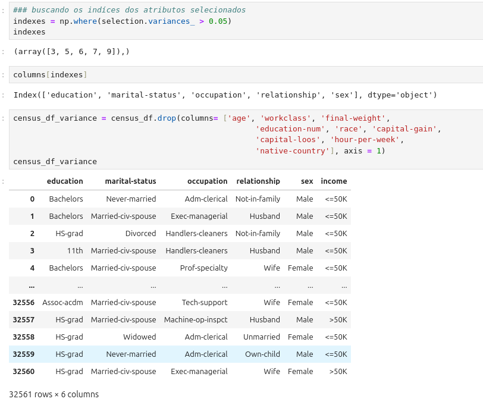

    Depois de realizar alguns processos, obtivemos esse modelo com **atributos selecionados** e **dimensionalidade reduzida**.

    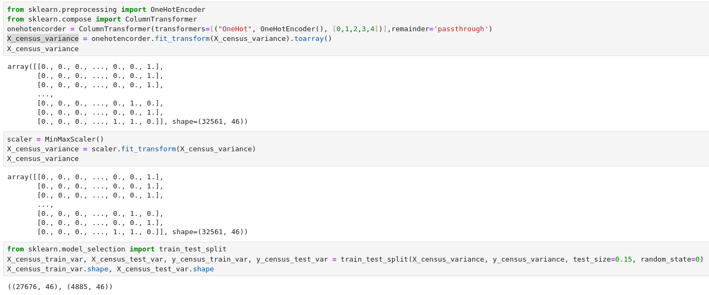

- **Seção 28: Redução de dimensionalidade**  A **redução de dimensionalidade** é uma técnica de análise de dados e estatística para reduzir o número de variáveis aleatórias que serão inseridas em um modelo para treino, mantendo as suas **características essenciais**.

    A redução de dimensionalidade pode ser útil para: 

    - Melhorar o desempenho, a precisão e a interpretabilidade dos modelos
    - Economizar tempo e espaço
    - Eliminar redundâncias
    - Melhorar a eficiência dos algoritmos de aprendizado de máquina

    Um dos algortimos mais utilizados é o `PCA(Principal Component Analysis)`. Ele transforma os atributos originais em componentes principais, que são combinações lineares das variáveis.

    Na imagem abaixo é possível observar que o algoritmo fez uma combinação de atributos, e o que eram 14, viraram 6 atributos, reduzindo a dimensionalidade.

    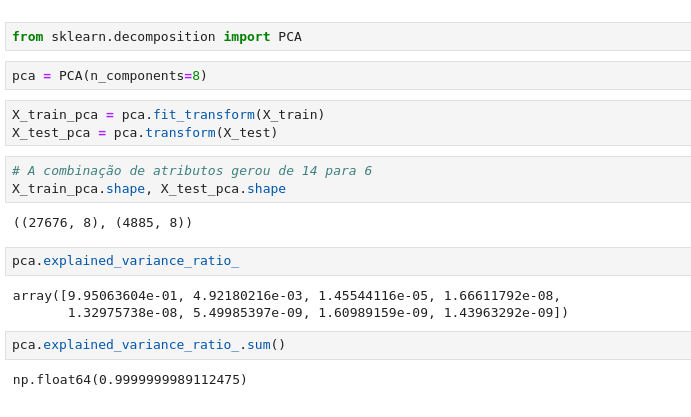

    O modelo teve uma acurácia muito boa.

    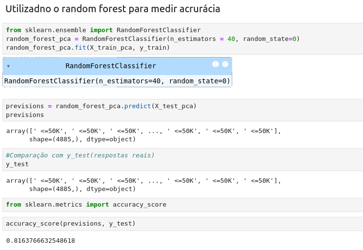

- **Seção 29: Detecção de Outliers**  Um `Outlier` é um valor anormal, ou seja, fora do padrão(afastados da média). Esse valor anormal pode ser decorrente do acaso, **erro no preenchimento dos dados ou fraudes**, sendo necessário tratá-los seja **removendo o registro**, o que pode influenciar negativamente na base de dados, **substituí-lo por outro valor**, ou **não fazer nada**.

    Na imagem abaixo é possível visualizar os outliers(pontos) que representam valores anormais relacionados a idades em um dataframe, provavelmente decorrente de erros de digitação ou de cálculo.

    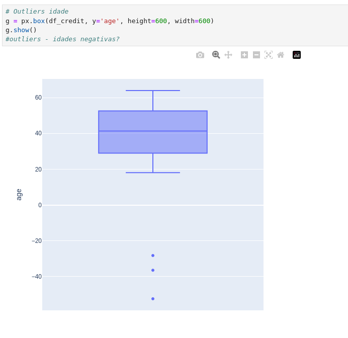

    Scatter plot que mostra a relação entre a idade e a pontuação de uma pessoa.

    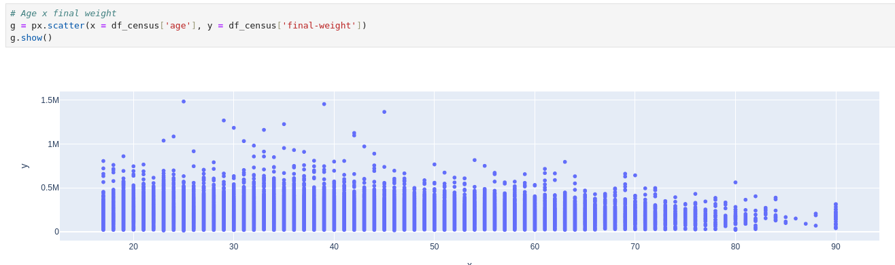

# 👨🏼‍🎓 Certificados

- Certificado do Curso **Machine Learning com Amazon AWS e SageMaker**

    