<h1 align="center">
    <strong>SPRINT 05</strong>
</h1>

# 🔗 Vídeo - [Desafio Sprint 05](https://compasso-my.sharepoint.com/:v:/r/personal/matheus_azevedo_pb_compasso_com_br/Documents/Sprint5_Video_Desafio_MatheusAzevedo.mp4?csf=1&web=1&nav=eyJyZWZlcnJhbEluZm8iOnsicmVmZXJyYWxBcHAiOiJPbmVEcml2ZUZvckJ1c2luZXNzIiwicmVmZXJyYWxBcHBQbGF0Zm9ybSI6IldlYiIsInJlZmVycmFsTW9kZSI6InZpZXciLCJyZWZlcnJhbFZpZXciOiJNeUZpbGVzTGlua0NvcHkifX0&e=NJi4DL)

# 📌 Projeto 2 

[Clique aqui para visualizar o código do projeto](project2.ipynb)

## 📜 Introdução

O objetivo do desafio proposto é através do dataset *Used Cars Dataset*, criar um modelo de **Machine Learning** responsável por **prever o preço de carros**.

Desenvolver esse projeto foi uma excelente forma de exercer na prática, com um **dataset real**, os aprendizados obtidos em todas as sprints anteriores. Principalmente, trabalhar conceitos **essenciais em um projeto de machine learning** como a análise exploratória, pré-processamento dos dados, transformação de variáveis, treinamento e avaliação de modelos e tuning de hiperparâmetros.

## 🔎 Análise Exploratória de Dados

A análise exploratória é parte essencial de um projeto de análise/ciência de dados, pois é muito importante que você **conheça os dados que estão sendo trabalhados**. Isso inclui saber quais variáveis são categóricas e quais são numéricas, valores faltantes, duplicatas e obter insights gerais sobre as variáveis e características do dataset.

Minha escolha foi gerar uma **amostra simples**, na imagem abaixo isso é exibido, assim como a reprodutibilidade dela através do **np.random.seed**, que garante que trabalhemos sempre com a mesma amostra.

### Geração da amostra aleatória

O dataset trabalhado no desafio é uma base real de dados de carros usados de um grande website da internet possuindo um número muito grande de registros. Portanto, algo requerido para auxiliar na manipulação do dataset e no treinamento do modelo foi a **criação de uma amostra aleatória reprodutível de 25% do conjunto de dados**, o que já é mais que suficiente para desenvolver uma boa análise.

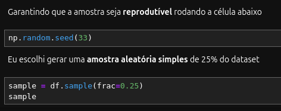

### Fabricantes mais presentes no site

Com a variável *manufacturer* foi possível visualizar e entender **quais são os fabricantes de carros que mais estão presentes no dataset, ou seja, no site**. É interessante analisar as variáveis pois esse entendimento pode levar a outras análise dentro de cada fabricante do dataset.

### Distribuição dos anos de fabricação

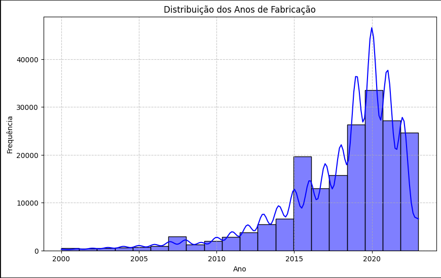

Após um tratamento de outliers da variável *year* onde eu limitei os anos de fabricação dos carros de **2000 à 2023**, eu obtive o gráfico acima. Ele não indica uma distribuição normal, mas evidencia a tendência de subida em 2017 e um pico de fabricação de carros no ano de 2020.

### Distribuição de preços

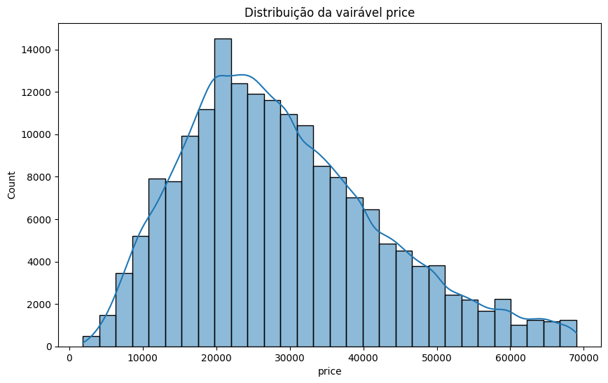

Após a remoção de outliers, o plot do histograma evidenciou que a distribuição da variável *price* ficou bem melhor, apesar de não ser normal. Ele mostra que mesmo após a remoção de outliers, há valores de price que são maiores, mas em menor quantidade. Além disso, o pico mais alto no histograma está em torno de 20.000, o que indica que existe uma **maior quantidade de carros com esse valor** na sample.

## 🤖 Construção e Treinamento do Modelo

Após todo o processo de limpeza, pré-processamento e transformação, era necessário descobrir estatisticamente quais são as **variáveis mais importantes para o treinamento de modelos**. Para isso, rodei um **RandomForestRegressor** com todas as variáveis para descobrir quais são mais importantes.

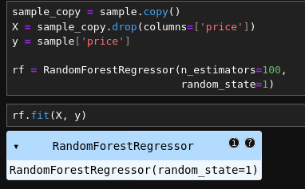

Com os resultados desse modelo treinado, fiz algumas transformações e obtive esse gráfico que exibe as **variáveis mais importantes de acordo com o RandomForest**.

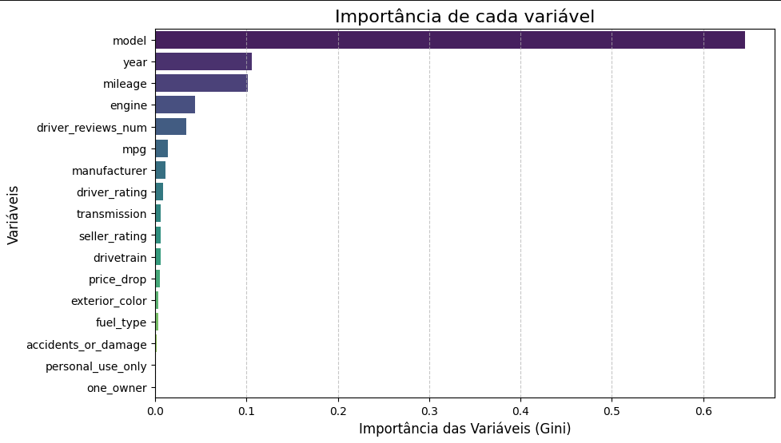

### Treinamento

Foram realizados testes com 2 algoritmos diferentes, o **RandomForestRegressor**, um algoritmo que cira múltiplas árvores de decisão e o **LightGBM**, um algoritmo de Gradient Boosting muito eficiente para grandes bases de dados. 

Treinei 3 modelos para cada abordagem, um sem usar **nenhum tipo de normalização de dados**, outro utilizando o **StandardScaler** e outro utilzando o **Min-Max Scaler**. Foi interessante observar que, como os algoritmos são baseados em árvores e eles são **invariantes à transformação de dados**, os modelos que tiveram os dados escalados tiveram piores métricas, portanto, não utilizei nenhum tipo de normalização.

### Random Forest

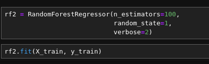

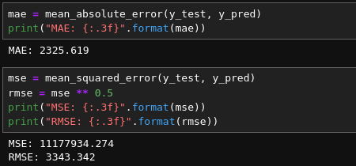

### LightGBM

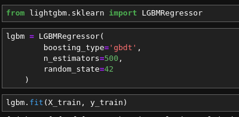

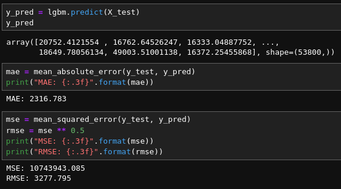

### Tuning

Para melhorar essas métricas, um bom caminho seria fazer o **Tuning de hiperparâmetros** para os modelos testados, e ele foi realizado com a ferramenta **Optuna**, onde você define uma função **objective** para sugerir uma margem de valores para os hiperparâmetros definidos e retornar o **MAE** dos treinos realizados. Após isso, um **study** é criado e orientado a minimizar a métrica e o **optimze** roda o Tuning com a quantidade de vezes definidas pelo **n_trials**.

Depois de rodar o Tuning, com o *.best_params* você consegue visualizar a **melhor combinação de parâmetros** encontrada por algoritmo.

## Random Forest

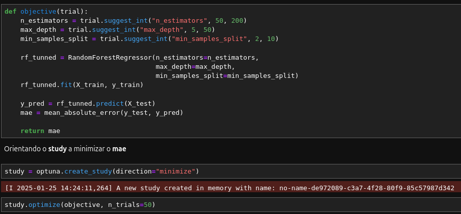

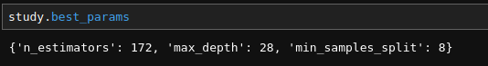

## LightGBM

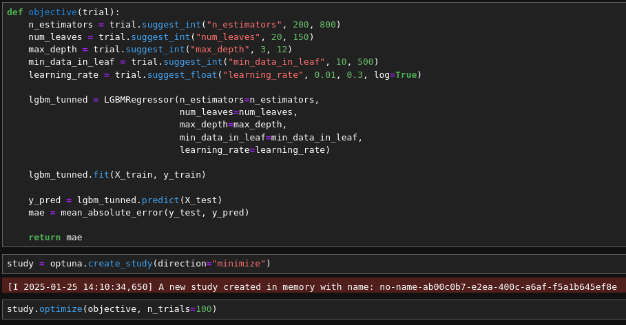

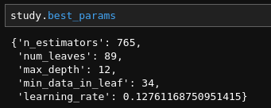

## 📝 Avaliação do Modelo e Métricas

Para avaliar os modelos de regressão, eu utilizei as métricas **Mean Absolute Error(MAE)** e **Root Mean Squared Error(RMSE)**.

- O **MSE** representa os valores erro absoluto médio entre as previsões e os valores reais.

- O **RMSE** leva em consideração o quadrado dos erros, penalizando erros maiores de forma mais severa.

Após a realização do Tuning, os modelos foram treinados com os melhores hiperparâmetros, e o que teve as melhores métricas foi o **LightGBM**.

### LightGBM

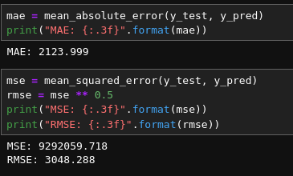

### Random Forest

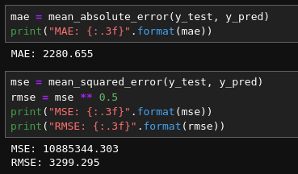

## 🧠 Conclusão

Avaliando as métricas, é perceptível que o **LightGBM** teve um resultado **melhor** do que o **RandomForest**, tanto para **MAE**, quanto para **RMSE**, principalmente após o Tuning de hiperparâmetros. Porém, não necessariamente a performance do modelo é boa. Como dito anteriormente, para valores mais altos de price a diferença que pode existir na previsão de valores pode não ser tão impactante porém, para previsões de carros mais baratos, a diferença pode ser mais impactante e influenciar mais na previsão.