<h1 align="center">
    <strong>SPRINT 06</strong>
</h1>

# 🔗 Vídeo - [Desafio Sprint 06](https://compasso-my.sharepoint.com/:v:/r/personal/matheus_azevedo_pb_compasso_com_br/Documents/Sprint6_Video_Desafio_MatheusAzevedo.mp4?csf=1&web=1&e=m1w56h)

# 📝 Exercícios

### 🧠 Curso: Formação Processamento de Linguagem Natural, LLMs e Gen AI

- Diretório com os notebooks trabalhados: [Clique aqui](./exercicios/curso_formacao_processamento_nlp/)

### 🧠 Curso: Face Recognition with Machine Learning + Deploy Flask App

- Diretório com os notebooks trabalhados: [Clique aqui](./exercicios/curso_face_recognition/)

### 🧠 Curso: MLOps: Implantação e Operação de Modelos de Machine Learning

- Diretório com os notebooks trabalhados: [Clique aqui](./exercicios/curso_mlops/)

# 🔎 Evidências

### 🧠 Curso: Formação Processamento de Linguagem Natural, LLMs e Gen AI

- **Seção 2: Fundamentos de Processamento de Linguagem Natural** 
Na seção 2 aprendi sobre conceitos introdutórios que são muito utilizados e importantes para o entendimento de Processamento de Linguagem Natural, como por exemplo:
    - **Corpus:** É um conjunto de texto estrutrado em linguagem natural.
    - **Annotations:** Elementos específicos no texto que dependem do domínio em que se trabalha
    - **Tokenization:** Processo de separar a sentença em suas partes: palavras, pontos, símbolos, stop words, alphanumeric etc.
    - **Parts-of-Speech Tagging (POS):** Adiciona tags a cada token, como por exemplo, se é verbo, substantivo, adjetivo etc.
    - **Stop Words:** São palavras que não são relevantes para o resultado de uma busca, e por isso podem ser removidas do texto. Ou seja, não possuem emoção, não alteram o sentido do texto e não têm valor semântico.

    Para usar um modelo estatístico ou de deep learning em NLP, é necessário transformar o texto em uma informação numérica, mais especificamente um **vetor**. **Word Embeddings** são representações computacionais de texto.

- **Seção 3: NLP com Spacy** 
Na seção 3 trabalhei com o `Spacy`, que é uma biblioteca de Linguagem de Processamento Natural Open-Source que nos permite fazer download de **modelos pré-treinados em português**. Esses modelos permitem que possamos processar e extrair informações relevantes de textos em português de maneira eficiente.

    Nesse módulo trabalhei com **Tokens**, **Pos-Tagging**, **Stop-Words**, **Similaridade**, **Pipelines**, entre outros.

    Os `Tokens` representam a menor unidade de texto que um modelo NLP pode processar. E o processo de **tokenização** consiste em  dividir um texto em palavras, pontuações ou até mesmo subpalavras

    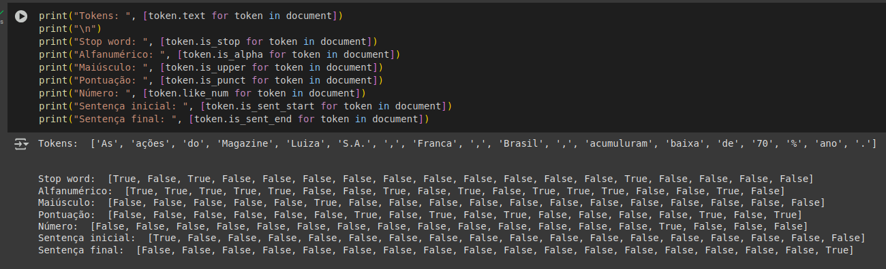

    A `similaridade` mede o quão semelhantes são duas palavras, frases ou documentos. A métrica utilizada é o **cosseno**, um valor entre **0 e 1**, ou seja, quanto mais próximo de 1 mais similaridade, quanto mais próximo de 0 menos similaridade.

    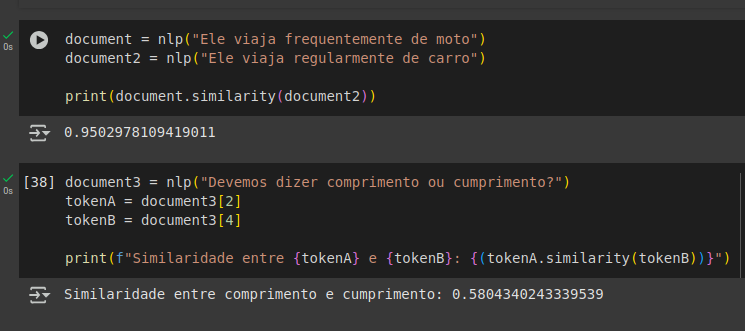

    `Displacy` é um módulo do Spacy para visualização.

    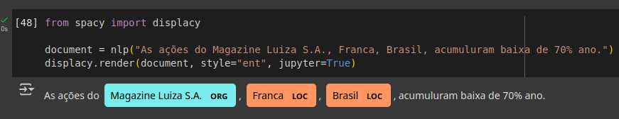

- **Seção 4: NLP com NLTK** 
Na seção 4 vi sobre o `NLTK` que é uma biblioteca Python de Processamento de Linguagem Natural. Ele é similar ao Spacy, porém mais **poderoso** e **versátil**. Além disso, também exige mais configuração manual.

    É necessário a instalação de alguns pacotes para a sua utilização:

    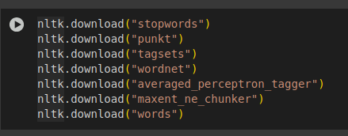

    A biblioteca NLTK realmente tem funcionalidades muito parecidas com a SpaCy. Algumas funcionalidades que eu achei interessantes de se estudar foram a **produção de métricas** e o **Stemming**.

    Uma simples produção de métricas é a contagem de palavras mais comuns em um conjunto de tokens. Isso é feito pelo **nltk.FreqDist** e **most_common**.

    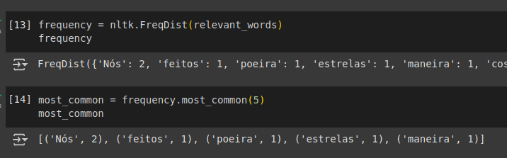

    `Stemming` é o processo de analisar cada palavra reduzi-la à sua raiz(seu **significado**). Uma característica dessa técnica é que ela pode reduzir a palavra a uma outra gramaticalmente **incorreta**, porém ainda com **valor** para nossa análise. 

    Existem 3 tipos de Stemming:
    - Porter: mais comum e mais antigo

        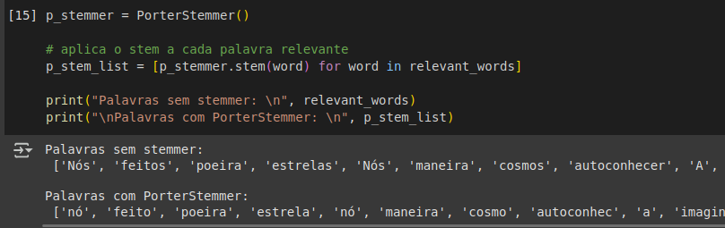

    - Snowball: melhor performance computacional

        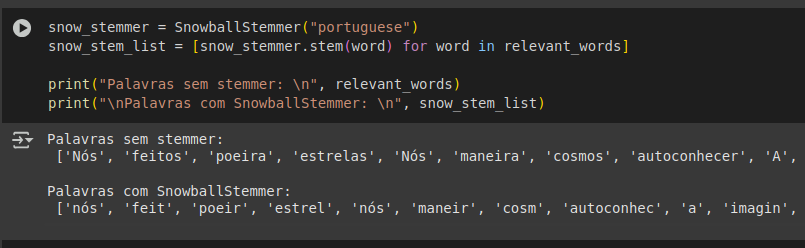

    - Lancaster: mais agressivo. Resultados as vezes não intuitivos

        

- **Seção 6: Machine Learning e Deep Learning para NLP na Prática** 
    
    Nesta seção desenvolvemos o treinamento de uma `Rede Neural`. Foi interessante para relembrar alguns importantes conceitos relacionados, como por exemplo:

    Hiperparâmetros:

    - **loss:** função de perda para avaliação do erro. ex: mean_squared_error
    - **optimizer:** otimizador de ajuste de pesos da rede. stochastic gradient descnet
    - **metrics:** a métrica que a rede vai utilizar para avaliar a performance

    As funções de ativação como **relu** e **sigmoid** que são fundamentais para redes neurais, pois introduzem não-linearidade, permitindo que a rede aprenda padrões complexos.

    Por fim, o **dropout**, que é uma técinca que desativa aleatoriamente neurônios durante o treinamento, a fim de reduzir o overfitting e melhorar a capacidade de aprendizado e generalização da rede. 

    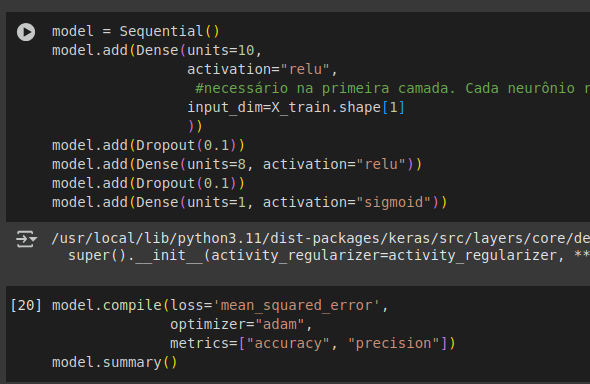

    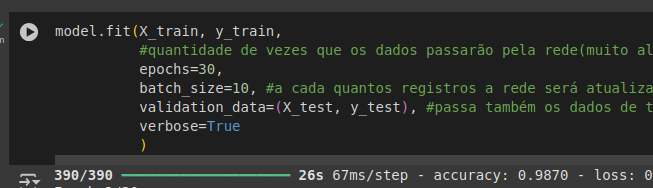

    AS métricas evidenciam uma **ótima performance** do modelo para prever se uma mensagem é spam ou veridica.

    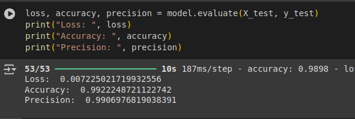

    Foi interessante também colocar em prática o uso de `Embeddings`. Treinar uma rede neural com Embedding na prática é transformar as palavras em vetores densos de baixa dimensão que capturam significado e contexto.

    O uso de Embeddings proporciona as seguintes vantagens:
    - Redução de dimensionalidade, pois cada palavra é um vetor de poucas dimensões
    - A captura do significado semântico da palavra
    - Aprendicado contextual pela rede

    Antes de aplicar embeddings no modelo, é necessário gerar os `Tokens` do texto. Posteriormente, cada token é substituído por um número que representa sua posição no vocabulário, isso pois o embedding requer números inteiros como entrada e as palavras irão receber identificadores únicos. Para finalizar, o `Padding` padroniza o tamanho das sequências.

    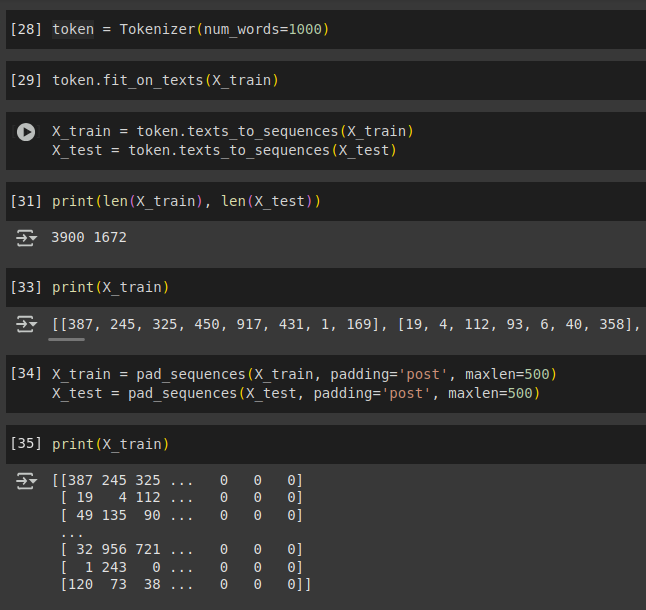

    O modelo com o Embedding:

    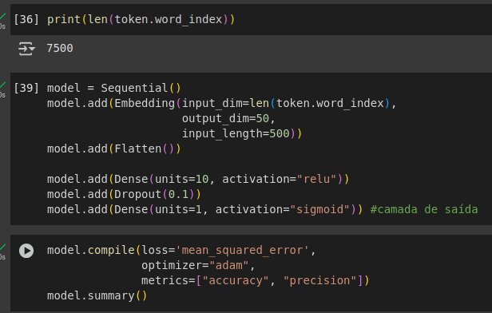

- **Seção 7: Análise de Sentimentos** 
Na seção 7 é trabalhado a área de `Análise de Sentimentos`, muito importante em vários modelos de negócio, geralmente para avaliar a **percepção dos usuários** sobre um produto, monitorar redes sociais, marcas e realizar uma pesquisa de mercado no geral. É interessante ressaltar que o **contexto é muito importante**, pois ocorrências de ironia, sarcasmo e ambiguidade são tarefas desafiadoras ao analisar sentimentos.

    Uma forma de se trabalhar com análise de sentimentos é com o `LSTM`, sigla para `Long Short-Term Memory`, ou seja, memória de curto e longo prazo. É um tipo de rede neural recorrente (RNN) que consegue **memorizar informações por longos períodos de tempo**.

    É interessante destacar o pré-processamento realizado para a utilização do LSTM, os comentários no código já explicam para que cada funcionalidade serve:

    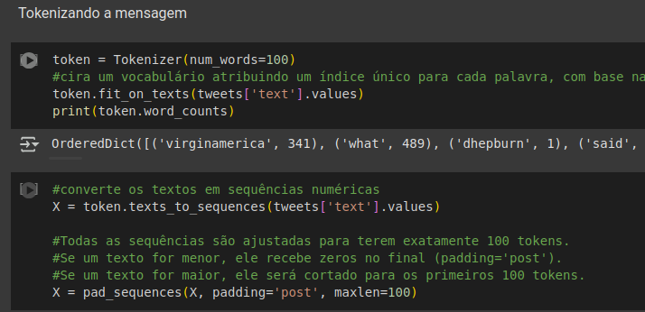

    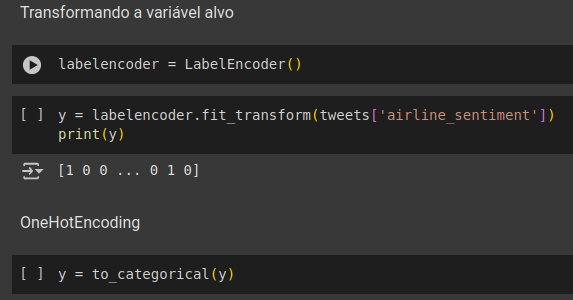

    Outra interessante alternativa, é realizar a análise de sentimentos com o **Vader**.  Vader trabalha com uma análise de sentimentos **baseado em regras**, portanto é interessante saber alguns conceitos:

    - `Compound`: métrica que representa o **sentimento geral** de um texto. É um valor real entre -1 (muitonegativo) e 1 (muito positivo).
    - `Polarity`: Mede o grau de **positividade ou negatividade** de um texto. Valor real entre -1 (muito negativo) e 1 (muito positivo).
    - `Subjectivity`: O quanto a sentença se refere a **opinião**, **julgamento** ou **emoção**. Valor real entre 0 e 1, quando mais próximo de 1, mais subjetivo.

    Exemplos:

    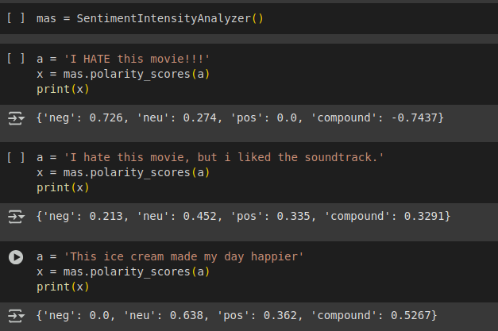 

    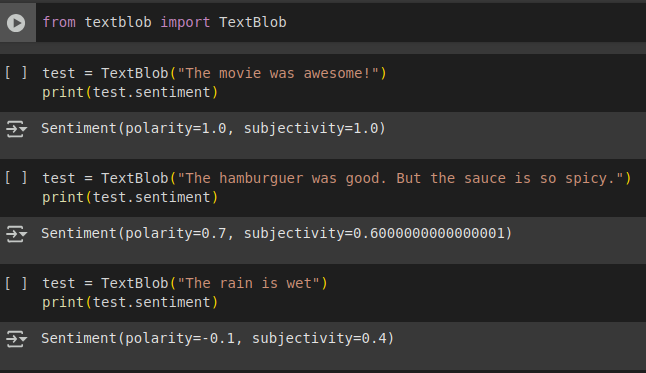 

- **Seção 8: Transformers, GPT (do ChatGPT) e Bert** 
Na seção 8, trabalhei com os `Transformers`, que são um tipo de arquitetura de rede neural baseada em **atenção** que revolucionou o processamento de linguagem natural (NLP). Sua principal funcionalidade é **processar** e **entender** **sequências de texto** de maneira eficiente, usando o mecanismo de atenção para capturar **dependências** entre palavras. Isso permite que ele traduza, gere, resuma e classifique textos com alta precisão.

    As principais características são:
    - `Self-Attention`: tem a função de descobrir a **relação entre as palavras**. O transformer calcula a representação e a relação de cada palavra.
    - `Multi-Attention`: Em vez de um processo Attention, múltiplos processos são processados e o resultado é somado.
    - `Processamento Paralelo`: Diferente de RNNs/LSTMs, os Transformers** não precisam processar palavras em sequência**, tornando-os muito mais rápidos.
    - `Transfer Learning`: Modelos como BERT e GPT podem ser **pré-treinados em grandes quantidades de dados** e depois **ajustados para tarefas específicas**.

    A **arquitetura** do Transformer é dividida em duas partes principais:
    - `Encoder (Codificador)`: Extrai **significado** do texto de entrada.
    - `Decoder (Decodificador)`: Gera a **saída baseada no contexto aprendido** pelo encoder.

    Outro conceito muito importante que é basedo em **transformers** é o `BERT`, um modelo de linguagem capaz de entender o **contexto completo de uma palavra dentro de uma frase**, considerando tanto as palavras da esquerda, quanto da direita.

    O BERT possui várias variantes com diversas caractéricas como serem mais leves, ou mais rápidas ou menores, entre outras.

    Nesta seção utilizei da plataforma colaborativa `HuggingFace` que possui uma gama muito vasta de modelos capazes de lidar com processamento de texto, aúdio e imagem. A plataforma possui uma lib chamada `Transformers`, que possui várias funcionalidades úteis, como por exemplo, o `Pipeline`. 
    
    Um **pipeline** é uma abstração que **encapsula todo o fluxo de entrada e saída para uma tarefa específica de PLN**. Ele cuida de toda a pré-processamento, inferência e pós-processamento, permitindo que você use modelos sem precisar lidar diretamente com as complexidades da arquitetura.

    Exemplo de um pipeline **Q&A(Question Answering)**:

    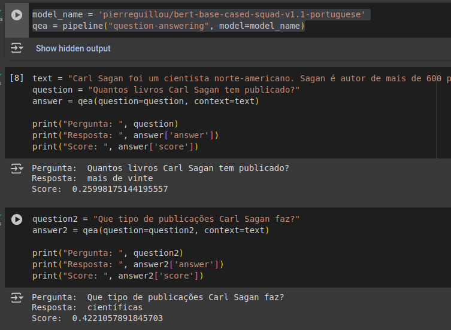

    Outro pipeline interessante é o de **preenchimento de lacunas(Fill Mask)**. Ele dá algumas sugestões de palavras para completar a lacuna com um score para cada uma:

    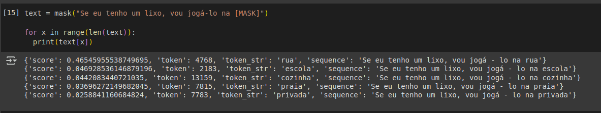

    Essas sugestões de onde jogar o lixo não foram muito boas... 😅

    Outra plataforma trabalhada nessa seção foi a **OpenAI** para utilização do modelo `GPT-3`. Porém, como a OpenAI não fornece mais free trial, não é possível utilizar os modelos GPT.

- **Seção 9: Modelagem de Tópicos com Bert** 
Na seção 9 aprendi sobre **modelagem de tópicos** utilizando o `BERT`, conceituado na seção anterior. A modelagem de tópicos é uma técnica usada para descobrir automaticamente os **temas principais** dentro de um grande conjunto de textos.

    O `BERTopic` é um modelo avançado de modelagem de tópicos que combina **embeddings** de linguagem (como BERT) com algoritmos de clusterização para identificar tópicos de maneira mais precisa.

    Criação do modelo BERTopic:

    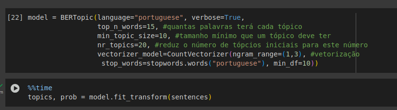

    Tópicos encontrados:

    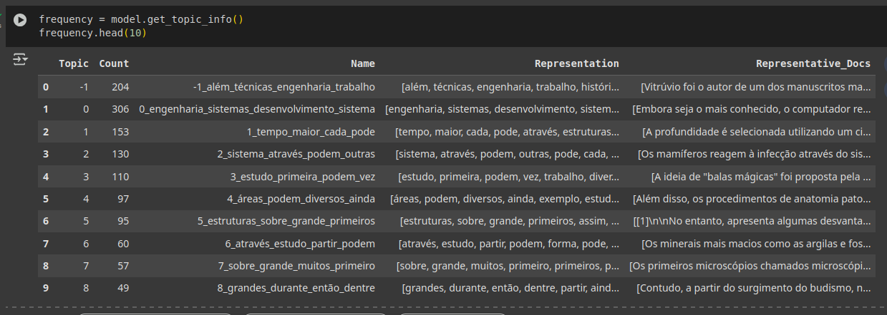

    Visualização dos scores de 6 palavras dos top 8 tópicos:

    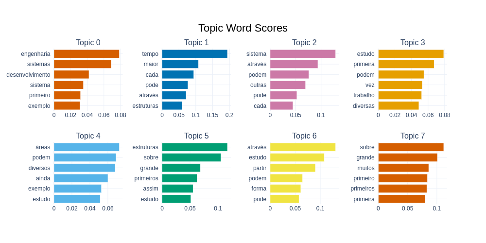 

- **Seção 10: NLP com Spark** 
Na seção 10 trablhei com o `Spark` utilizando um cluster no **Databricks Community**. Databricks é uma plataforma otimizada para utilização de Spark, onde NLP pode ser utilizado usando Deep Learning e embeddings de BERT, RoBERTa, Word2Vec, etc.

    Para estudar um pouco sobre como funcionava NLP dentro do Spark, o professor utilizou a mesma base spam.csv de outras seções.

    Transformação da variável **Category**(semelhante ao labelencoder):

    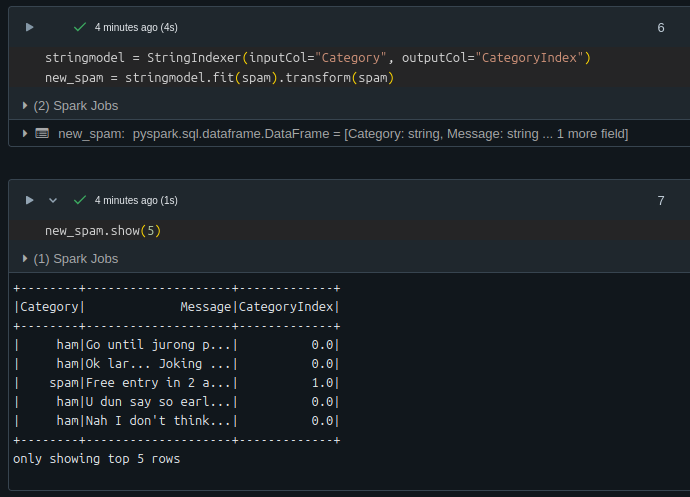

    Tokenização da variável **Message**:

    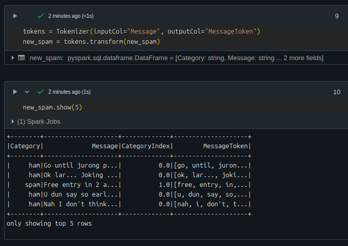

    Utilizando o `Word2Vec` para representar a variável **Message** vetorialmente.

    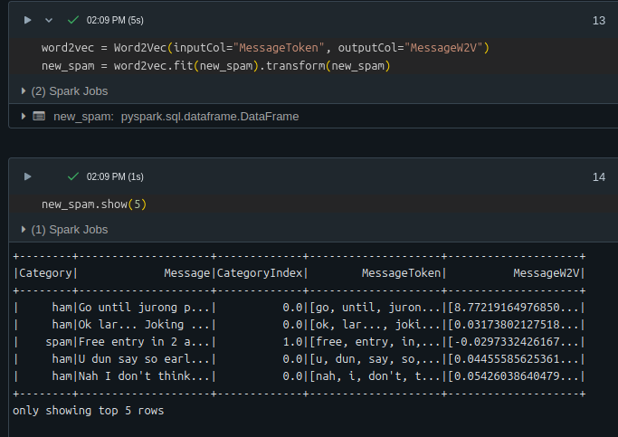

    Após o treinamento do RandomForestClassifier, as previsões foram geradas. É interessante observar que o Spark cria 3 colunas adicionais: **rawPrediction**, **probability** e **prediction**.

    - `rawPrediction`: Soma das probabilidades dos votos de **todas as árvores do Random Forest**. Representa a contagem ponderada dos votos para cada classe.
    - `probability`:  **Normalização** da rawPrediction, convertendo-a em uma distribuição de probabilidades entre 0 e 1 para cada classe.
    - `prediction`: Classe **final prevista**, baseada na classe com maior probabilidade em probability.

    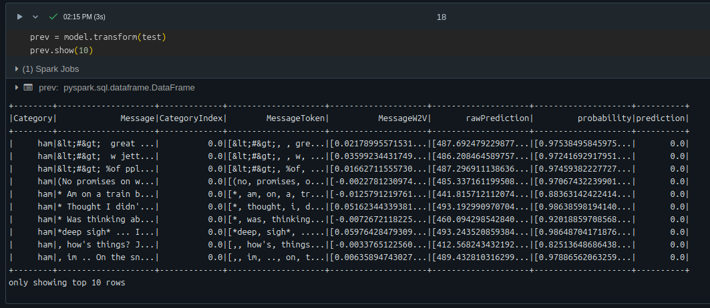

### 🧠 Curso: Face Recognition with Machine Learning + Deploy Flask App

- **Seção 2: Processamento de imagem com OpenCV** 
Na seção 2 aprendi a trabalhar com o `OpenCV`, que basicamente é uma biblioteca voltada para **visão computacional** e **processamento de imagens**.

    É importante entender como uma máquina entende uma imagem.
    Uma imagem digital é representada como uma **matriz de pixels**, onde cada pixel contém informações sobre a **intensidade de cor**. Em imagens **em escala de cinza**:

    - Valores baixos (próximos de 0) representam tons mais escuros (preto).
    - Valores altos (próximos de 255) representam tons mais claros (branco).

    É possível ver isso na prática:

    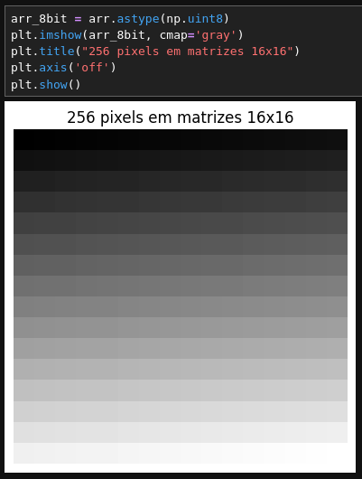

    Em **imagens coloridas**, cada pixel contém três canais conhecidos como **RGB(Red, Green, Blue)**. Porém, o OpenCV lê imagens no formato **BGR (Blue, Green, Red)**. O OpenCV trabalha com a ordem dos canais invertidas por questões históricas e de eficiência, mas como a conversão para RGB é fácil, isso não impacta o processamento de imagens. É possível visualizar a difereça no exemplo abaixo:

    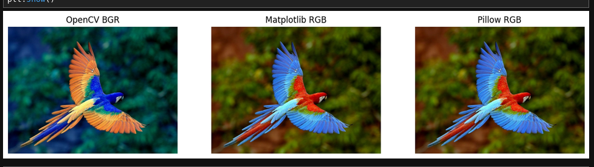

    Algo interessante de visualizar, é a separação dos canais **BGR**, onde é possível ver como a imagem reconhece cada cor. As partes com mais contraste(**mais amarelas**) de cada imagem representa a cor do respectivo canal.

    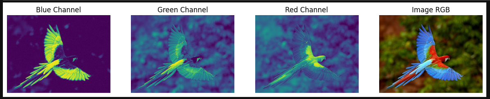

    Outro conceito explorado foi o de `Face Detection` utilizando o `Haar Cascade Classifier`, um modelo pré-treinado que usa um arquivo XML especializado na **detecção de rostos frontais**. 

    Os passos para utilizar o Haar são:
    - Conversão para Escala de Cinza
    - Carregamento do Classificador Pré-Treinado
    - Detecção de Objetos na Imagem
    - Desenho das detecções

    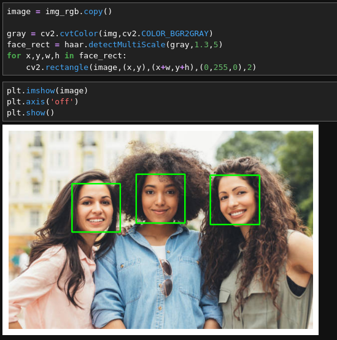

- **Seção 3: Desenvolvendo um modelo de Reconhecimento Facial com Machine Learning** 

    - `Crop Faces`: O processo de crop face (recorte de rosto) envolve detectar e extrair a região da face em uma imagem, para utilização em aplicações de reconhecimento facial.
    
        Antes: 
            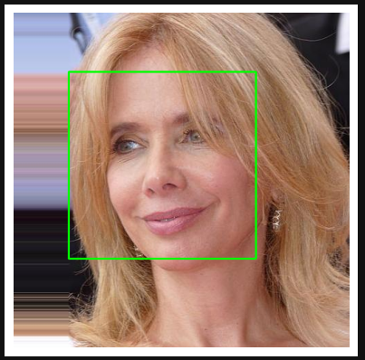

        Depois: 
            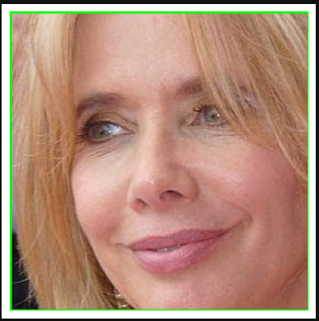

    - `Eigenfaces`: Eigenfaces são um conjunto de autovetores de uma matriz de covariância formada por **imagens de faces (rostos)**. Esta é uma técnica que busca representar **padrões encontrados em imagens** de rostos utilizando o método PCA (Análise de Componentes Principais)*.

        Com Eigenfaces, pode-se realizar o reconhecimento de rostos, ou seja, é possível dizer** a quem determinado rosto pertence**, baseado num banco de dados sobre esta pessoa previamente cadastrado.

        É importante realizar a extração de características de imagens de rostos usando a técnica de Eigenfaces, que é baseada em Análise de Componentes Principais (PCA). A `mean face` é calculada como a média de todas as imagens do dataset. Essa face média representa o **"rosto típico"** do conjunto de dados.

        Exemplo de mean face:

        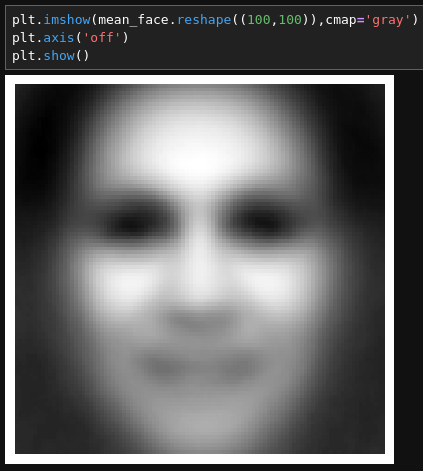
        
        A Eigenface são os componentes principais extraídos das imagens faciais que capturam padrões de variação entre os rostos, permitindo representar faces de forma compacta e eficiente.

        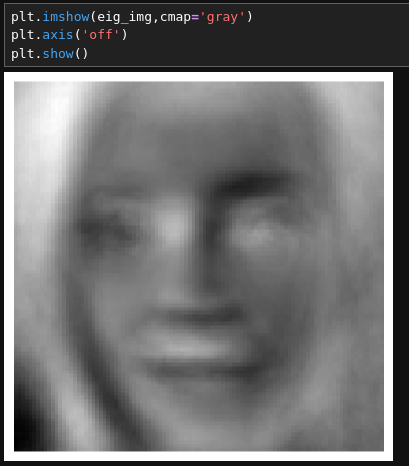
    
    - `Pipeline`: Em várias partes dessa seção, foram realizados treinamentos de modelos e esses foram salvos através da biblioteca **pickle**. Um pipeline é criado com o objetivo de classificar o gênero de um rosto presente em uma imagem utilizando 3 modelos salvos.

    - `Classificador Haar Cascade`: Detecta rostos na imagem convertida para escala de cinza. Retorna as coordenadas dos rostos detectados.

    - `Modelo PCA`: Contém os componentes principais (Eigenfaces) e a face média do conjunto de treinamento. O rosto detectado é transformado para o espaço PCA, reduzindo a dimensionalidade dos dados antes da classificação.

    - `Modelo SVM`: Um classificador SVM treinado para distinguir entre os gêneros masculino e feminino. Recebe a representação do rosto no espaço PCA e retorna a previsão do gênero, junto com a pontuação de confiança.

        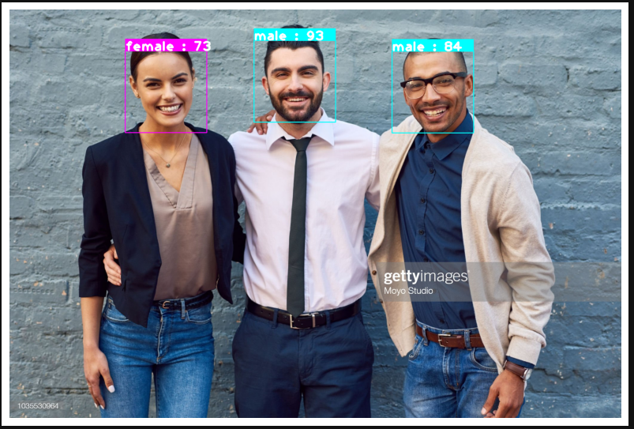

### 🧠 Curso: MLOps: Implantação e Operação de Modelos de Machine Learning

- **Seção 1: Introdução** 
Criar um bom modelo machine learning já é um grande desafio, porém **implantá-lo** e **mantê-lo em produção** é um desafio ainda maior. 

    É interessante ressaltar que o ciclo de vida de um **modelo** é diferente do ciclo de vida do **código** e do ciclo de vida dos **dados**. Modelos são temporários, isso pois eles dependem de dados e dados mudam com o tempo.

    Para falar de `MLOps`, primeiro temos que contextualizar o `DevOps`. DevOps é a integração de **Desenvolvimento** e **Operações**, de forma que as duas áreas possam trabalhar em conjunto para automatizar o processo de implantação com entrega contínua. O MLOps nada mais é que o **DevOps para Machine Learning**, uma prática que combina o desenvolvimento de aplicações de machine learning com a implantação e operações do sistema. 

    Os **níveis** MLOPS:
    - `Nível 0`: Manual
    - `Nível 1`: Automatização do pipeline de Machine Learning
    - `Nível 2`: Automatização da Integração Contínua e da Entrega Contínua

- **Seção 2: Apresentando MLFlow** 
Nesta seção aprendi sobre o `MLFlow`, uma plataforma de código aberto para **gerenciamento do ciclo de vida** de modelos Machine Learning. Ele facilita o gerenciamento do fluxo de trabalho para treinamento, rastreamento de experimentos e produção de modelos. 

- **Seção 4: Criando e Registrando Modelos** 
Criação do meu **primeiro experimento MLFlow** utilizando um modelo **Naive Bayes**:

    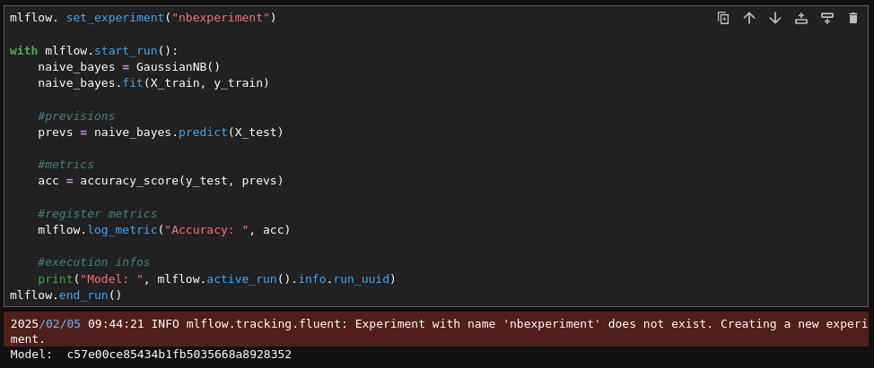

    É possível visualizar o modelo criado no experimento através do diretório `mlruns`, onde você navega pelas pastas e encontra um diretório com a **chave do modelo treinado**. O diretório contém informações sobre **artefatos, métricas, patâmetros e tags do modelo criado**. No exemplo abaixo, a acurácia que foi registrada no experimento está dentro da pasta metrics.

    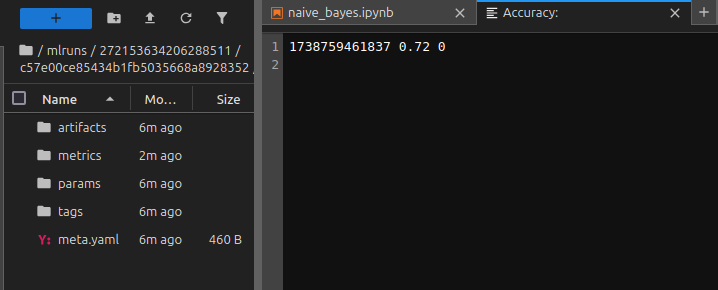

    No seu ambiente virtual, digite o comando `mlflow ui` e uma interface local do **mlflow** irá rodar. Lá é possível ver todas as informações a respeito dos seus experimentos criados, metricas, parâmetros, entre outros.

    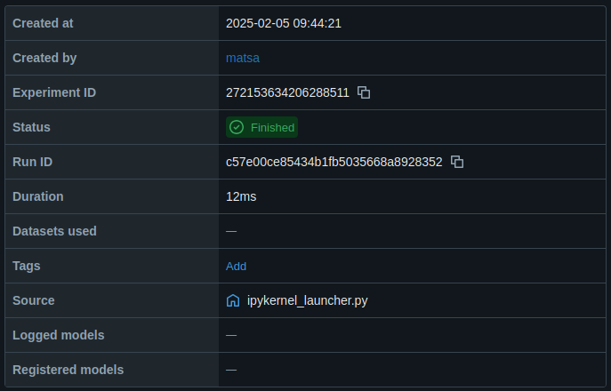

    Experimento com mais métricas:

    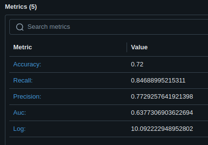

    Os artefatos incluem o modelo salvo, o enviroment, gráficos gerados e podem conter outros tipos de artefatos.

    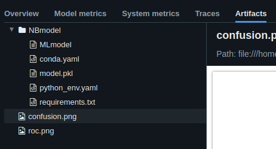

    Outra funcionalidade interessante de se explorar ao treinar modelos com MLFlow, é testar **diferentes combinações** de **hiperparâmetros** e visualizar detalhadamente os resultados obtidos.

    No exemplo abaixo, configurei um experimento de **Deep Learning com Keras**, onde selecionei alguns hiperparâmetros para serem testados automaticamente:

    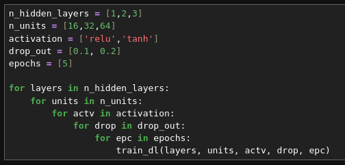

    Os diversos modelos criados no experimento MLFlow:

    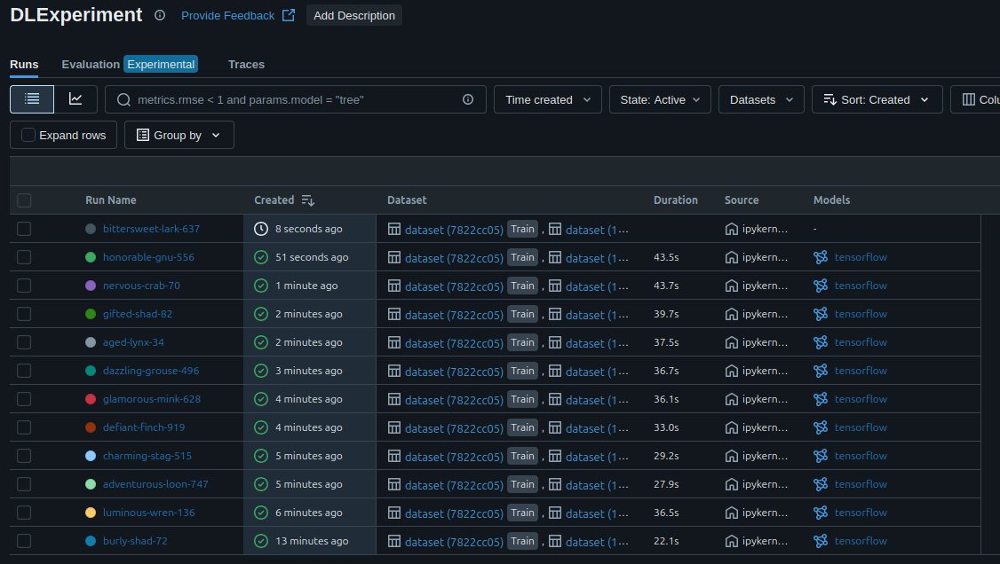

    Ao clicar em qualquer um desses modelos, é possível visualizar informações detalhadas, como os hiperparâmetros utilizados, métricas obtidas, tags e outros detalhes importantes para análise e comparação.

- **Seção 5: Servindo Modelos on premise / local** 
Na seção 5 aprendi como servir modelos, o que na prática significa **disponibilizar modelos** de machine learning **localmente** em vez de utilizar serviços em nuvem.

    É interessante disponibilizar modelos após a etapa de experimentos, onde você encontrou o melhor modelo e pode permitir que outras aplicações, usuários ou sistemas possam aproveitar do desempenho do modelo criado para tomar decisões ou gerar insights.

    Com o comando `mlflow models serve --env-manager local -m runs:/8f0ce2208a5a4978aad2283a025d2c76/RFmodel -p 2345` foi possível servir o modelo localmente, sendo **8f0ce2208a5a4978aad2283a025d2c76** o ID do modelo, **RFmodel** seu nome, e **2345** a porta.

    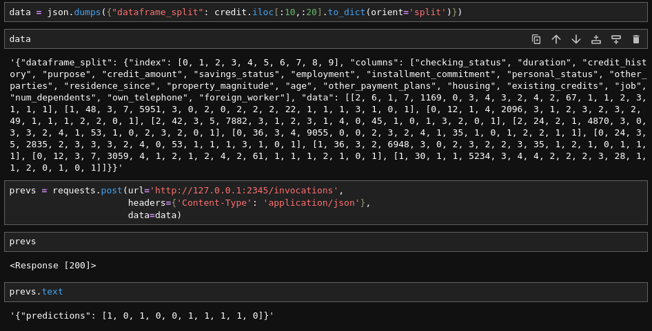

    Com o modelo servido locamente, é possível fazer fazer uma requisição **HTTP POST**  enviando dados no formato JSON para **obter previsões de um modelo** de machine learning que está sendo servido.

# 👨🏼‍🎓 Certificados

### 🧠 Curso: Formação Processamento de Linguagem Natural, LLMs e Gen AI

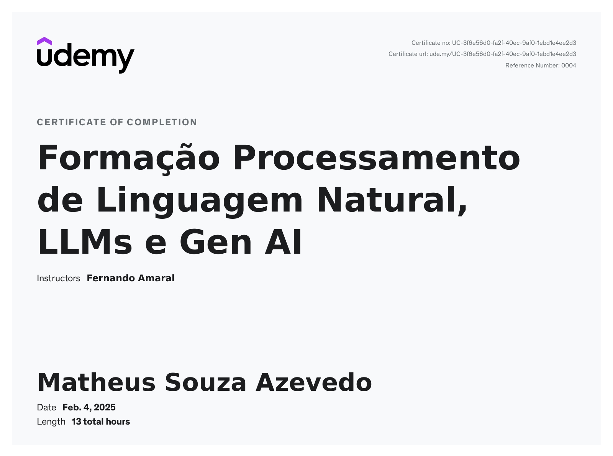

### 🧠 Curso: Face Recognition with Machine Learning + Deploy Flask App

### 🧠 Curso: MLOps: Implantação e Operação de Modelos de Machine Learning

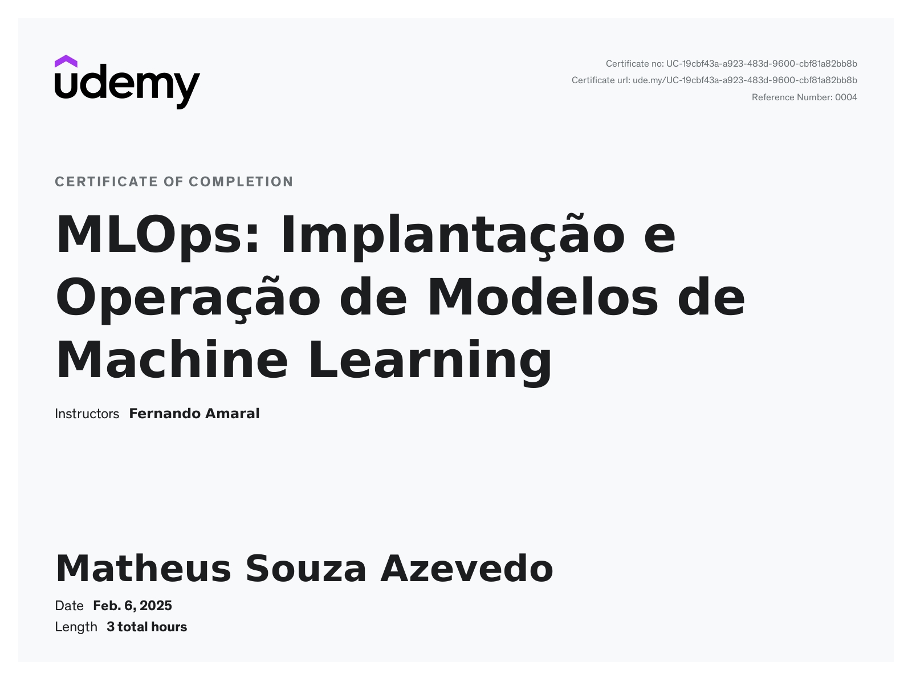