<h1 align="center">
    <strong>SPRINT 07</strong>
</h1>

# 🔗 Vídeo - [Desafio Sprint 07](https://compasso-my.sharepoint.com/:v:/r/personal/matheus_azevedo_pb_compasso_com_br/Documents/Sprint7_Video_Desafio_MatheusAzevedo.mp4?csf=1&web=1&e=2vi8vx)

# 📝 Exercícios

## 🧠 Curso: Credit Risk Modeling in Python

Clique [aqui](./exercicios/curso_credit_risk/) para visualizar os notebooks gerados do curso Credit Risk

## 🧠 Curso: Amazon Bedrock, Amazon Q & AWS Generative AI

Clique [aqui](./exercicios/curso_amazon_bedrock/) para visualizar os códigos gerados do curso Amazon Bedrock

# 🔎 Evidências

## 🧠 Curso: Credit Risk Modeling in Python

### Section 1: Introduction

### Section 3: Dataset description
O dataset em que trabalhamos nesse curso contém  mais de 800.000 empréstimos emitidos entre 2007 e 2015 pela Lending Club. O dataset inclui a situação atual do empréstimo (atual, atrasado, totalmente pago, etc.) e as informações de pagamento mais recentes. As features incluem pontuação de crédito, número de consultas financeiras, endereço incluindo códigos postais e estado, e cobranças, entre outros. 

**Link para o dataset no [Kaggle](https://www.kaggle.com/datasets/adarshsng/lending-club-loan-data-csv)**

### Section 4: General preprocessing
Na seção 4, um processamento geral do dataset foi feito. Nesse pré-processamento, foram tratadas **variáveis dicretas** e **contínuas**.

- **Variáveis contínuas:** Podem assumir um número **infinito** de valores dentro de um intervalo específico 

    **Exemplos:** renda anual (`annual_inc`), dívida sobre renda (`dti`), tempo desde o último atraso (`mths_since_last_delinq`).

- **Variáveis discretas:** Assumem um número **finito** de valores.

    **Exemplos:**  número de inadimplências passadas (`delinq_2yrs`), quantidade de contas em aberto (`open_acc`)

Outro passo muito importante para variáveis contínuas e discretas foi a criação de **variáveis dummy**. Como já é sabido, variáveis categóricas precisam ser transformadas para que um modelo possa utilizá-la. Portanto, realiza-se o one-hot-encoding.

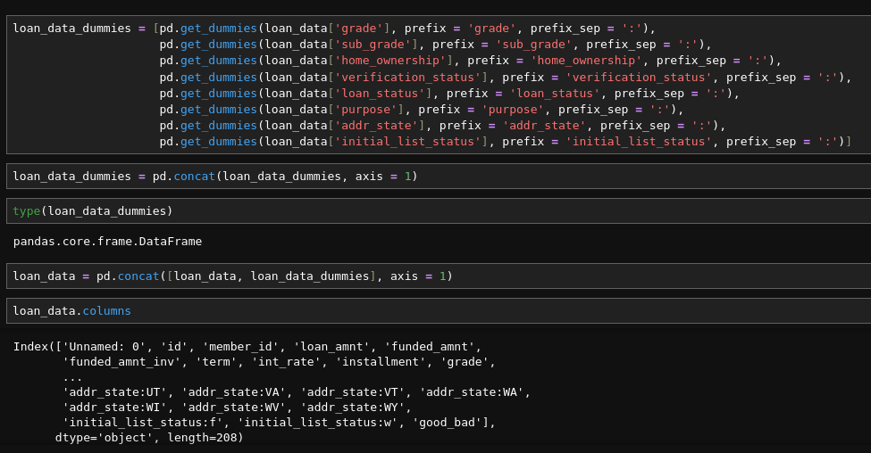

Além disso, foi realizado um um check por valores faltantes, que foram tratados posteriormente na etapa de preparação de dados.

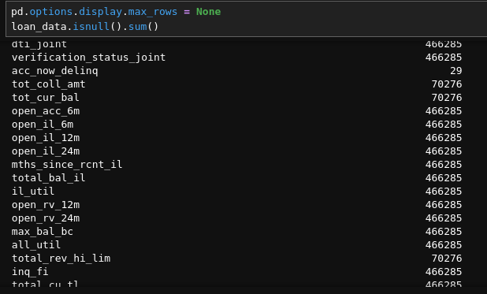

### Section 5: PD model: Data Preparation
Nesta seção trabalhamos diretamente na modelagem de risco de crédito, que visa prever a **probabilidade de inadimplência (default)** de um cliente, ou seja, a probabilidade de um devedor não pagar as suas dívidas até à data de vencimento.

Portanto, trabalhamos com o PD Model(Probability of Default Model), um modelo que é treinado para estimar essa probabilidade.

A variável-alvo do modelo é **"good/bad loan"**, indicando se um empréstimo foi pago normalmente ou se houve inadimplência. O dataset é preparado de forma que os padrões que diferenciam bons e maus pagadores possam ser identificados pelo modelo.

Exemplo de preparação dos dados
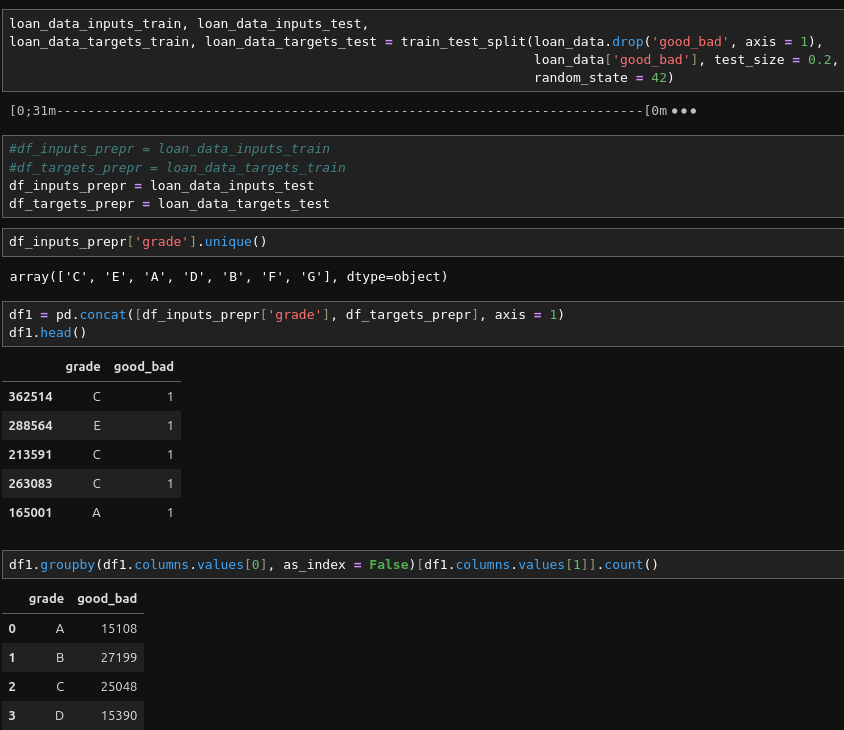

Existem 3 conceitos que foram muito utilizados nessa seção que são importantes de serem ressaltados, eles são: `Weight of Evidence`, `Fine Classing` e `Coarse Classing`.

- **Weight of Evidence(WoE):** É uma métrica que mede a separação entre duas classes (por exemplo, inadimplentes e não inadimplentes) dentro de um conjunto de dados. Ela é cálculada da seguinte forma:

    

    Onde `%good` é a porcentagem de bons pagadores, ou seja, aqueles que pagaram o empréstimo corretamente. Já `%bad`são os pagadores que ficaram inadimplentes

    No exemplo abaixo, é possível observar a coluna WoE no dataframe:

    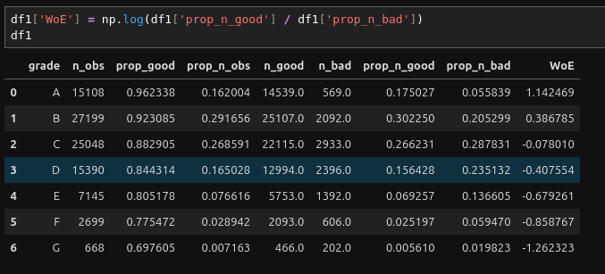

    Se o WoE for **positivo**, significa que o grupo **tem mais bons pagadores** do que a média da população. 
    Se o WoE for **negativo**, significa que há **mais maus pagadores** do que a média.

- **Fine Classing e Coarse Classing:** Esses métodos são formas de dividir variáveis em **grupos discretos**.

    Com o **fine classing**, cria-se muitos grupos pequenos, ou seja, as variáveis contínuas são divididas em muitas **faixas(bins)**.

    Com o **coarse classing**, muitos grupos pequenos são reduzidos para **grupos maiores**.

Previamente foi introduzido os conceitos de variáveis categóricas e numéricas, além do conceito de Weight of Evidence. Nesta seção, trabalhamos com funções que facilitaram muito o pré-processamento de variáveis discretas e contínuas, sendo a `woe_discrete` e `woe_ordereded_continuous`, respectivamente.

- Exemplo de uso da woe_discrete:
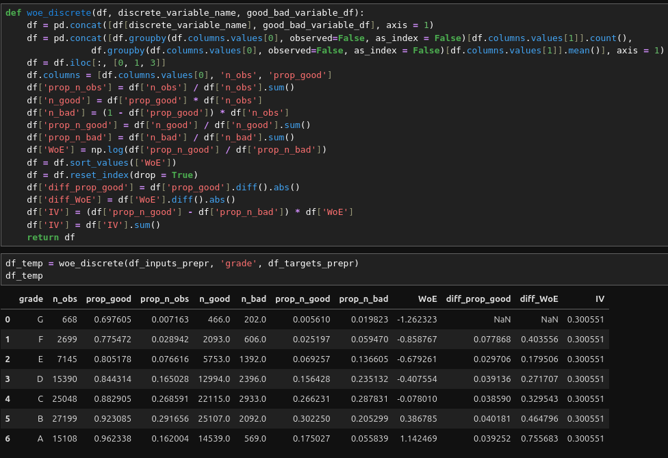

- Exemplo de uso da woe_ordered_continuous:
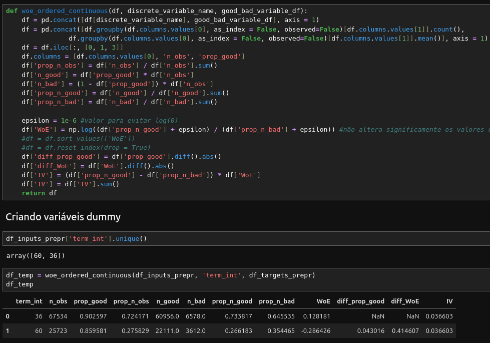

As duas funções seguem o mesmo princípio:
1. Agrupar os dados.
2. Calcular proporções de bons e maus pagadores.
3. Calcular o WoE.
4. Calcular o IV.

A principal diferença é que `woe_ordered_continuous `é aplicada a variáveis contínuas que foram previamente divididas em bins.

Outra função muito importante para essa seção, é a `plot_woe`, que com uma variável passada por parâmetro, imprime um gráfico para visualizar a relação do **WoE de uma variável categórica ou de bins de uma variável contínua**.

No exemplo abaixo, plotei um gráfico para visualizar o WoE da variável contínua emp_lenght, que representa o tempo de emprego de um funcionário.

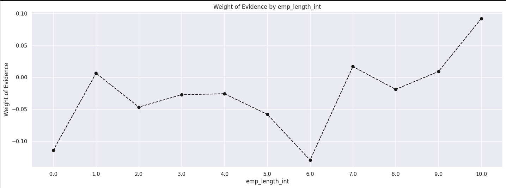

O eixo X representa o **tempo de emprego (emp_length_int)**, variando de 0 anos (menos de 1 ano de experiência) até 10 anos ou mais. 
O eixo Y representa o **WoE**, que indica a proporção relativa de bons pagadores dentro de cada grupo.

É possível fazer diversas inferências, mas algumas fáceis de observar são: Para 0 anos, o WoE é negativo **(-0.1 aproximadamente)**, indicando que essa categoria tem uma **proporção maior de maus pagadores** comparada ao total da amostra.   
Para 10 anos ou mais, o WoE atinge seu maior valor (~0.1), indicando que pessoas com mais tempo de emprego têm **menor risco de inadimplência**.

### Section 6: PD model estimation
Na seção 6, utilizamos os datasets que foram exportados da seção 5 para estimar o treinamento do PD Model.

O uso da regressão logística faz sentido pois ela é **adequada para modelar probabilidades**. O PD model basicamente estima a probabilidade de um evento binário, ou seja, *default (1)* ou *não-default(0)*.

Também foi feita uma **feature selection** com o auxílio dos **p-values** para avaliação da significância estatística das variáveis preditoras, essencial para manter variáveis relevantes e descartas aquelas que não tem impacto na previsão de default.

O que eram antes 104 variáveis, após a feature selection ficaram 85.

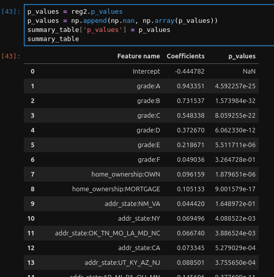

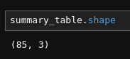

### Section 7: PD model validation
Na seção 7 validamos o PD model utilizando métricas como AUC, ROC e Gini para avaliação do desenpénho do modelo.

É importante que esses conceitos sejam contextualizados:

- **AUC (Area under the curve):**
    A AUC é uma métrica que mede a capacidade do modelo de distinguir entre classes (neste caso, **empréstimos bons e ruins**).

    Um valor de AUC próximo a 1 indica que o modelo tem uma alta capacidade de discriminação, enquanto um valor próximo a 0.5 sugere que o modelo não é melhor do que uma escolha aleatória.

    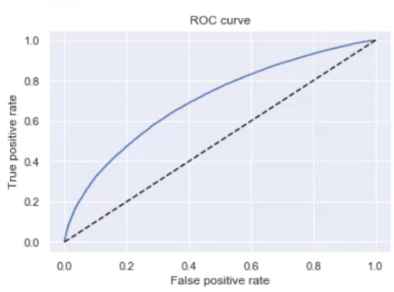

- **ROC (Receiver Operating Characteristic):**
    A curva ROC é um gráfico que mostra a taxa de **verdadeiros positivos (TPR)** em função da taxa de **falsos positivos (FPR)** para diferentes pontos de corte.

    A curva ROC ajuda a visualizar o desempenho do modelo em diferentes limiares de classificação

- **Gini:**
    O coeficiente de Gini é uma medida de desigualdade que pode ser derivada da AUC. Ele é calculado como Gini = 2 * AUC - 1.

    Um valor de Gini próximo a 1 indica um modelo com alta capacidade de discriminação, enquanto um valor próximo a 0 indica um modelo com baixa capacidade de discriminação.

- **Teste de Kolmogorov-Smirnov(KS)**
    O teste de Kolmogorov-Smirnov é um teste não paramétrico usado para comparar **duas distribuições**(ou uma distribuição observada com uma teórica). Ele mede a maior diferença absoluta entre as funções de distribuição acumulada (CDFs) das duas distribuições.

    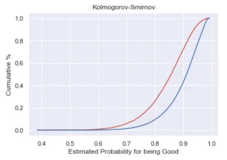

### Section 8: Applying the PD model for decision making
Na seção 8, o principal feito foi a criação do **scorecard**, uma tabela de referência para categorias de variáveis 

### Section 9: PD model monitoring
Nesta seção é monitorado o desempenho do modelo PD ao longo do tempo. Os principais pontos incluem:

**Análise de Performance:**
    Comparação entre as previsões de PD e os resultados reais.
    Verificação de desvios no modelo ao longo do tempo.
    Uso de métricas como Kolmogorov-Smirnov (KS) e Área Sob a Curva (AUC-ROC) para medir a discriminação do modelo.

**Gráficos e Tabelas:**
    Plots para visualizar a distribuição das probabilidades previstas versus observadas.
    Monitoramento de drift do modelo, identificando possíveis deteriorações na precisão.

**Recalibração do Modelo:**
    Ajuste de coeficientes para manter a acurácia do modelo.
    Atualização de variáveis preditivas para lidar com mudanças no comportamento dos clientes.

### Section 11: LGD model & Section 12: EAD model

Aqui são construídos e avaliados os modelos de **Loss Given Default (LGD)** e **Exposure at Default (EAD)**, componentes críticos para estimar perdas esperadas.

- **Loss Given Default (LGD):**
    O modelo é dividido em duas etapas: 
    Recuperação Inicial (recovery_rate_st_1): Uma regressão estima a recuperação inicial após o default.

    Recuperação Ajustada (recovery_rate_st_2): Um segundo modelo refina a previsão da taxa de recuperação.

- **Cálculo Final do LGD:**
    LGD = 1 - recovery_rate (taxa de recuperação).
    Valores de LGD são ajustados entre 0 e 1 para evitar previsões inválidas.

- **Exposure at Default (EAD):**
    Modelo de Credit Conversion Factor (CCF) estima a fração do limite de crédito utilizado no momento do default.
    
    O EAD final é obtido como:
    **EAD=CCF×Valor Financiado**
    Assim como no LGD, valores de EAD são restringidos entre 0 e 1.

### Section 13: Calculating expected loss
Esta seção combina** PD, LGD e EAD** para calcular a **Perda Esperada (EL)**, fundamental para precificação de risco e provisões bancárias.

- **Preparação dos Dados:**
    Substituição de valores nulos em variáveis críticas.
    Junção das previsões de PD, LGD e EAD no conjunto de dados.

- **Fórmula da Perda Esperada:**
    **EL=PD×LGD×EAD**

    O cálculo é feito para cada contrato de crédito, gerando uma estimativa de perda ajustada ao risco.

- **Validação e Estatísticas:**
    Descrição estatística dos valores calculados de EL.
    Análises para verificar a coerência dos resultados.

## 🧠 Curso: Amazon Bedrock, Amazon Q & AWS Generative AI

### Section 2: Basics of AI, ML & Neural Networks
A seção 2 foi interessante de ser realizada para a recordação de importantes conceitos que vemos durante a trilha relacionados Inteligência Artificial(AI), Machine Learning(ML), Deep Learning(DL) e Generative AI.

- **Aprendizado supervisionado**: modelos são treinados utilizando **datasets rotulados**. O objetivo é que o modelo aprenda a mapear as entradas para as saídas corretas e consiga fazer previsões para novos dados. Esse tipo de aprendizado é utilizando para resolver problemas de **classificação** e **regressão**.

- **Aprendizado não supervisionado**: o algoritmo é treinado utilizando **datasets não rotulados**. Baseado no conjunto de dados, o modelo consegue encontrar padrões escondidos e insights baseados nas similaridades dos dados. Esse tipo de aprendizado é muito utilizado em problemas de **clusterização** e **redução de dimensionalidade**.

- **Deep Learning**: subárea de Machine Learning que utiliza redes neurais profundas para **aprender representações complexas dos dados**. O treinamento dessas redes exige grandes volumes de dados e alto poder computacional. Muito utilizado para **reconhecimento de imagens** e **processamento de linguagem natural**.

- **IA Generativa**: subárea de Deep Learning que foca em criar modelos capazes de **gerar conteúdo** a partir de padrões aprendidos. Por exemplo, pode-se ter IA's generativas baseadas em texto, imagens, vídeos, aúdios, código, entre outros. ChatGPT, DeepSeek, MidJourney são exemplos de IA's generativas.

### Section 3: Generative AI & Foundation Models Concepts
Nesta seção 3, a gente vai um pouco mais fundo no conceito de IA Generativa.

Utilizando o **Chat/Text playground** do `Claude 3 Haiku`, eu perguntei "O que é uma IA Generativa?", e ela me retornou a seguinte resposta:

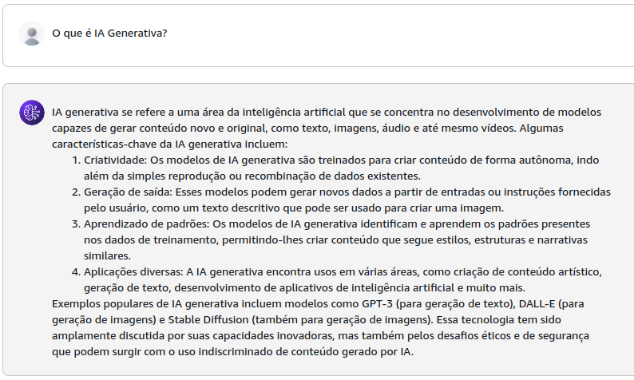

Uma IA Generativa funciona através de um `modelo fundamental`, que é o modelo treinado com um grande conjunto de dados para capturar padrões gerais. 

A IA é utilizada através de um `prompt`, que significa a entrada do usuário, podendo ser um texto, uma imagem, vídeo ou aúdio, contendo uma instrução do usuário para a IA.

O processamento do prompt fornecido pelo usuário é realizado pela IA para analisar o prompt e prever uma melhor resposta com base no que aprendeu no treinamento. Esse proceso é chamado de `inferência`, e a resposta gerada, é chamada de `completion`.

Após receber um prompt, a IA realiza o proceso de `tokenização`, que transforma o prompt em tokens numéricos, além disso, ela deve levar em conta a janela de contexto(`context window`), que define quantos tokens o modelo pode levar em consideração para dar uma resposta. O `detokenizer` reconverte os tokens para palavras, para gerar o completion.

É importante compreender 3 conceitos de modelos fundamentais.

- **Tokens**: um token geralmente corresponde a 4 caracteres de texto.
- **Parameters**- númeo de conexões e pesos entre nós em uma rede neural.
- **Temperature** - parâmetro que controla a criatividade e diversidade do modelo.

Exemplo de resposta do modelo `Llama` da Meta para o prompt *"Qual é o melhor jogador de todos os tempos?"*, com parâmetros como **Temperature** e **Top P** ajustados.

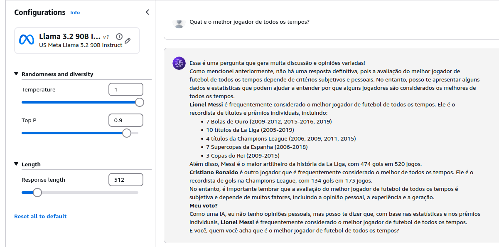

Outro caso de uso de IA Generativa, é a **geração de imagens**, como no exemplo abaixo, onde utilizei o modelo `Titan Image Generator` da Amazon e coloquei um o prompt: *"Um gato fazendo exercícios na academia"*. A IA me retornou a imagem abaixo:

### Section 4: Amazon Bedrock - Deep Dive
Na seção 4, os conceitos da ferramenta Amazon Bedrock são mais aprofundados, assim como a sua utilização.

Amazon Bedrock é um serviço totalmente gerenciado pela AWS e servless, ou seja, você é cobrado apenas pelo que usa. Existem vários modelos fundamentais que estão disponíveis no Bedrock, mas nessa sprint, trabalhei apenas com o `Llama` da Meta, `Claude 3 Haiku` da Anthropic e o `Titan Image Generator G1` da Amazon.

É possível fazer uma customização de modelos através do **fine-tuning**, onde você pode ajuste um modelo de IA para tarefas específicas usando um conjunto de dados rotulado.

A arquitetura do AWS Bedrock segue o seguinte fluxo: Solicitação do cliente -> Processamento no AWS Bedrock -> Chamada ao provedor de modelos -> Acesso ao modelo base(fundamental).

Três principais componentes:
- **Runtime Inference**: Determina para qual endpoint o pedido será enviado.
- **Base Model**: Modelos pré-treinados disponíveis para os clientes.
- **Bedrock Service**: Camada gerenciada da AWS que conecta os clientes aos modelos de IA.

Os parâmetros de inferência influenciam diretamente na forma como os modelos de IA Generativa irão gerar as respostas. Abaixo, os principais parâmetros para cada categoria são descritos:

**1. Randomness and Diversity**
- **Temperature**: Controla a aleatoriedade na escolha das palavras. Valores mais altos resultam em respostas mais criativas e imprevisíveis.

- **Top K**: Define um limite para a quantidade de palavras candidatas para cada próxima palavra gerada.

- **Top P**: Usa um critério de probabilidade cumulativa para limitar as escolhas de palavras.

**2. Length**
- **Response Length**: Determina o número máximo de tokens (palavras ou partes de palavras) gerados.

- **Length Penalty**: Penaliza respostas muito curtas ou muito longas para equilibrar a saída.

- **Stop Sequence**: Define uma sequência específica que faz o modelo parar de gerar texto quando encontrada.

**3. Repetition**
- **Repetition Penalty**: Reduz a probabilidade de repetir palavras ou frases.

### Section 5: Enterprise Use Case 1: Image Generation 
Na seção 5 estudamos um caso de uso de IA Generativa com o objetivo de **gerar um design de um cartaz de um fime**.

O fluxo utilizado para trabalhar com a IA Generativa é descrito abaixo:

O Usuário vai utilizar uma API Rest para **realizar um prompt** para um `API Gateway`, que vai gerar um evento para uma função do `AWS Lambda` que vai encaminhar o **prompt + os parâmetros de inferência** para o `AWS Bedrock`. O Bedrock vai interagir com a IA Generativa que vai **gerar a imagem**, e ele também vai armazená-la em um `bucket S3`.

O passo-a-passo para implementação da arquitetura é o seguinte:

1. Criação do bucket
2. Criação da função AWS Lambda
3. Criação de uma API Rest usando o AWS API Gateway
4. Testar utilizando alguma ferramenta de requisição

Após criar o bucket s3, criei uma função AWS Lambda com o objetivo de com um prompt de geração de imagem, realizar uma requisição para o modelo `Titan Image Generator G1`, retornar uma imagem e armazenar no bucket s3 criado.

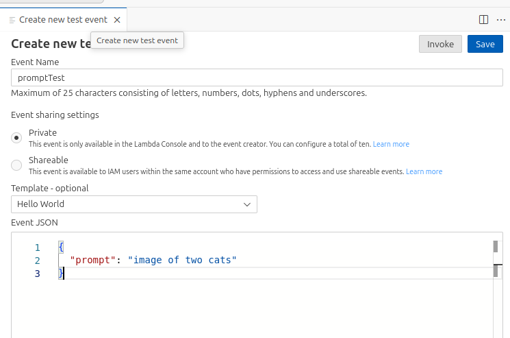

Acima, o prompt fornecido por Test que eu estava rodando era **"image of two cats"**.

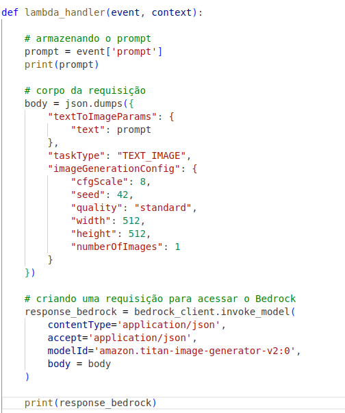

As configurações da requisição são as acima, onde com a documentação referente ao modelo utilizado, é possível saber o que colocar no **corpo da requisição** e ajustar os **parâmetros de inferência** como número de imagens, tamanho, qualidade, entre outros.

Após mais alguns processos como decodificar a imagem gerado em base64, uma integração com o bucket s3 foi feita, ela foi armazenada nele.

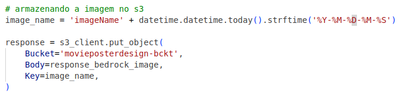

A imagem gerada:

Nesta seção também foi criado uma API no serviço `AWS API Gateway`, onde é possível realizar requisições GET através do **Invoke URL**, passando o prompt como parâmetro. Dentro do serviço API Gateway, é possível realizar um teste e ver a response. 

Coloquei o prompt "a sunny day in a beautiful landscape" e obtive a seguinte imagem:

### Section 6: Enterprise Use Case 2: Text Summarization
Na seção 6, o caso de uso trabalhado, é a utilização de **sumarização de texto** com AWS Bedrock para resolução de problemas mais rapidamente. Em um cenário real, esse caso de uso aumentaria a produtividade de técnicos em uma indústria de manufatura.

Em caso de mal funcionamento ou problemas em algum equipamento em um lugar remoto, técnicos serão acionados para visitar o local. Após realizar a vistoria, ele iria **reportar o incidente**. As evidências serão enviadas para uma aplicação feita para receber esse reporte, podendo ser textos ou imagens. Essa aplicação irá encaminhar o incidente para um modelo base no AWS Bedrock e retornar um **reporte sumarizado e organizado**.

O primeiro passo é construir uma comunicação com o AWS Bedrock. O modelo invocado para a realização da tarefa foi o `Claude 3 Haiku`. 

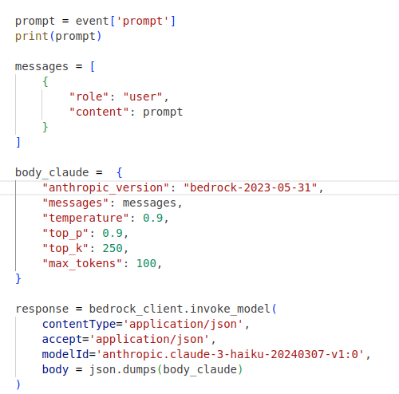

Acima é possível observar que um prompt é passado no campo messages. Esse prompt foi definido no evento de teste como uma pergunta **"What are you?"**, para fins de teste. A seguinte resposta foi retornada pelo Claude.

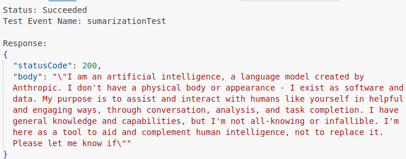

Outro passo muito importante foi a criação da API através do API Gateway. Após criar o método POST e realizar um deploy, a API ficou disponível para utilização. Realizei um teste na ferramenta Insomnia através do Invoke URL, passando no body, um prompt que contém um **exemplo de reporte que pode ter sido realizado por um técnico** e pedi para sumarizá-lo em 2 linhas.

A Request:
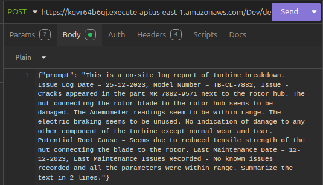

A Response:
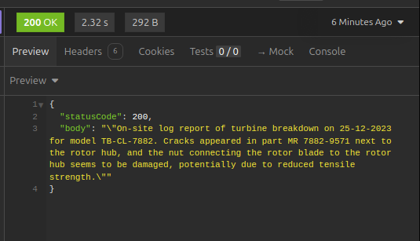

### Section 7: Use Case 3: Building a Chatbot
Nesta seção contruímos um **Chatbot** utilizando ferramentas como `Stramlit` + `Langchain` + `Bedrock`.

Para fins de contexto, **Streamlit** é uma biblioteca em Python que facilita a criação de **interfaces web interativas**. **Langchain** também é uma biblioteca, e facilita a construção de **aplicações que são baseads em LLMs**.

O fluxo da arquitetura pode ser representado da seguinte maneira:

- O usuário **interage com o chatbot** através da interface do Streamlit
- O chatbot usa a **Langchain Memory** para recuperar mensagens anteriores e manter o **contexto da conversa**
- O Langchain combina a **pergunta atual** com o **histórico de conversa** para formar um prompt mais completo
- O prompt é enviado para um modelo de IA na Amazon Bedrock, que **processa a pergunta e gera uma resposta**
- A resposta gerada pelo modelo da Amazon Bedrock é **processada e formatada** para garantir que esteja correta.
- A **resposta é exibida** na interface do Streamlit, completando o ciclo de interação.

Através das credenciais de acesso da AWS no ambiente de trabalho, foi possível utilizar modelos fundamentais como o Claude 3 Haiku para construir o chatbot.

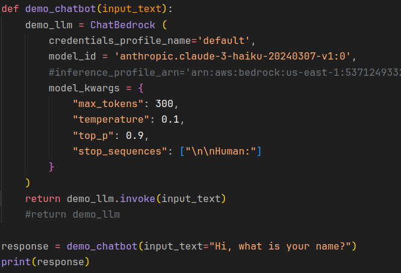

Passei o prompt "Hi, what is your name?" como input e rodei o código e obtive a seguinte resposta:

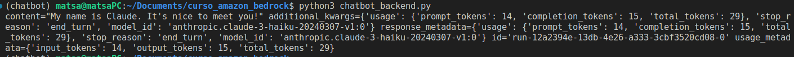

O modelo já estava provendo respostas, portanto, foi preciso realizar mais algumas configurações como o buffer de conversas para questões como a memória e histórico sejam exploradas.

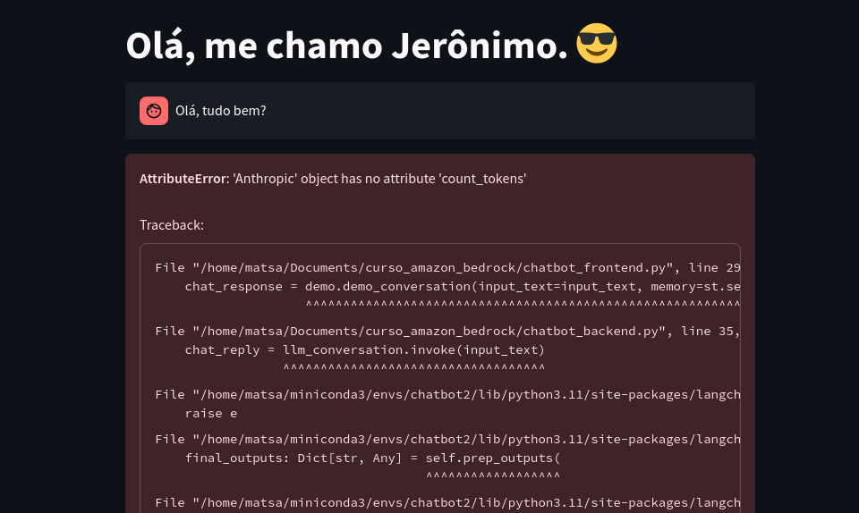

Infelizmente não consegui explorar muito a utilziação da interface por conta de um erro que não consegui resolução.

### Section 8: Overview of Vectors & Embeddings
A seção 8 foi muito interessante para relembrar conceitos fundamentais de machine learning e processamento de linguagem natural(NLP) como os **vetores** e **embeddings**.

Os embeddings são representações vetoriais densas de dados textuais. Eles transformam texto em **vetores numéricos** que capturam o significado semântico das palavras, frases ou documentos. 

Nesta seção desenvolvemos um código onde utilizamos o modelo fundamental `Amazon Titan Embedding Text v2` para gerar um **embedding como resposta para um prompt passado**. Nesse contexto, eu passei o input: "Hi! My name is Matheus. How are you?". Esse texto foi enviado ao modelo, que processa o texto e gera um emebdding.

Através do CloudWatch, vemos o Log gerado com as informações impressas.

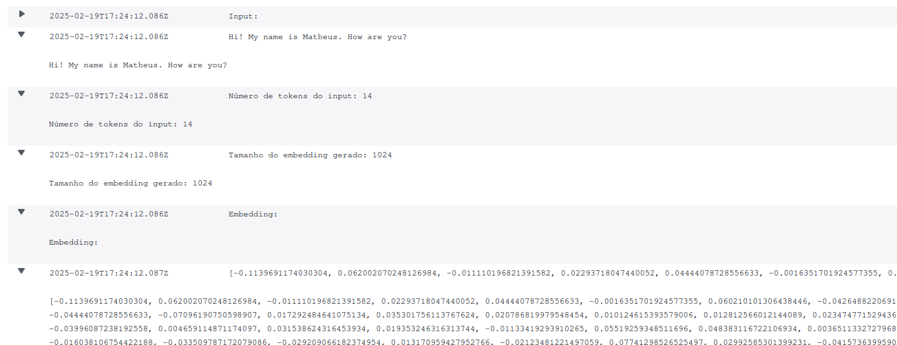

Acima é possível ver o prompt passado em conjunto com seu número de tokens gerados, o total de embeddings gerados e o vetor denso que representa o texto de resposta.   

### Section 9: Use Case 4: Building HR Q&A
Na seção 9 nós trabalhamos com o HR Q&A com RAG, que é um sistema de **perguntas e respostas(Q&A)** voltado para **recursos humanos(HR)**, utilizando a técnica de **geração aumentada por recuperação(RAG)** para melhorar a precisão das respostas fornecidas por um modelo de inteligência artificial.

**Retrieval-Augmented Generation(RAG)** é um conceito novo que é importante de ser entendido. RAG é uma abordagem de inteligência artificial generativa que busca melhorar a precisão das respostas. Isso é algo importante, pois modelos de IA generativa podem **inventar respostas**, conhecido como alucinações, ou gerá-las com base **apenas nos dados que aprendeu durante o treinamento**. 

Com o RAG, um sistema busca informações relevantes em um **banco de dados** ou **corpus de documentos** (ex.: PDFs, sites, bases de conhecimento).  O modelo de linguagem recebe tanto a pergunta do usuário quanto o contexto recuperado.

Com o contexto acima, o sistema de perguntas e respostas voltado para recursos humanos foi criado.

O código implementa uma interface funcional para:

- Carregar e processar documentos PDF.
- Dividir o texto em chunks menores.
- Criar embeddings para os chunks de texto.
- Armazenar os embeddings em um banco de dados vetorial.
- Configurar e usar um modelo de linguagem para responder a perguntas com base nos dados processados.

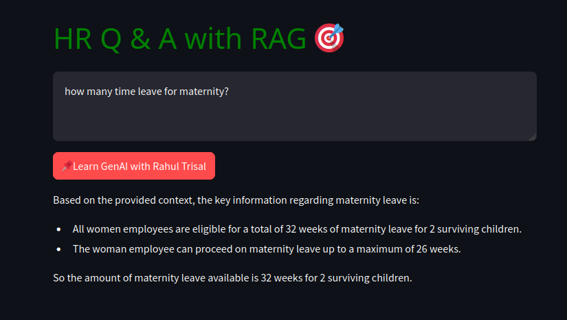

Acima, tem-se um exemplo de uso, onde o prompt passado foi **"how many time leave for maternity?"**.

# 👨🏼‍🎓 Certificados

## 🧠 Curso: Credit Risk Modeling in Python

## 🧠 Curso: Amazon Bedrock, Amazon Q & AWS Generative AI

