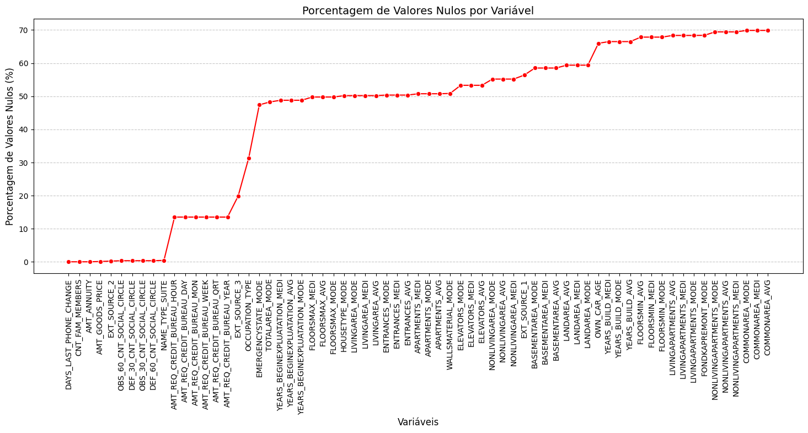
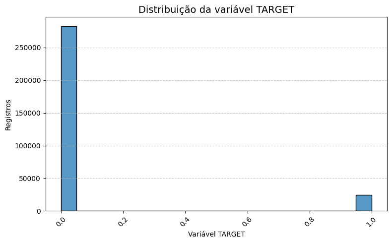
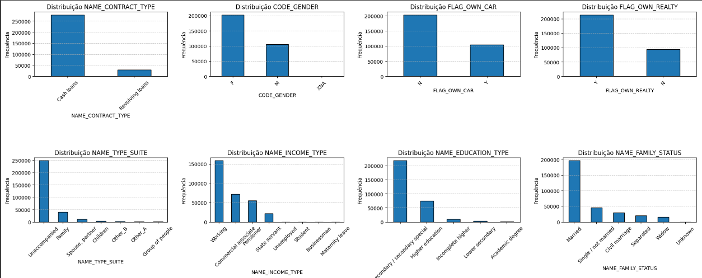
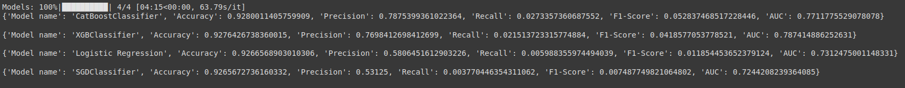
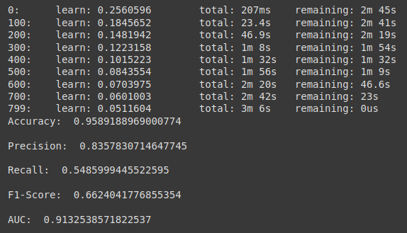
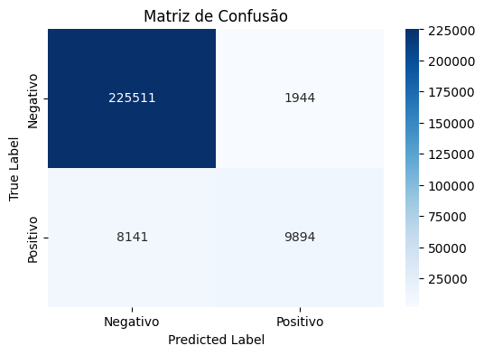
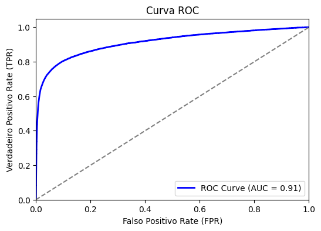

<h1 align="center">
    <strong>SPRINT 08</strong>
</h1>

# 🔗 Vídeo - [Desafio Sprint 05](https://compasso-my.sharepoint.com/:v:/r/personal/matheus_azevedo_pb_compasso_com_br/Documents/Sprint8_Video_Desafio_Matheus_Azevedo.mp4?csf=1&web=1&nav=eyJyZWZlcnJhbEluZm8iOnsicmVmZXJyYWxBcHAiOiJPbmVEcml2ZUZvckJ1c2luZXNzIiwicmVmZXJyYWxBcHBQbGF0Zm9ybSI6IldlYiIsInJlZmVycmFsTW9kZSI6InZpZXciLCJyZWZlcnJhbFZpZXciOiJNeUZpbGVzTGlua0NvcHkifX0&e=qwdQA0)

# 📌 Projeto 3

[Clique aqui para visualizar o código do projeto](project03.ipynb)

## 📜 Introdução

Muitas pessoas têm dificuldade em obter empréstimos devido a históricos de crédito insuficientes ou inexistentes, e
frequentemente são exploradas por credores não confiáveis.

Nesta sprint, tinhamos como desafio desenvolver um modelo machine learning capaz de **prever a capacidade de pagamento dos clientes** e decidir se o empréstimo será concedido. A ideia é garantir que clientes com capacidade de pagamento **não sejam rejeitados** e que os empréstimos oferecidos sejam adequados para capacitar seus clientes a terem sucesso.

Para isso, nos foi fornecido um conjunto de datasets com dados estatísticos de aplicações de empréstimo, histórico de pagamentos além de créditos anteriores fornecidos por outras instituições financeiras, que foram relatados ao birô de crédito.

## 🔎 Análise Exploratória de Dados

Após carregar os datasets e visualizar informações básicas como número de linhas e colunas, tipos de variáveis, porcentagem de valores nulos e duplicatas, eu parti para a análise exploratória. 

A etapa de EDA é feita com o objetivo de entender os dados trabalhados. Portanto, para cada dataset eu fiz uma análise mais profunda das colunas presentes nos datasets.

Vou utilizar como exemplo o dataset principal, mas para todos os outros dataframes, as mesmas análises foram aplicadas.

### Análise de valores nulos:

Para cada dataset eu plotei um gráfico de linha que exibe a **porcentagem de valores nulos para cada variável**. Não foi definido um threshold exato para exclusão de variáveis, mas features com 60% de valores nulos foram excluídas e outras com 40% e até 50% foram analisadas para verificar se pode existir alguma importância para o modelo. 

### Desbalanceamento

Desde o princípio foi verificado que a distribuição dos dados era desbalanceada, evidenciada pela variável **TARGET**. Portanto, era mais um fator a se atentar durante toda a análise.

### Análise de features categóricas

Para melhor entendimento das colunas categóricas de cada conjunto de dados, eu plotei um subplot de histogramas. 

Através desses gráficos foi possível analisar muito mais facilmente a distribuição de cada variável categórica, sendo possível pensar em possíveis manipulações de tipos, categorizações, exclusão de variáveis e dentre outras conclusões.

### Análise de features numéricas

Para melhor entendimento das colunas numéricas de cada conjunto de dados, eu plotei um subplot de histogramas. 

Através desses gráficos foi possível analisar muito mais facilmente a distribuição de cada variável numérica, sendo possível identificar desbalanceamento, distribuições assimétricas, outliers e dentra outras conclusões.

## Conclusão

Após uma detalhada análise exploratória, baseada majoritariamente nas análises acima, eu decidi utilizar para compor o dataset final os datasets: 
- **application_train**
- **bureau**
- **bureau_balance**
- **POS_CASH_balance**
- **instalments_payments**

Isso devido principalmente a complexidade de manipulação dos datasets **previous_application** e **credit_card_balance**. Além disso, os datasets escolhidos já possuem muitas informações relevantes para a análise do risco de inadimplência, não sendo preciso aumentar a dimensionalidade do dataset final para englobar mais 2 datasets, o que deixaria o treinamento do modelo ainda mais complexo e demorado.

## ⚙️ Modelagem

Após a análise exploratória de todos os datasets, chega o momento da modelagem dos dados. Nessa etapa eu englobei principalmente as agregações dos dados de acordo com a chave primária de cada dataset e os merges para alcançar o dataset final.

Para minimizar a perda de informações de créditos relacionados, foi necessário trabalhar com uma ordem específica de merges, de forma a utilizar o melhor das chaves que estavamos trabalhando (**SK_ID_CURR** e **SK_ID_PREV**). 

Por exemplo, antes de agregar informações no dataset **bureau**, foi necessário primeiro agregar informações no dataset **bureau_balance**. Isso porque a chave **SK_ID_BUREAU** é única no dataset **bureau**, e se agruparmos por **SK_ID_CURR** (id do empréstimo) iremos perder muitas informações sobre os créditos relacionados. Portanto, agrupando primeiro pela chave **SK_ID_BUREAU** no dataset **bureau_balance**, conseguimos extrair o melhor dos dados nos dois datasets.

Esse mesmo cuidado foi tomado para realizar o merge com o restante dos datasets, deixando por último, o dataset principal (**application_train**).

O dataset final tinha o shape de **818298 rows × 58 columns**.

É importante ressaltar foi tomado cuidado em não imputar valores ou realizar qualquer etapa de pré-processamento antes de dividir o conjunto de dados final em treino e teste.

    X_train: (572808, 54)
    X_test: (245490, 54)
    y_train: (572808,)
    y_test: (245490,)

## 🛠️ Pré-processamento

No pré-processamento, uma ferramenta muito útil trabalhada foi o pipeline, da biblioteca sklearn. Ele facilita muito essa etapa, pois através dele é possível organizar, padronizar e ter uma consistência do pré-processamento de dados

    #Transformer de variáveis numéricas
    num_transformer = Pipeline(steps=[
        ('imputer', SimpleImputer(strategy='mean')),
        ('scaler', StandardScaler())
    ])
Para variáveis numéricas utilizei um simples **imputador de média** para valores nulos e o **StandardScaler** para normalização dos dados.

    #Transformer de variáveis categóricas
    cat_transformer = Pipeline(steps=[
        ('imputer', SimpleImputer(strategy='most_frequent')),
        ('encoder', OneHotEncoder(handle_unknown='ignore'))
    ])
Para variáveis categóricas, eu utilizei um simples **imputador de moda** e **One Hot Encoder** para transformar as categorias para numéricas.

Restante do pipeline:

    #Combinação dos pré-processadores
    preprocessor = ColumnTransformer(
        transformers = [
            ('num', num_transformer, num_features),
            ('cat', cat_transformer, cat_features)
        ]
    )

    #Pipeline final
    pipeline = Pipeline(steps=[
        ('preprocessor', preprocessor)
    ])

    #fit_transform em X_train e transform em X_test, de forma a evitar data leakage
    X_train_transformed = pipeline.fit_transform(X_train)
    X_test_transformed = pipeline.transform(X_test)

## 🤖 Treinamento e avaliações dos modelos 

Na etapa de treinamento dos modelos, pela conhecida demora na execução de algoritmos de SVM, eu escolhi me basear em algoritmos de **regressão logística** e **árvores de decisão**.

Portanto, utilzei 2 algoritmos de cada abordagem para poder avaliar melhor diferentes métodos. Na regressão logística, utilizei o **LogisticRegression com regularizações** e o **SGDClassifier**, que é baseada em otimização de gradient. Já para árvores de decisão, resolvi utilizar o Catboost e o XGBoost. Para algortimos baseados em árvores, eu utilizei o **CatBoostClassifier** e o **XGBoostClassifier**.

### Primeiro Resultado

Nos primeiros treinamentos, os algoritmos baseados em árvore se destacaram sobre os algoritmos de regressão logística. Em especial, o **CatBoostClassifier** que teve um balanço melhor das métricas de **recall**, **f1-score** e **AUC** em comparação com os demais algoritmos.

### Tunning

Como os resutados ainda podem melhorar, principalmente para métricas com recall e f1-score, resolvi fazer um Tuning de hiperparâmetros utilizando o Optuna a fim de descobrir os melhores parâmetros **maximizando a métrica f1-score**.

Após realizar o Tuning e obter os melhores parâmetros, eu re-treinei o algoritmo CatBoostClassifier e obtive as seguintes novas métricas:

É notável que todas as métricas melhoraram bastante, com destaque ao F1-Score e o AUC, que dizem bastante sobre o nosso modelo.

### Matriz de confusão

Através da matriz de confusão é possível observar que o modelo prevê muito bem bons pagadores. Além disso, considerando o tamanho da base de dados, os erros de predição em inadimplência quando é bom pagador e vice-versa, são bem poucos. Além disso, considerando o desbalanceamento da variável alvo, o modelo também está prevendo inadimplência de forma satisfatória. 

### Curva ROC

A curva ROC nos mostra que a taxa de Verdadeiro Postivo é muito alta, então, ao escolher um cliente aleatório que é inadimplente e outro que não é, há 93% de chance do modelo classificar corretamente o inadimplente com uma pontuação maior.

Na prática, o modelo está fazendo boas previsões, minimizando falsos negativos **(aprovar inadimplentes)** e falsos positivos **(rejeitar bons pagadores)**.

## 🧠 Conclusão

O modelo de **CatBoostClassifier** apresentou um ótimo desempenho na previsão da capacidade de pagamento dos clientes, destacando-se em relação aos outros algoritmos testados. 

O modelo conseguiu equilibrar **precisão e recall**, indicando que está prevendo bem os clientes inadimplentes sem comprometer excessivamente os bons pagadores.

Houve também uma boa separação entre pagadores e inadimplentes, e apesar do desbalanceamento dos dados, o modelo consegue capturar inadimplentes de forma satisfatória.
