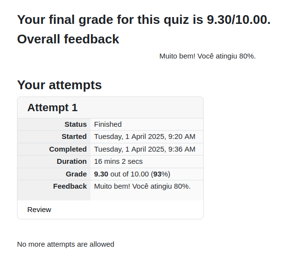
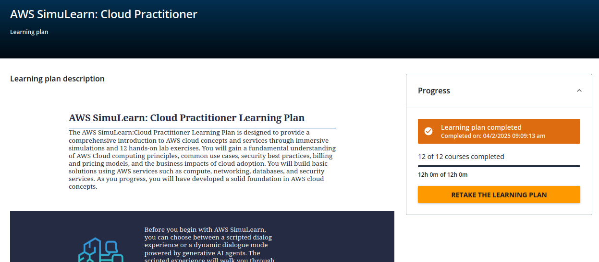
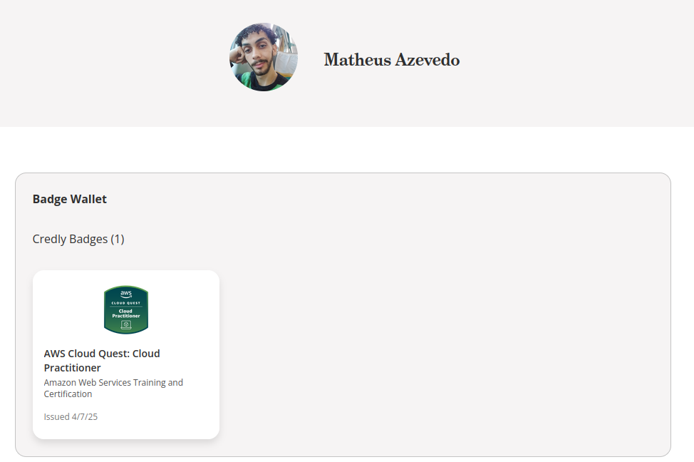

<h1 align="center">
    <strong>SPRINTS 09 E 10</strong>
</h1>

# Introdução
As **SPRINTS 09 e 10** foram realizadas com foco total na preparação para a aprovação na certificação **AWS Cloud Practitioner (CLF-C02)** ☁️🚀.

## Sprint 09

Na sprint 09, estudamos através de 2 cursos oferecidos pela AWS na plataforma **AWS Skill Builder** e algumas perguntas na mesma plataforma:
- Cloud Practitioner: Essentials
- Cloud Practitioner: Curso padrão de preparação para o exame (CLF-C02 - Português)
- Cloud Practitioner: Perguntas práticas oficiais (CLF -C02 Português)

Esses cursos possibilitaram uma introdução aprofundada aos **princípios de computação em nuvem e AWS**. Além disso, conheci seus principais serviços, suas finalidades e a grande importância que eles exercem no mundo atualmente.

Além disso, o curso do Andre Iacono possibilitou reforçar as bases aprendidas nos cursos anteriores, bem como ver uma parte mais prática, o que foi complementado muito bem pelos simulados realizados nesta sprint.

## Sprint 10

Na sprint 10, complementamos ainda mais os estudos de uma forma mais **dinâmica, prática e visual** através dos laboratórios oferecidos pela AWS.

Esses laboratórios permitiram que fosse simulado como seria o uso e configuração de alguns serviços AWS passo-a-passo, como **EC2, ASG, VPC, IAM, EFS, DynamoDB**, entre outros.

Vale destacar o **Cloud Practitioner: AWS Cloud Quest** que proporcionou uma boa experiência de aprendizado de forma gamificada. 🎮

# 🔎 Evidências

## 🧠 Simulados: AWS Cloud Practitioner (CLF-C02) 

### Simulado 1

### Simulado 2

### Simulado 3

### Simulado 4

### Simulado 5

### Simulado 6

## 🧠 Resultado do simulado ao vivo na reunião técnica de 01/04/2025

## 🧠 Tela de conclusão do AWS Simulearn: Cloud Practitioner

## 🧠 Badge de conclusão do Cloud Practitioner: AWS Cloud Quest

# 👨🏼‍🎓 Certificados

## 🧠 Curso: Cloud Practitioner: Essentials

## 🧠 Curso: Cloud Practitioner: Curso padrão de preparação para o exame

## 🧠 Curso: Certificação Amazon AWS Certified Cloud Practitioner CLF-C02

