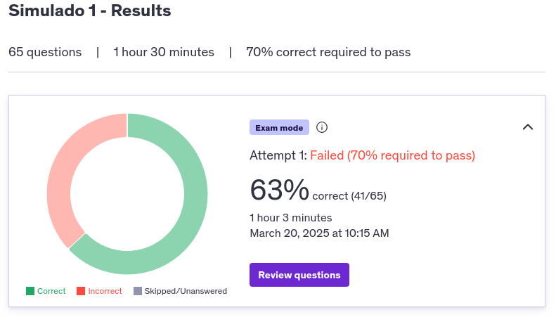
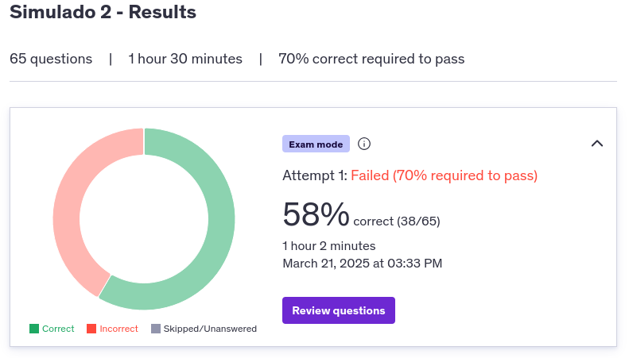
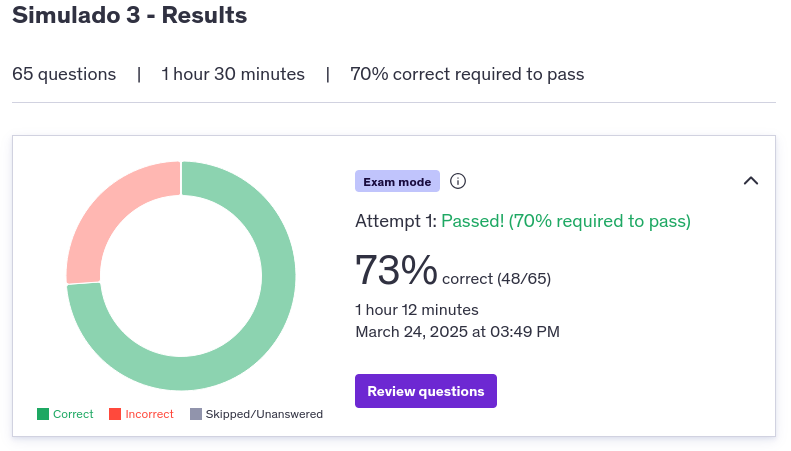
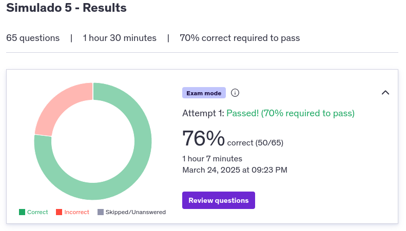
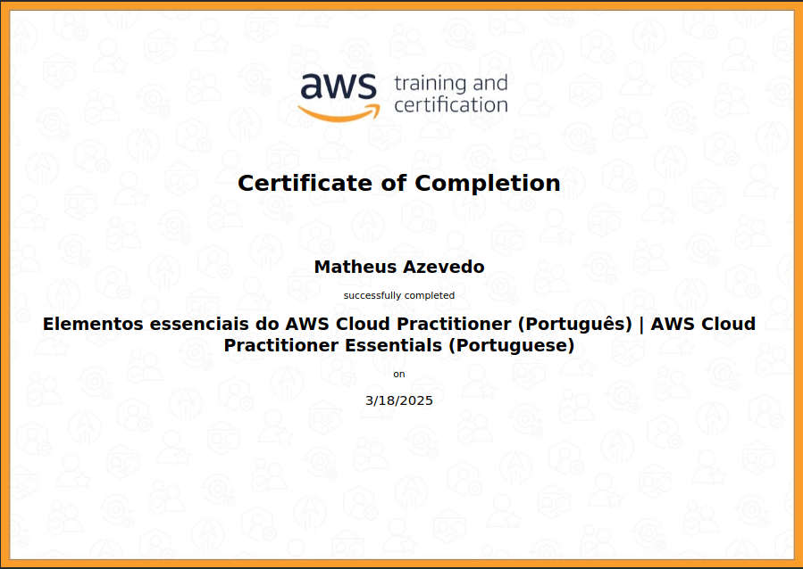
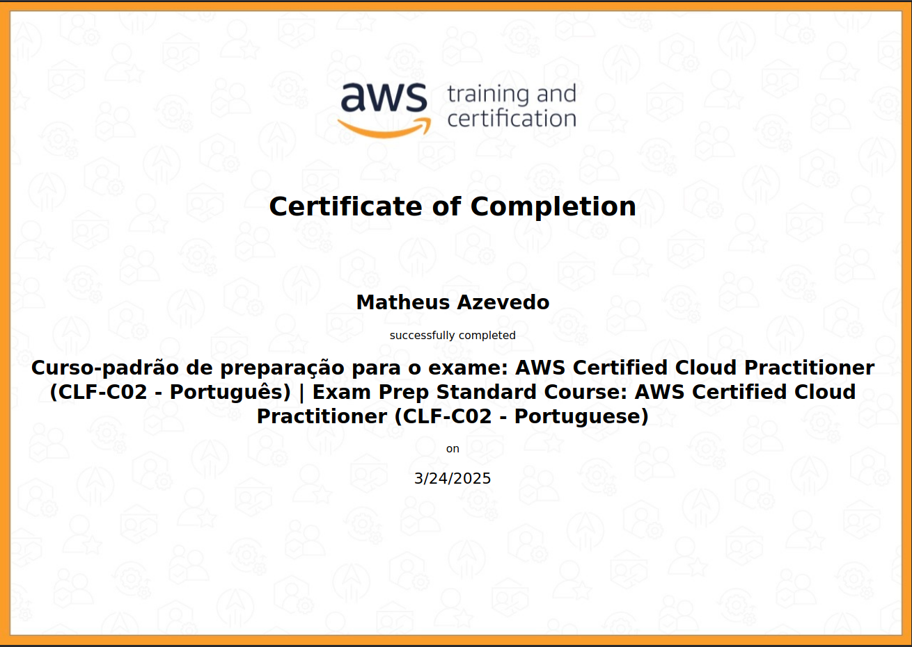
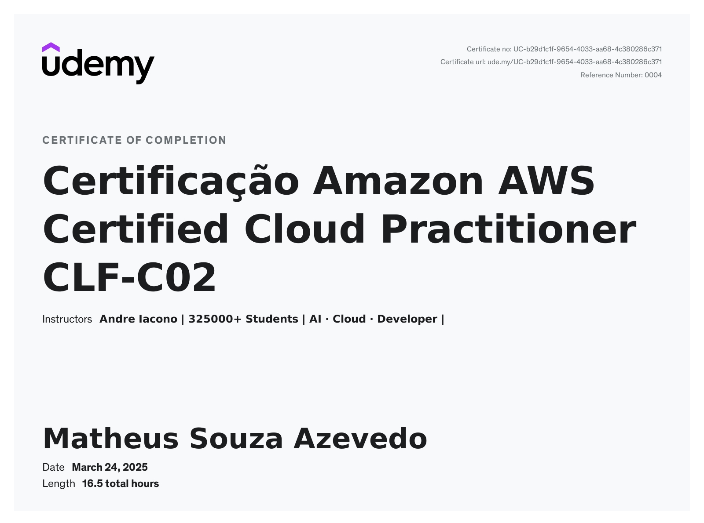

<h1 align="center">
    <strong>SPRINTS 09 E 10</strong>
</h1>

# Introdução
As **sprints 09 e 10** estão sendo utilizadas para foco total na preparação para a certificação **AWS Cloud Practitioner (CLF-C02)**.

# 🔎 Evidências

## 🧠 Simulados: AWS Cloud Practitioner (CLF-C02) 

### Simulado 1

### Simulado 2

### Simulado 3

### Simulado 4

### Simulado 5

### Simulado 6

# 👨🏼‍🎓 Certificados

## 🧠 Curso: Cloud Practitioner: Essentials

## 🧠 Curso: Cloud Practitioner: Curso padrão de preparação para o exame

## 🧠 Curso: Certificação Amazon AWS Certified Cloud Practitioner CLF-C02

